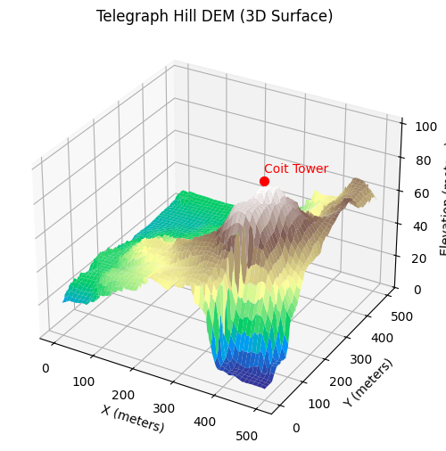
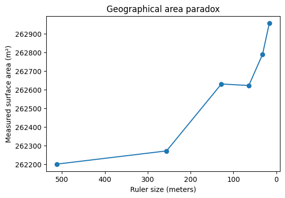
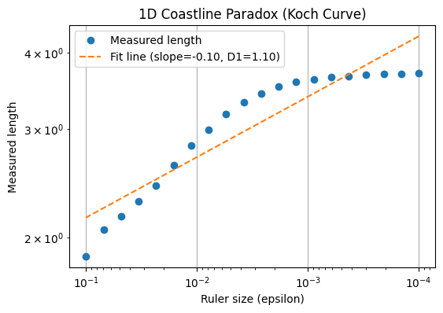
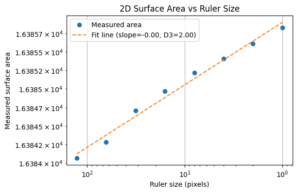

# Introduction
If you’ve ever come across the coastline paradox, you’ve probably seen the classic (and somewhat overused) image of the coastline of Britain. Recently, a friend asked me a question that felt like the 3D analogue of this paradox: What is the surface area of a city? More specifically, does a very hilly city have more surface area than a relatively flat one?

The answer, as it turns out, is more complicated than it first appears. My initial instinct was to treat this as the 3D version of the coastline paradox, and that idea sent me down a rabbit hole—one whose key insights form the basis of this blog post. 
**Complete follow along notebook can be found [here](https://github.com/FranciscoRMendes/coastline-paradox-3d).**

Here’s how the post is structured:

1. Visualizing the 2D coastline paradox using the Koch curve, a well-known fractal curve.

2. Extending this to the 3D case by visualizing the surface area paradox with a fractal terrain.

3. Applying these ideas to real-world GIS data to verify the paradox in practice.

4. Exploring the concept of dimension.

Point 4 turned out to be particularly enlightening. In researching this post, I realized that the way we commonly think about “dimension”—1D, 2D, 3D—is not mathematically rigorous. The coastline paradox and its 3D surface area counterpart only exist because our intuitive notion of dimension is incomplete. In fact, dimensions can be fractional, and by using the results from sections 1, 2, and 3, we can actually measure them and gain a deeper understanding of the geometry underlying these paradoxes.

# 2D Coastline Paradox 
The figure above illustrates the coastline paradox using a Koch curve, a classic fractal curve. As the ruler size decreases, the measured length of the curve increases dramatically, highlighting that the “true” length of a jagged, self-similar shape is not well-defined. In the top plot, we visualise the Koch curve after six iterations, showing its intricate zig-zag pattern. The bottom plot demonstrates the paradox quantitatively: on a log–log scale, smaller ruler sizes (on the right) capture finer details, resulting in a rapidly increasing measured length. This simple experiment illustrates why fractal curves require a scale-invariant descriptor—the Minkowski or box-counting dimension—to characterise their complexity, rather than relying on a single length measurement.

The figures above illustrate the coastline paradox using a Koch curve, a classic fractal curve. As the ruler size decreases, the measured length of the curve increases dramatically, highlighting that the “true” length of a jagged, self-similar shape is not well-defined. In the top plot, we visualise the Koch curve after six iterations, showing its intricate zig-zag pattern. The bottom plot demonstrates the paradox quantitatively: on a log–log scale, smaller ruler sizes (on the right) capture finer details, resulting in a rapidly increasing measured length. This simple experiment illustrates why fractal curves require a scale-invariant descriptor—the Minkowski or box-counting dimension—to characterise their complexity, rather than relying on a single length measurement.

## Mathematical Proof 

Consider a jagged curve (e.g., a coastline) in 2D, and let $L(\varepsilon)$ denote the measured length using a ruler of size $\varepsilon$.

1. Divide the curve into segments of length $\varepsilon$. Let $N(\varepsilon)$ be the number of segments required to cover the curve:

$$
L(\varepsilon) \approx N(\varepsilon) \cdot \varepsilon
$$

2. Assume the curve is fractal with Minkowski–Bouligand dimension $D$, so the number of boxes needed to cover the curve scales as:

$$
N(\varepsilon) \sim \varepsilon^{-D}
$$

3. Substitute the scaling relation into the length formula:

$$
L(\varepsilon) \sim \varepsilon \cdot \varepsilon^{-D} = \varepsilon^{1-D}
$$

4. Interpretation:

* If the curve is smooth: $D = 1$, then $L(\varepsilon) \sim \varepsilon^{0} = \text{constant}$.
* If the curve is fractal: $D > 1$, then $L(\varepsilon) \to \infty$ as $\varepsilon \to 0$.

This demonstrates the paradox: the measured length depends on the ruler size, and only the fractal dimension $D$ provides a scale-invariant measure of the curve’s complexity.

5. Recovering the fractal dimension from data:

$$
D = 1 - \frac{d \log L(\varepsilon)}{d \log \varepsilon}
$$

* On a log–log plot of $L(\varepsilon)$ vs $\varepsilon$, the slope is $1-D$.
* This allows us to characterise the roughness of the curve quantitatively.

## 3D Coastline Paradox 

The figure below demonstrates the geographical area paradox, the 3D analogue of the coastline paradox. Here, we measure the surface area of a fractal terrain generated using the diamond-square algorithm. As the size of the measurement “ruler” (square grid) decreases, the measured surface area increases, revealing more of the fine-scale roughness of the terrain. Just as the length of a fractal curve diverges with smaller ruler sizes, the area of a fractal surface grows without bound. This shows that for rough surfaces, the conventional notion of area is ill-defined at very small scales. Instead, the fractal dimension of the surface provides a single, scale-invariant number that quantifies the complexity of the terrain.

## Mathematical Formulation of the 3D Surface Paradox

Consider a 3D surface $z = f(x,y)$ defined over a 2D domain. Let $A(\varepsilon)$ denote the measured surface area using a square ruler of side $\varepsilon$.

1. Divide the plane into a grid of squares of side (\varepsilon). Let $N(\varepsilon)$ be the number of squares required to cover the surface (or, equivalently, the number of boxes intersecting the surface in 3D):

$$
A(\varepsilon) \approx N(\varepsilon) \cdot \varepsilon^2
$$

2. Assume the surface is fractal with Minkowski–Bouligand dimension $D$ (with $2 < D < 3$):

$$
N(\varepsilon) \sim \varepsilon^{-D}
$$

3. Substitute into the area formula:

$$
A(\varepsilon) \sim \varepsilon^2 \cdot \varepsilon^{-D} = \varepsilon^{2-D}
$$

4. Interpretation:

* If the surface is smooth: $D = 2$, then $A(\varepsilon) \sim \varepsilon^0 = \text{constant}$.
* If the surface is fractal: $D > 2$, then $A(\varepsilon) \to \infty$ as $\varepsilon \to 0$.

5. Recovering the fractal dimension from data:

$$
D = 2 - \frac{d \log A(\varepsilon)}{d \log \varepsilon}
$$

* On a log–log plot of $A(\varepsilon)$ vs $\varepsilon$, the slope is $2$D.
* This provides a scale-invariant measure of the surface’s roughness  analogous to the 2D case but in two dimensions.

# Telegraph Hill 
Up to this point, we have illustrated the coastline (or geographical area) paradox using a simulated fractal surface. While this is useful for building intuition, it is ultimately a controlled toy example. In this section, we replace the synthetic terrain with real elevation data from Telegraph Hill in San Francisco. Extracting and preparing this data turned out to be an ordeal in its own right—one that probably deserves a dedicated blog post. There is something uniquely satisfying about working with GIS data: every raster, projection, and coordinate transform is a walking demonstration of linear algebra in the wild. But I digress. With the elevation data in hand, we can now repeat the same multi-scale measurement exercise and observe the coastline paradox emerge not from a mathematical construction, but from an actual piece of geography.

To illustrate the coastline paradox in a real geographical setting, we estimate the surface area of Telegraph Hill using progressively smaller “rulers.” In the code above, the terrain is measured with square rulers of 256, 128, 64, and 32 meters, and the total surface area is recomputed at each scale. As the ruler size decreases, the measured area systematically increases. This is not because the hill is physically changing, but because finer rulers capture more of the terrain’s small-scale roughness—minor ridges, gullies, and local slope variations that are invisible at coarser resolutions. The resulting curve demonstrates the geographical area paradox: for a rough, fractal-like surface, area is not a single well-defined number, but a scale-dependent quantity. What remains invariant across scales is not the measured area itself, but the rate at which it grows as the ruler size shrinks—an idea formalised by the surface’s fractal dimension.

## Fractional Dimensions

So far, we have seen how measured length or surface area **depends on the ruler size**: smaller rulers reveal more detail, producing larger measured values. The key insight of fractal geometry is that this scale-dependence can be quantified by a **fractional, scale-invariant dimension**, also called the Minkowski–Bouligand dimension.

### 2D Case: Koch Curve

For a fractal curve, the measured length (L(\varepsilon)) scales with ruler size (\varepsilon) as:

$$
L(\varepsilon) \sim \varepsilon^{1-D_1} = 1.1
$$

where $D_1$ is the fractal dimension of the curve. By plotting $\log L(\varepsilon)$ versus $\log \varepsilon$, the slope of the line gives $1-D_1$, from which we can solve for $D_1$. For the Koch curve, this yields $D_1 \approx 1.1$ (theoretically this is $1.26$), reflecting that the curve is “rougher than a line” but does not fill a plane.

### 3D Case: Simulated Fractal Surface

For a fractal surface, the measured area (A(\varepsilon)) scales with ruler size (\varepsilon) as:

$$
A(\varepsilon) \sim \varepsilon^{2-D_2} = 2.00002
$$

where (D_2) is the surface’s fractal dimension (with (2 < D_2 < 3)). A log–log plot of (A(\varepsilon)) versus (\varepsilon) gives a slope of (2-D_2), allowing us to solve for (D_2). In practice, simulated terrains often have (D_2 \approx 2.3{-}2.5), meaning the surface is rougher than a plane but still does not fill 3D space.

### Real-World Case: Telegraph Hill

Finally, we can apply the same method to **elevation data from Telegraph Hill**. Using square rulers of decreasing size, we measure the terrain’s surface area at each scale. A log–log plot of measured area versus ruler size produces a slope that corresponds to (2-D_{TH}).

$$
D_{TH} = 2 - \frac{d \log A(\varepsilon)}{d \log \varepsilon} = 2.00084
$$

The resulting fractional dimension (D_{TH}) captures the **true roughness of the hill**, providing a quantitative, scale-invariant measure of the terrain’s complexity. Just like with the Koch curve or the simulated fractal surface, the hill exhibits a dimension that is **between its topological dimension (2) and the embedding dimension (3)**, revealing the fractal nature of real-world landscapes.

# The Fractal Boundary of Trainability

The most interesting region of hyperparameter space is not where training clearly succeeds or clearly fails, but the boundary between the two. This is where learning rates are just stable enough, regularisation is just sufficient, and optimisation teeters on the edge of divergence.

When we zoom into this boundary between convergent (blue) and divergent (red) training regimes, something remarkable happens: structure appears at every scale. Regions that look smooth at coarse resolution reveal increasingly intricate patterns as we zoom in. No matter how closely we examine it, the boundary never simplifies.

In this sense, the boundary of neural network trainability behaves like a fractal. Just as with coastlines or rough surfaces, the distinction between “trainable” and “untrainable” depends on the scale at which we probe it — a reminder that even optimisation lives in a world of fractional geometry.

# Scale dependent kinematics: spacetime extension

One intriguing extension is to imagine motion along a fractal path, where the effective distance depends on scale. If $L(\varepsilon) \sim \varepsilon^{1-D}$ is the measured length at scale $\varepsilon$, then a “scale-dependent velocity” $v(\varepsilon)$ could be written as:

$$
v(\varepsilon) = \frac{dL(\varepsilon)}{dt} \sim \frac{\varepsilon^{1-D}}{dt}
$$

For a particle moving in a fractal spacetime geometry, this hints at scale-dependent kinematics, where the observed velocity changes with the measurement resolution, connecting fractal dimension $D$ with the local structure of spacetime.

# Conclusions and Final Thoughts 

Through this exploration, we have seen how the coastline paradox extends naturally from 2D curves to 3D surfaces, and how it manifests in real-world terrain like Telegraph Hill. Starting with the Koch curve, we visualized the fundamental idea that measured length depends on the scale of measurement. Extending this to 3D, we saw that the surface area of a rough, fractal-like terrain increases as the measurement resolution becomes finer—a phenomenon we’ve called the geographical area paradox.

Applying the same principles to actual GIS data confirmed that this is not just a theoretical curiosity: hilly cities truly do have “more surface” at finer scales, and the apparent area depends on how finely it is measured.

Finally, this journey highlighted the importance of fractional dimensions. Traditional notions of dimension—1D, 2D, 3D—are insufficient to capture the complexity of fractal structures. By calculating Minkowski–Bouligand dimensions from 1D curves, 2D surfaces, and real-world elevation data, we gained a quantitative, scale-invariant measure of roughness.

In the end, the coastline paradox is more than a curiosity: it offers a window into the hidden complexity of the world, from jagged coastlines to hilly terrain, and pushes us to rethink the conventional notion of integer dimensions. Indeed, questioning our intuition about dimensions may be essential for a deeper understanding of concepts like velocity, especially when the underlying physical paths we traverse may be inherently fractal.

# References 
- [An absolutely ancient reference that uses UNIX to compute various box-counting algorithms but also has a nice theoretical background to fractal dimensions. ](https://paulbourke.net/fractals/fracdim/)

- [Real Analysis and Measure Theoretic Approach to dimension theory ](https://pi.math.cornell.edu/~erin/docs/dimension.pdf)

- [Jascha Sohl-Dickstein's Blog on Fractal Boundaries](https://sohl-dickstein.github.io/2024/02/12/fractal.html)

- [Original Paper by Sohl-Dickstein](https://arxiv.org/pdf/2402.06184)

- [The infinite coastline paradox](https://www.infinitelymore.xyz/p/the-infinite-coastline-paradox)