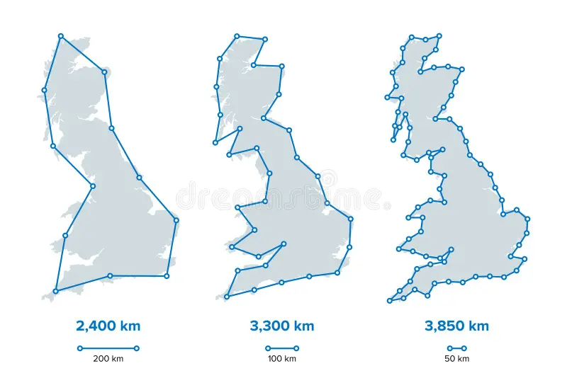
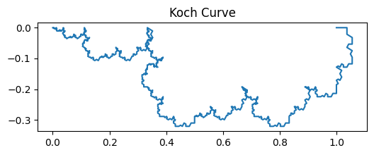

# Introduction

# 2D Coastline Paradox 

The figure above illustrates the coastline paradox using a Koch curve, a classic fractal curve. As the ruler size decreases, the measured length of the curve increases dramatically, highlighting that the “true” length of a jagged, self-similar shape is not well-defined. In the top plot, we visualise the Koch curve after six iterations, showing its intricate zig-zag pattern. The bottom plot demonstrates the paradox quantitatively: on a log–log scale, smaller ruler sizes (on the right) capture finer details, resulting in a rapidly increasing measured length. This simple experiment illustrates why fractal curves require a scale-invariant descriptor—the Minkowski or box-counting dimension—to characterise their complexity, rather than relying on a single length measurement.

## Mathematical Proof 

Consider a jagged curve (e.g., a coastline) in 2D, and let $L(\varepsilon)$ denote the measured length using a ruler of size $\varepsilon$.

1. Divide the curve into segments of length $\varepsilon$. Let $N(\varepsilon)$ be the number of segments required to cover the curve:

$$
L(\varepsilon) \approx N(\varepsilon) \cdot \varepsilon
$$

2. Assume the curve is fractal with Minkowski–Bouligand dimension $D$, so the number of boxes needed to cover the curve scales as:

$$
N(\varepsilon) \sim \varepsilon^{-D}
$$

3. Substitute the scaling relation into the length formula:

$$
L(\varepsilon) \sim \varepsilon \cdot \varepsilon^{-D} = \varepsilon^{1-D}
$$

4. Interpretation:

* If the curve is smooth: $D = 1$, then $L(\varepsilon) \sim \varepsilon^{0} = \text{constant}$.
* If the curve is fractal: $D > 1$, then $L(\varepsilon) \to \infty$ as $\varepsilon \to 0$.

This demonstrates the paradox: the measured length depends on the ruler size, and only the fractal dimension $D$ provides a scale-invariant measure of the curve’s complexity.

5. Recovering the fractal dimension from data:

$$
D = 1 - \frac{d \log L(\varepsilon)}{d \log \varepsilon}
$$

* On a log–log plot of $L(\varepsilon)$ vs $\varepsilon$, the slope is $1-D$.
* This allows us to characterise the roughness of the curve quantitatively.

## 3D Coastline Paradox 

The figure below demonstrates the geographical area paradox, the 3D analogue of the coastline paradox. Here, we measure the surface area of a fractal terrain generated using the diamond-square algorithm. As the size of the measurement “ruler” (square grid) decreases, the measured surface area increases, revealing more of the fine-scale roughness of the terrain. Just as the length of a fractal curve diverges with smaller ruler sizes, the area of a fractal surface grows without bound. This shows that for rough surfaces, the conventional notion of area is ill-defined at very small scales. Instead, the fractal dimension of the surface provides a single, scale-invariant number that quantifies the complexity of the terrain.

## Mathematical Formulation of the 3D Surface Paradox

Consider a 3D surface $z = f(x,y)$ defined over a 2D domain. Let $A(\varepsilon)$ denote the measured surface area using a square ruler of side $\varepsilon$.

1. Divide the plane into a grid of squares of side (\varepsilon). Let $N(\varepsilon)$ be the number of squares required to cover the surface (or, equivalently, the number of boxes intersecting the surface in 3D):

$$
A(\varepsilon) \approx N(\varepsilon) \cdot \varepsilon^2
$$

2. Assume the surface is fractal with Minkowski–Bouligand dimension $D$ (with $2 < D < 3$):

$$
N(\varepsilon) \sim \varepsilon^{-D}
$$

3. Substitute into the area formula:

$$
A(\varepsilon) \sim \varepsilon^2 \cdot \varepsilon^{-D} = \varepsilon^{2-D}
$$

4. Interpretation:

* If the surface is smooth: $D = 2$, then $A(\varepsilon) \sim \varepsilon^0 = \text{constant}$.
* If the surface is fractal: $D > 2$, then $A(\varepsilon) \to \infty$ as $\varepsilon \to 0$.

5. Recovering the fractal dimension from data:

$$
D = 2 - \frac{d \log A(\varepsilon)}{d \log \varepsilon}
$$

* On a log–log plot of $A(\varepsilon)$ vs $\varepsilon$, the slope is $2$D.
* This provides a scale-invariant measure of the surface’s roughness  analogous to the 2D case but in two dimensions.

