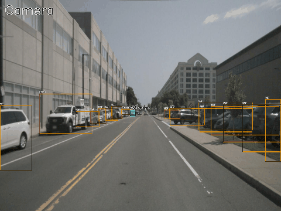
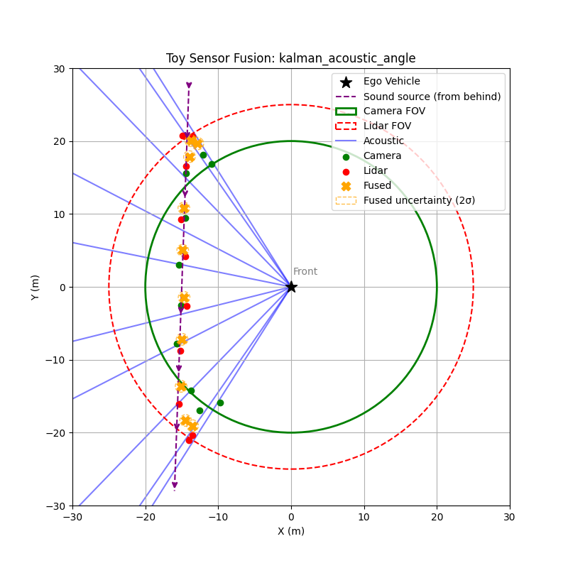
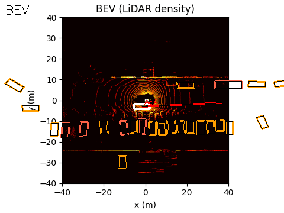
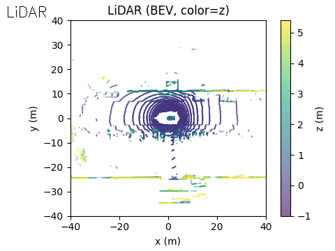

# Introduction

In autonomous driving, perception systems typically rely on photons i.e. cameras, lidar, and radar. But what if we could also listen to the environment, capturing sound cues that are invisible to traditional vision-based sensors?

There are many intuitively appealing use cases where an additional sensing modality could enhance awareness of the surroundings. Acoustic sensing itself is not new in automotive systems. For example, ultrasonic sensors have long been used for short-range applications such as parking assistance. Extending this idea to environmental sound sensing—allowing a vehicle to effectively hear its surroundings—has been explored by organizations such as the Fraunhofer Institute and Renesas Electronics. At CVPR '23 we had the Princeton Computational Image lab create 2D "images" using beamforming (more on this later) from passive acoustic listening and fused this with RGB camera data. 


While the Princeton paper was highly influential to this work, our client was interested in passing certain scenarios only without overly relying on (or expending energy on) a highly complex multi-dimensional sensor modality. In this post we explore several motivations for adding a simpler version of passive acoustic sensing to the autonomous vehicle sensor stack.

<div style="text-align:center;">
  
  <p><em>Sneak Peek of our solution: Flashing red/cyan vehicle is emitting sound</em></p>
</div>

### Why consider acoustic sensing?

- Obstructed-view scenarios are increasingly emphasized in safety standards such as Euro NACP. Detecting hazards before they become visible is critical for improving safety metrics.
- With the rise of autonomous systems in defense and security applications, additional sensing modalities may provide a differentiator when competing for contracts.
- Sound does not require line-of-sight (LoS). Important events such as children playing in the street, emergency vehicle sirens, or approaching traffic can be detected even when visually occluded.
- Sound is a natural communication modality for humans, and could provide a mechanism for richer interaction between the environment and the ego vehicle.
- Acoustic signals can intrinsically provide directional information (heading), which can improve situational awareness metrics such as MAPH (Mean Average Precision with Heading).
- Beamforming+RGB outperforms RGB alone in challenging occluded scenarios

### Key disadvantages

Acoustic sensing also introduces several challenges:

- Passive acoustic systems typically provide Angle-of-Arrival (AoA) information but not reliable distance estimates.
- Performance can degrade due to vehicle noise, wind noise, and environmental interference.

## Toy Example: Acoustic Direction Improves Early Detection

To illustrate the value of acoustic sensing, consider a simple scenario:

- An emergency vehicle approaches from the bottom-right relative to the ego vehicle.  
- Acoustic sensing estimates the direction of arrival using TDOA between microphones, but cannot determine distance.  
- Camera and lidar only detect the vehicle once it enters their field of view.

In the simulation, the vehicle moves toward the ego vehicle. The acoustic system continuously estimates a sextant, or directional sector, while the camera and lidar begin detecting the vehicle only after it enters their sensing range.

This allows the fusion system to gain early directional awareness, giving planning systems a chance to anticipate the approaching vehicle before visual confirmation. Even though the acoustic angle estimate is noisy, it provides information beyond the field of view of both camera and lidar. After fusing with lidar and camera data, the system produces more accurate position estimates.



### Context

The work described here was originally developed at Reality AI, which was later acquired by Renesas Electronics to explore the commercial feasibility of passive acoustic sensing in automotive systems. My role focused on scaling the solution and validating it across different environments.

We conducted experiments using simulated emergency sirens in multiple environments, including:

- controlled warehouse setups  
- busy urban streets  
- open environments with realistic traffic noise  

We also collaborated with external partners to collect additional datasets and explore multi-sensor fusion approaches.

In this article, I will explore PAMVON (Passive Acoustic Monitoring for Vehicles and Objects)—a system that uses microphone arrays, signal processing, and machine learning to detect and localize important acoustic events in the driving environment.


The work described here was originally developed at Reality AI, which was later acquired by Renesas Electronics to explore the commercial feasibility of passive acoustic sensing in automotive systems. My role focused on scaling the solution and validating it across different environments.

We conducted experiments using simulated emergency sirens in multiple environments, including:

- controlled warehouse setups  
- busy urban streets  
- open environments with realistic traffic noise  

We also collaborated with external partners to collect additional datasets and explore multi-sensor fusion approaches.

# Passive Acoustic Monitoring (PAM)

Passive Acoustic Monitoring (PAM) detects environmental sounds without emitting signals. Instead, the system passively listens for events in the surrounding environment such as emergency vehicle sirens, horns, tire skids, engine noise, drones or machinery, and even children playing in the street.

The key advantage of this approach is that sound does not require line-of-sight. Important cues can be detected even when they are visually occluded, in low-light conditions, or in adverse weather. This makes acoustic sensing particularly attractive for early warning scenarios, such as an approaching ambulance that has not yet entered the field of view of the vehicle's cameras or lidar.

Recent developments in multimodal large language models also change how one might think about acoustic perception. Rather than requiring a rigid classifier that assigns each sound to a predefined category, modern multimodal systems can reason over audio signals more flexibly and incorporate them into a broader contextual understanding of the scene. In practice this means the acoustic signal can act less as a strict classification task and more as an additional stream of environmental information that the perception system can interpret alongside vision and other sensor modalities.


# Microphone Arrays and Beamforming
Sound (like light) travels in a straight line and therefore we need at least 4 microphones to provide an accurate estimate of the angle of arrival of the sound wave. 
A single microphone provides limited spatial information. To estimate where a sound originates, passive acoustic monitoring systems typically use small arrays of microphones. By observing the time differences between when a signal reaches each microphone, the system can estimate the direction of arrival of the sound source. Arrays also make it possible to improve signal quality by combining signals from multiple sensors.

In practice this enables several useful capabilities. The system can estimate the direction of arrival of a sound, approximate the location of the source under certain assumptions, and improve the signal-to-noise ratio by combining measurements across the array.

Beamforming is the signal processing technique that makes this possible. The idea is simple: signals arriving from a particular direction reach each microphone at slightly different times. By applying the appropriate delays and summing the signals together, the array reinforces sounds from the desired direction while suppressing sounds from other directions.

The microphone array can be visualized like this:

```

    Mic1 ----------- Mic2
       \               /
        \             /
         \           /
           ( sound )
             source
         /           \
        /             \
       /               \
    Mic3 ----------- Mic4

```


In practice the system estimates the relative delay between microphones using cross-correlation. When a sound arrives at the array, it reaches each microphone at slightly different times. By computing the cross-correlation between pairs of microphone signals, the system can estimate the time difference of arrival between them.

These time differences constrain the direction from which the sound could have originated. With multiple microphone pairs, the system can estimate a consistent direction of arrival for the source.

Once the delays are known, the array can also combine the microphone signals in a way that reinforces sounds coming from that direction while suppressing others. In effect, the array behaves like a steerable listening sensor that can focus on different parts of the acoustic scene.

### Angle of Arrival (AoA) Estimation via Cross-Correlation

In a microphone array, a sound source reaches each microphone at slightly different times. By comparing these signals, the system can estimate the relative delay between them. A common way to do this is through cross-correlation, which measures how similar two signals are as one is shifted in time relative to the other.

For two microphone signals $x_1(t)$ and $x_2(t)$, the cross-correlation can be written as

$$
R_{12}(\tau) = \int x_1(t) \, x_2(t+\tau) \, dt
$$

The time shift $\tau$ that maximizes this correlation corresponds to the time difference of arrival between the two microphones:

$$
\tau_{\text{max}} = \arg\max_\tau R_{12}(\tau)
$$

If the microphones are separated by a distance $d$, this delay can be converted into an estimate of the angle of arrival:

$$
\theta = \arcsin\left(\frac{c \cdot \tau_{\text{max}}}{d}\right)
$$

where $c$ is the speed of sound.

In real environments, reflections and background noise can make the correlation peak less reliable. A commonly used approach to improve robustness is generalized cross-correlation with phase transform (GCC-PHAT). This method emphasizes phase information in the frequency domain and reduces the influence of signal magnitude differences:

$$
R_{12}(\tau) = \mathcal{F}^{-1}\{\frac{X_1(f) X_2^(f)}{|X_1(f) X_2^*(f)|}\}
$$

Here $X_1(f)$ and $X_2(f)$ are the Fourier transforms of the microphone signals. The peak of $R_{12}(\tau)$ provides a stable estimate of the arrival delay, which can then be used to infer the direction of the sound source.


# Signal Processing Pipeline

Passive acoustic monitoring typically follows a structured processing pipeline:

1. Preprocessing: The raw microphone signals are filtered to remove irrelevant frequency bands, and gain normalization ensures consistent amplitude levels across microphones.  
2. Time-frequency analysis: Signals are converted into spectrograms using the Short-Time Fourier Transform (STFT), revealing how frequency content evolves over time.  
3. Beamforming: Directional enhancement techniques, such as delay-and-sum or cross-correlation-based beamforming, focus on sounds from specific directions while suppressing noise and interference.  
4. Event detection: Open-source neural networks, including VGGish, convolutional-recurrent networks (CRNNs), and transformers, analyze the spectrograms to detect and classify events such as sirens, horns, or tire skids.
5. Localization: Time Difference of Arrival (TDOA) estimates, often computed using GCC-PHAT cross-correlation, are combined across microphone pairs to infer the direction of incoming sounds and, in some cases, approximate source locations.

This pipeline allows the system to transform raw audio into actionable information for autonomous vehicle perception, providing early warning of hazards even when they are outside the line of sight of cameras or lidar.


# Acoustic Sensor Data Representation

In a generalized form, data from a passive acoustic monitoring array can be represented as a tuple capturing the relevant information for fusion:

$$
\displaystyle z_{\mathrm{ac}} = (\theta, \sigma_\theta, c, f, t, p_{\mathrm{ego}})
$$

Where:

- $\theta$: Estimated angle of arrival (AoA) of the sound, typically computed using TDOA and cross-correlation (GCC-PHAT).  
- $\sigma_\theta$: Uncertainty of the angle estimate, reflecting noise, reverberation, or low SNR.  
- $c$: Sound class probability vector produced by the ML model. The classes correspond to ambulance, police, and other unknown loud sounds. For example, $c = [0.7, 0.2, 0.1]$
- $f$: Frequency-domain features, such as Mel spectrogram or STFT frame, optionally used for downstream ML fusion.  
- $t$: Timestamp of the measurement, to allow temporal alignment with other sensors.  
- $\mathbf{p}_{\text{ego}}$: Pose of the ego vehicle when the measurement was captured, typically $(x, y, \psi)$ in 2D or 3D coordinates.

This representation allows the acoustic signal to integrate easily into perception and fusion pipelines:

- $\theta$ provides a directional prior for early detection.  
- $c$ informs semantic understanding of the source.  
- $\sigma_\theta$ can be used in probabilistic fusion (e.g., weighted averaging, Kalman updates).  
- $f$ allows future retraining or fine-tuning of ML models.  
- $t$ and $\mathbf{p}_{\text{ego}}$ allow projection into bird’s-eye view (BEV) maps or occupancy grids alongside camera and lidar data.

For an array of $N$ microphones, the raw signals can also be stored as:

$$
\mathbf{X}_{\text{raw}} = [x_1(t), x_2(t), \dots, x_N(t)]
$$

These raw signals are processed into the generalized form above, providing a compact yet rich representation for sensor fusion.

# Simple ID-Based Matching
Before exploring a more technical late fusion approach, we first evaluated a simpler strategy based on ID matching. In this setup, acoustic detections were associated directly with annotated object identities in the dataset.

The acoustic classifier produced class probabilities for events such as ambulance sirens, police sirens, or other loud sounds. When the classifier detected a high probability ambulance siren, we matched that event to the corresponding object detection annotation in the scene. In practice this meant associating the acoustic event with the object ID labeled as an emergency vehicle in the perception dataset.

One challenge is that the acoustic detector often produces a directional estimate much earlier than the moment when the vehicle becomes visible and is annotated by the vision system. The acoustic pipeline provides an angle of arrival $\theta$, but not a direct range estimate. To place this information in the BEV representation, we projected the acoustic bearing into the map by creating an artificial point along the direction of arrival at a fixed distance $d$ from the ego vehicle. The distance was chosen to be larger than the field of view of the camera and lidar sensors so that the acoustic signal could represent a potential source outside the current perception range.

This artificial point can be written as

$$
p_{ac} =
\begin{bmatrix}
x_{ego} \\\\
y_{ego}
\end{bmatrix}
+
d
\begin{bmatrix}
\cos \theta \\\\
\sin \theta
\end{bmatrix}
$$

where $(x_{ego}, y_{ego})$ is the position of the ego vehicle in BEV coordinates. As the vehicle approaches and eventually enters the sensor field of view, the projected acoustic point becomes spatially consistent with the detected object.

This approach relies on the object detection pipeline already identifying vehicles and assigning consistent IDs across frames. The acoustic system then acts as an additional signal that confirms the presence of a specific type of vehicle.

Although simple, this method is surprisingly effective. The acoustic cue provides early detection of emergency vehicles, while the vision system provides precise localization and tracking. By linking the acoustic classification to existing object IDs, the system can quickly identify which tracked object is likely producing the sound.

This ID-based matching served as a useful baseline before implementing a more general late fusion approach using probabilistic tracking and bearing measurements.


# Late Fusion with an Existing BEV Pipeline

While the ID-based matching approach provided a strong baseline, it relies on the object already being detected and assigned an identity by the perception pipeline. In many cases the acoustic signal appears earlier, before the vehicle enters the field of view of the cameras or lidar. To make better use of this early directional information, we extended the system using a more formal late fusion approach.

In this setup, acoustic sensing was integrated on top of an existing lidar and camera perception stack. The vision and lidar pipeline already produced tracked objects in bird's-eye view (BEV), including estimates of position, velocity, and uncertainty. The acoustic sensor then contributed an additional bearing measurement, which could be incorporated into the tracking framework to refine object estimates and improve situational awareness.


After lidar and camera fusion, each tracked object is represented by a state vector

$$
\mathbf{x} =
\begin{bmatrix}
x \\\\
y \\\\
v_x \\\\ 
v_y
\end{bmatrix}
$$

where $(x,y)$ represents the position of the object in BEV coordinates and $(v_x, v_y)$ represents the velocity components. The tracker also maintains a covariance matrix

$$
\mathbf{P}
$$

which represents the uncertainty of the state estimate.

The acoustic system produces a bearing measurement corresponding to the direction of arrival of the sound:

$$
z_{ac} = \theta
$$

where $\theta$ is the estimated angle of arrival relative to the ego vehicle.

If the ego vehicle is located at position $(x_e, y_e)$, the predicted bearing of a tracked object can be written as

$$
h(\mathbf{x}) =
\arctan2(y - y_e, \; x - x_e)
$$

This function maps the tracked object position into the expected acoustic measurement.

The difference between the observed bearing and the predicted bearing is the innovation:

$$
\mathbf{y} = z_{ac} - h(\mathbf{x})
$$

Because the measurement model is nonlinear, we linearize it using the Jacobian

$$
\mathbf{H} =
\begin{bmatrix}
\frac{\partial h}{\partial x} &
\frac{\partial h}{\partial y} &
0 &
0
\end{bmatrix}
$$

For the bearing function this yields

$$
\frac{\partial h}{\partial x} = -\frac{y - y_e}{(x-x_e)^2 + (y-y_e)^2}
$$

$$
\frac{\partial h}{\partial y} = \frac{x - x_e}{(x-x_e)^2 + (y-y_e)^2}
$$

Given acoustic measurement noise $R_{ac}$, the Kalman gain can then be computed as

$$
\mathbf{K} =
\mathbf{P} \mathbf{H}^T
(\mathbf{H} \mathbf{P} \mathbf{H}^T + R_{ac})^{-1}
$$

The updated state estimate becomes

$$
\mathbf{x}_{new} =\mathbf{x} + \mathbf{K}\mathbf{y}
$$

and the covariance is updated as

$$
\mathbf{P}_{new} = (I - \mathbf{K}\mathbf{H})\mathbf{P}
$$

Since the acoustic sensor only provides directional information, this update primarily reduces uncertainty perpendicular to the acoustic ray while leaving uncertainty along the ray largely unchanged. In practice, this allows acoustic measurements to improve the tracking of objects detected by lidar and camera without requiring modifications to the existing perception pipeline.


# Final Output

The final output of the system is represented in Bird’s-Eye View (BEV) space. The acoustic information can be projected into this space using either of the two methods discussed earlier.

In the example scene below, the ego vehicle drives past a stationary car that is simulated to emit an emergency vehicle siren. The figure illustrates how the acoustic signal integrates with the rest of the perception stack.

On the left, we show the acoustic output tagged with an object ID from the real-time object detection system provided by the customer (likely based on a model such as YOLO).

In the centre, we show the BEV representation, where the estimated angle of arrival (AoA) from the microphone array is plotted as a ray originating from the ego vehicle. Because the clip is only six seconds long, the visualization shows a ray pointing in the direction of the detected emergency vehicle sound from the start of the sequence. In this case, the microphones detect the siren before the object enters the field of view of either the camera or the lidar.

Once the vision-based detector identifies the vehicle, the AoA estimate can be associated with that object, with small corrections applied if necessary to account for sensor alignment or localisation error.

On the right, we show the lidar point cloud for the same scene. In this example, the acoustic output is not annotated in the lidar view, although such a visualization is also possible.

<div style="text-align:center;">
  
  <p><em>Camera: Flashing red/cyan vehicle is emitting sound</em></p>
</div>

<div style="text-align:center;">
  
  <p><em>BEV: Acoustic AoA Plotted</em></p>
</div>

<div style="text-align:center;">
  
  <p><em>LiDAR</em></p>
</div>


# Implementation Considerations

The passive acoustic monitoring pipeline can be implemented efficiently on embedded automotive hardware. In our implementation, the audio processing pipeline, machine learning inference, and angle of arrival estimation were designed to run on a single MCU core. This includes signal preprocessing, spectrogram generation, neural network inference, and cross-correlation based localization.

The system was implemented on Renesas automotive controllers, specifically the RH850 microcontroller family. Audio input processing, AI target detection, and angle of arrival estimation ran on a single RH850 core alongside the A2B audio stack. In this configuration the full acoustic pipeline occupied roughly 300 KB of code space, even while running in a debug configuration and without aggressive optimization.

This relatively small footprint makes it feasible to deploy acoustic sensing alongside other perception tasks without requiring specialized hardware acceleration. On RH850 devices, significant CPU, flash, and RAM resources remain available for additional vehicle functions.

Microphone array configurations can also be adapted depending on coverage requirements. A four-microphone array provides approximately 180 degrees of coverage, while an eight-microphone configuration enables full 360 degree sensing around the vehicle.

In practice, the computational requirements depend on the complexity of the processing pipeline. Efficient PAM processing can run entirely on automotive-grade microcontrollers such as the RH850. Larger microphone arrays or more complex neural networks may benefit from more powerful automotive SoCs such as the Renesas R-Car platform. Regardless of the hardware platform, maintaining real-time processing is critical so that acoustic events can be incorporated into the perception pipeline with minimal latency.

```

    Microphone Array
 (4 or 8 digital microphones)
          │
          │
          ▼
  +------------------+
  |   A2B Audio Bus  |
  | (Automotive Audio|
  |   Backbone)      |
  +------------------+
          │
          │
          ▼
  +----------------------+
  |   RH850 MCU          |
  |----------------------|
  |  Audio Preprocessing |
  |  STFT / Spectrogram  |
  |  VGGish Inference    |
  |  GCC-PHAT (TDOA)     |
  |  AoA Estimation      |
  +----------------------+
          │
          │
          ▼
  +----------------------+
  |  Acoustic Detection  |
  |  θ (bearing)         |
  |  class probabilities |
  +----------------------+
          │
          │
          ▼
  +----------------------+
  |   BEV Fusion Layer   |
  | (Camera + Lidar +    |
  |    Acoustic)         |
  +----------------------+
          │
          ▼
  +----------------------+
  |  Tracking / Planning |
  +----------------------+

```
# Conclusion

Passive acoustic monitoring has shown significant potential but has not yet become standard in autonomous vehicle perception stacks. There are several challenges that limit its adoption:

1. Ambient noise and signal variability – urban environments are full of sounds that can mask sirens, horns, and other important cues.  
2. Environmental acoustic complexity – reflections, occlusions, and vibrations from the vehicle itself make accurate localization difficult.  
3. Automotive qualification and safety standards – microphones and processing hardware must meet rigorous requirements such as ISO 26262 and AEC-Q100, and survive extreme temperatures and vibrations.  
4. Limited generalization of machine learning models – systems that perform well in controlled tests can struggle on highways, in multi-siren urban settings, or with unusual sound events.  
5. No regulatory requirement – without a mandate from safety standards or OEMs, there is little commercial incentive to integrate acoustic sensing into production vehicles.  

Despite these obstacles, acoustic sensing can still provide value when used as a complementary modality. Integrating sound cues through late fusion on top of camera and lidar tracks allows early warnings of approaching emergency vehicles or other hazards, even before they enter the field of view. In this way, the acoustic signal reinforces and augments traditional sensors, enhancing situational awareness without requiring a full redesign of the perception stack. Performance improvements were observed in EuroNACP obstructed view testing scenarios, demonstrating the practical benefit of including an acoustic modality in complex urban environments.

# References

- Renesas Electronics. Seeing Sound: AI-Based Detection of Participants in Automotive Environment Using Passive Audio. White Paper.
https://www.renesas.com/en/document/whp/seeing-sound-ai-based-detection-participants-automotive-environment-passive-audio?r=1626806

- Princeton University Light + Sound Interaction Lab. Seeing with Sound.
https://light.princeton.edu/publication/seeingwithsound/