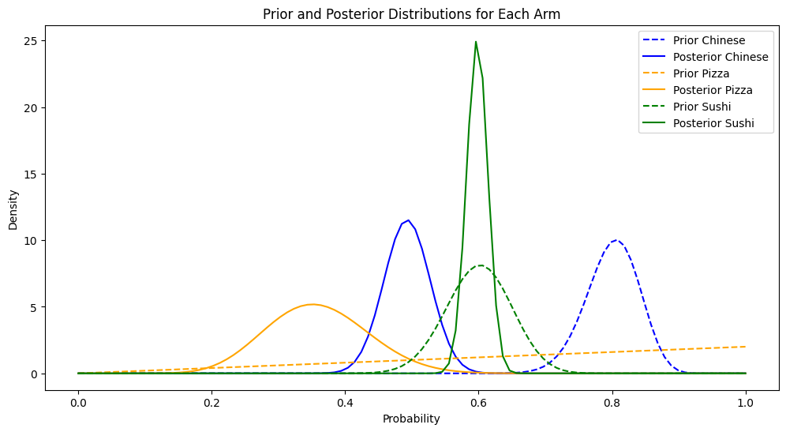
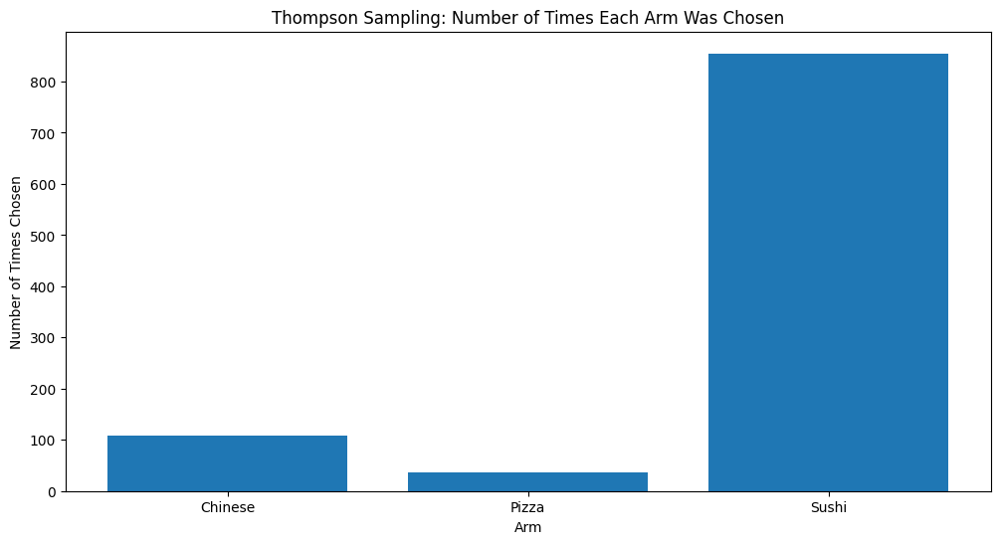

A friend of mine recently asked me for advice in preparing for an interview that required Bayesian statistics in Consulting. They asked me if I had done anything in Bayesian statistics. I decided to compile a list of representative projects that encapsulate the general idea of Bayesian statistics in consulting. These projects are rudimentary but could serve as a useful interview guide if needed!
# Exploring Bayesian Methods: From A/B Testing to Recommendation Engines

Bayesian methods are like the secret sauce of data science. They add a layer of sophistication to measuring the success of machine learning (ML) algorithms and proving their effectiveness. In this post, I’ll walk you through how Bayesian statistics have shaped my approach to A/B testing and recommendation engines. Whether you're a data science enthusiast or a seasoned pro, there’s something here for you!

## Bayesian A/B Testing: A Real-World Example

Imagine you’re working on a project for a large telecommunications company, and your goal is to build a recommendation engine. This engine needs to send automated product recommendations to customers every 15 days. To test whether your new machine learning-based recommendations outperform the traditional heuristic approach, you decide to run an A/B test.

### Measuring Success

In this scenario, we’re interested in measuring whether our recommendation engine performs better than the traditional method. We use a Bayesian approach to compare the click-through rates (CTR) of both methods. Click-through rate is a common metric that measures how often users click on the recommendations they receive.

We model the CTR using a beta distribution, which is parameterized by $\alpha$ (the number of clicks) and $\beta$ (the number of ignored recommendations). For both the new and traditional campaigns, we start with prior distributions:

$$ 
C_d = \text{beta}(\alpha_0, \beta_0) 
$$
$$ 
C_c = \text{beta}(\alpha_0, \beta_0) 
$$


```python
# Bayesian A/B Testing using Beta Distribution
import numpy as np
import matplotlib.pyplot as plt
from scipy.stats import beta

# 1. Introduction
print("Bayesian A/B Testing using Beta Distribution")

# 2. Setting Up the Experiment
# Let's say that we have two teams inside a marketing company. One of them (A) 
# uses business intelligence and marketing experience to recommend products to 
# customers, and the other team (B) uses machine learning to recommend products. 
# Given a recommendation, a customer can either accept (successes) or reject it. 
# Each team also gets a sample of customers they can expose their 
# recommendations to (trials).

# We have a binary outcome (success/failure) for variants A and B

# 3. Generating Synthetic Data
# Let's assume variant A has 200 trials with 60 successes, and variant B has 180 trials with 90 successes
data_A = {'successes': 60, 'trials': 200}
data_B = {'successes': 90, 'trials': 180}

```
### Choosing a Prior

Choosing the right prior for our Bayesian model was challenging. We had to match our new campaign against historical campaigns that were similar to ours and come up with appropriate values for $\alpha_0$ and $\beta_0$. This required some convincing, but ultimately, we got the client's approval.


```python
# 4. Prior Distribution
# From prior campaigns we know of a conversion rate that we can expect for 
# any campaign. This is of course can assumption, but in the marketing world, 
# conversion rates rarely look different, no matter how good your recommendations
# are. The industry rates will always look standard. 
# Use a uniform prior, Beta(10, 190)
alpha_prior = 85 # Let's say this is 85 conversions, per 285 trials
beta_prior = 200
```
### Updating Beliefs

Every 15 days, we collect new data and update our prior beliefs. The beta distribution is a conjugate prior, meaning its posterior distribution is also a beta distribution. Updating is straightforward:

$$ 
C_i = \text{beta}(\alpha_0 + \text{clicks}\_{t_0+15}, \beta + \text{ignored}_{t_0+15}) 
$$

This allows us to continuously refine our model as new data comes in.

```python
# 5. Likelihood and Posterior Distribution
# Update the posterior distribution with the data
alpha_post_A = alpha_prior + data_A['successes']
beta_post_A = beta_prior + data_A['trials'] - data_A['successes']

alpha_post_B = alpha_prior + data_B['successes']
beta_post_B = beta_prior + data_B['trials'] - data_B['successes']
```


### Simulating Results

To determine if our recommendation engine beats the traditional method, we simulate a pseudo p-value by drawing samples from the posterior. We check how often our recommendation engine outperforms the traditional one:

$$ 
E(I_{\theta^j_d> \theta^j_c}) = \sum_1^N I_{\theta^j_d> \theta^j_c} = P(\theta_d > \theta_c) 
$$

This tells us how frequently our engine's CTR exceeds the traditional method’s CTR.


```python
# 6. Posterior Predictive Checks
# Generate samples from the posterior distributions
# since the beta distribution is a conjugate prior, the posterior distribution 
# is also a beta distribution. We can find its parameters by adding the prior parameters.

samples_A = beta.rvs(alpha_post_A, beta_post_A, size=10000)
samples_B = beta.rvs(alpha_post_B, beta_post_B, size=10000)

# 7. Decision Making
# Calculate the probability that variant B is better than variant A
prob_B_better_than_A = np.mean(samples_B > samples_A)
print(f"Probability that variant B is better than variant A: {prob_B_better_than_A:.2f}")
```
### Conclusion

While complex measurement campaigns might signal trouble in some machine learning setups, our Bayesian approach showed promising results. Initially, our probability of outperforming the traditional method was 70%, which improved to 76%. This increase, combined with the ability to recommend high-margin products, demonstrated a tangible uplift due to our recommendation engine.


```python
# 8. Visualization
# Plot the prior and posterior distributions
x = np.linspace(0, 1, 1000)
prior = beta.pdf(x, alpha_prior, beta_prior)
posterior_A = beta.pdf(x, alpha_post_A, beta_post_A)
posterior_B = beta.pdf(x, alpha_post_B, beta_post_B)

plt.figure(figsize=(12, 6))
plt.plot(x, prior, label='Prior', linestyle='--')
plt.plot(x, posterior_A, label='Posterior A')
plt.plot(x, posterior_B, label='Posterior B')
plt.fill_between(x, 0, posterior_A, alpha=0.3)
plt.fill_between(x, 0, posterior_B, alpha=0.3)
plt.legend()
plt.xlabel('Conversion Rate')
plt.ylabel('Density')
plt.title('Prior and Posterior Distributions')
plt.show()
```


## Bayesian Recommendation Engines: Beyond A/B Testing

But Bayesian methods don’t stop at A/B testing. They also play a significant role in recommendation engines. Most of my work in consulting was in signal processing and recommendation engines. In many cases our clients did not even need very complex recommender systems, they could benefit from relatively simple Bayesian updation based on the users behavior. 


# Exploring the Power of Thompson Sampling for Multi-Armed Bandit Problems with Named Arms: A Deep Dive

---

## Introduction

Imagine you're running a bustling food delivery app, and you want to personalize the dining experience for your users. With an ever-growing list of restaurant options, how do you decide which cuisines to promote on the homepage? Should you highlight the new trendy Sushi place, the reliable Pizza joint, or the popular Chinese restaurant? Making the right choice can significantly impact user engagement and satisfaction.

Enter the world of multi-armed bandit problems—a fascinating realm of decision-making under uncertainty. In this blog post, we will explore how Thompson Sampling, a powerful Bayesian algorithm, can help us optimize our choices dynamically. We'll dive into a practical implementation using named arms, representing different types of cuisine, to illustrate how this method can be a game-changer for your food delivery app.

---

## The Multi-Armed Bandit Problem

The multi-armed bandit problem is a classic scenario in reinforcement learning and decision theory. Picture a row of slot machines (the "bandits"), each with an unknown payout probability. Your goal is to maximize your total reward by deciding which machine to play at each step. In our context, the "slot machines" are different types of cuisine, and the "payout" is the user's engagement or order from that cuisine.

The challenge lies in balancing exploration (trying out different cuisines to learn their popularity) and exploitation (promoting the currently known most popular cuisine). Thompson Sampling provides an elegant solution to this exploration-exploitation dilemma by using Bayesian inference to update our beliefs about each cuisine's popularity based on user interactions.

---

## Why Thompson Sampling?

Thompson Sampling stands out for its simplicity and effectiveness. Unlike other methods that require complex calculations or large amounts of data, Thompson Sampling leverages probabilistic models to guide decision-making. By maintaining a distribution of potential outcomes for each option, it allows for a natural and intuitive way to balance exploration and exploitation.

Here's how it works: for each cuisine, we maintain a Beta distribution representing our belief about its popularity. Each time a user makes an order, we update these distributions based on the observed data. When deciding which cuisine to promote next, we sample from these distributions and choose the one with the highest sampled value. This approach ensures that we are more likely to promote cuisines with higher expected rewards while still occasionally exploring less popular options to refine our estimates.

---

## Practical Implementation

Let's dive into a practical example. We'll use three named arms—Chinese, Pizza, and Sushi—to demonstrate how Thompson Sampling can dynamically optimize our homepage recommendations. We'll start with an initial belief about the popularity of each cuisine and update these beliefs as users interact with the app.

### Initialization

We begin by setting up initial Beta distributions for each cuisine based on our prior knowledge or assumptions. For instance, if we believe Pizza is initially more popular, we can set higher alpha and beta parameters for its distribution.

```python
import numpy as np
import matplotlib.pyplot as plt
from scipy.stats import beta

# Set random seed for reproducibility
np.random.seed(42)

# Define the number of arms
n_arms = 3

# Define the arms
arms = ["Chinese", "Pizza", "Sushi"]

# Initialize alpha and beta for each arm
alpha = np.array([1, 3, 2])  # Prior successes (Pizza is initially more popular)
beta_params = np.array([3, 2, 2])  # Prior failures

# Function to plot the priors
def plot_beta_distributions(alpha, beta_params, title=""):
    x = np.linspace(0, 1, 100)
    for a, b, label in zip(alpha, beta_params, arms):
        y = beta(a, b).pdf(x)
        plt.plot(x, y, label=f"{label} (alpha={a}, beta={b})", linestyle='--')
    plt.title(title)
    plt.xlabel("Probability")
    plt.ylabel("Density")
    plt.legend()

plt.figure(figsize=(10, 6))
plot_beta_distributions(alpha, beta_params, title="Prior Distributions of Cuisines")
plt.show()
```


### User Interaction Simulation
We simulate user interactions over a series of trials, where each interaction represents a user choosing a cuisine. Based on the observed choices, we update our Beta distributions to reflect the new data. 

```python
# Simulate user interactions
n_trials = 1000
successes = np.zeros(n_arms)
failures = np.zeros(n_arms)

# Function to select an arm using Thompson Sampling
def thompson_sampling(alpha, beta_params):
    sampled_theta = np.random.beta(alpha, beta_params)
    return np.argmax(sampled_theta)

# Simulate interactions
for _ in range(n_trials):
    chosen_arm = thompson_sampling(alpha, beta_params)
    reward = np.random.binomial(1, [0.2, 0.6, 0.4][chosen_arm])  # True probabilities
    if reward == 1:
        successes[chosen_arm] += 1
    else:
        failures[chosen_arm] += 1
    alpha[chosen_arm] += reward
    beta_params[chosen_arm] += 1 - reward

# Plot posterior distributions
plt.figure(figsize=(10, 6))
plot_beta_distributions(alpha, beta_params, title="Posterior Distributions of Cuisines after User Interactions")
plt.show()
```

### Posterior Analysis
After a number of interactions, we analyze the posterior distributions to determine which cuisine is likely to be popular. We can then use this information to sort and display the cuisines on our app's homepage. 

```python
# Sort arms based on the highest posterior mean
posterior_means = alpha / (alpha + beta_params)
sorted_indices = np.argsort(posterior_means)[::-1]

print("Sorted Cuisines Based on Posterior Means:")
for idx in sorted_indices:
    print(f"{arms[idx]}: {posterior_means[idx]:.2f}")

# Visualize sorted cuisines
sorted_arms = [arms[i] for i in sorted_indices]
sorted_means = [posterior_means[i] for i in sorted_indices]

plt.figure(figsize=(10, 6))
plt.bar(sorted_arms, sorted_means, color=['blue', 'orange', 'green'])
plt.xlabel("Cuisine")
plt.ylabel("Posterior Mean Probability")
plt.title("Sorted Cuisines Based on Posterior Means")
plt.show()

```

### Visualizing the Results
To make our analysis more intuitive, we plot the prior and the posterior distributions for each cuisine. These visualizations help us understand how our beliefs evolve over time and provide a clear picture of the most likely user preferences. 


```python
# Function to plot both prior and posterior distributions
def plot_prior_and_posterior(alpha_prior, beta_prior, alpha_post, beta_post):
    x = np.linspace(0, 1, 100)
    for a_prior, b_prior, a_post, b_post, label in zip(alpha_prior, beta_prior, alpha_post, beta_post, arms):
        y_prior = beta(a_prior, b_prior).pdf(x)
        y_post = beta(a_post, b_post).pdf(x)
        plt.plot(x, y_prior, label=f"{label} Prior (alpha={a_prior}, beta={b_prior})", linestyle='--')
        plt.plot(x, y_post, label=f"{label} Posterior (alpha={a_post}, beta={b_post})")
    plt.xlabel("Probability")
    plt.ylabel("Density")
    plt.legend()

alpha_prior = np.array([1, 3, 2])
beta_prior = np.array([3, 2, 2])

plt.figure(figsize=(10, 6))
plot_prior_and_posterior(alpha_prior, beta_prior, alpha, beta_params)
plt.title("Prior and Posterior Distributions of Cuisines")
plt.show()

```

Through this implementation, we can see how Thompson Sampling dynamically adapts to user behavior, continually refining our recommendations to maximize user satisfaction. 

### Final Thoughts on Thompson Sampling
Thompson Sampling offers a powerful, flexible approach to solving the multi-armed bandit problem, particularly in dynamic and uncertain environments like a food delivery app. By leveraging Bayesian inference, it enables us to make data-driven decisions that balance exploration and exploitation effectively. Whether you are managing a food app, an e-commerce platform, or any other recommendation system, Thompson Sampling can help you optimize user engagement and drive better outcomes. So the next time you are faced with the challenge of deciding which options to promote, think of Thompson sampling!


### Bayesian Matrix Factorization with Side Information

Bayesian Matrix Factorization (BMF) with side information is a powerful extension of traditional matrix factorization. It incorporates additional context about users and items to improve recommendations. Here’s a breakdown:

#### Likelihood Function

The likelihood function models the probability of observing user-item interactions given latent factors:

$$
R_{ij} \sim \mathcal{N}(U_i^T V_j, \sigma^2)
$$

where $ U_i $ and $ V_j $ are latent factor vectors for users and items, respectively.

#### Prior Distributions

We assume Gaussian prior distributions for the latent factors:

$$
U_i \sim \mathcal{N}(\mu_u, \Lambda_u^{-1})
$$
$$
V_j \sim \mathcal{N}(\mu_v, \Lambda_v^{-1})
$$

#### Incorporating Side Information

Side information about users and items is integrated by conditioning the prior distributions:

$$
U_i \sim \mathcal{N}(W_u^T X_i, \Lambda_u^{-1})
$$
$$
V_j \sim \mathcal{N}(W_v^T Y_j, \Lambda_v^{-1})
$$

#### Posterior Distribution

The posterior distribution of the latent factors given the observed data and side information is derived using Bayes’ theorem:

$$
p(U, V \mid R, X, Y) \propto p(R \mid U, V) p(U \mid X) p(V \mid Y)
$$

Approximate inference methods like Variational Inference or MCMC are used to estimate these factors.

### Main Equation Summary

The core Bayesian matrix factorization model with side information can be summarized as:

$$
p(R, U, V \mid X, Y) = p(R \mid U, V) p(U \mid X) p(V \mid Y)
$$

This model integrates additional context into the matrix factorization process, enhancing the accuracy and robustness of the recommendation system.

## Conclusion

Bayesian methods offer a versatile toolkit for data scientists, enhancing both A/B testing and recommendation engines. As computational constraints lessen, Bayesian approaches are gaining traction. I’m always eager to explore new use cases and dive deeper into the specifics of applying these methods in different scenarios. If you have a challenging problem or an interesting use case, I’d love to hear about it!
