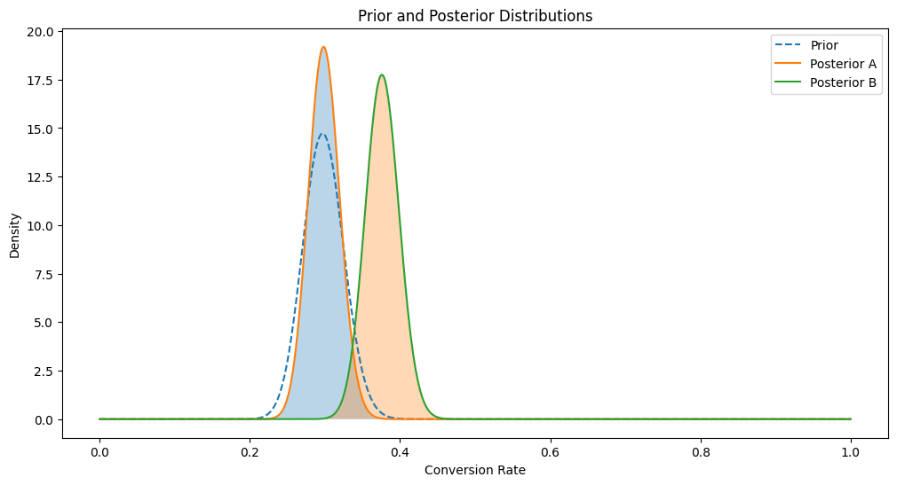

A friend of mine recently asked me for advice in preparing for an interview that required Bayesian statistics in Consulting. They asked me if I had done anything in Bayesian statistics. I decided to compile a list of representative projects that encapsulate the general idea of Bayesian statistics in consulting. These projects are rudimentary but could serve as a useful interview guide if needed!
# Exploring Bayesian Methods: From A/B Testing to Recommendation Engines

Bayesian methods are like the secret sauce of data science. They add a layer of sophistication to measuring the success of machine learning (ML) algorithms and proving their effectiveness. In this post, I’ll walk you through how Bayesian statistics have shaped my approach to A/B testing and recommendation engines. Whether you're a data science enthusiast or a seasoned pro, there’s something here for you!

## Bayesian A/B Testing: A Real-World Example

Imagine you’re working on a project for a large telecommunications company, and your goal is to build a recommendation engine. This engine needs to send automated product recommendations to customers every 15 days. To test whether your new machine learning-based recommendations outperform the traditional heuristic approach, you decide to run an A/B test.

### Measuring Success

In this scenario, we’re interested in measuring whether our recommendation engine performs better than the traditional method. We use a Bayesian approach to compare the click-through rates (CTR) of both methods. Click-through rate is a common metric that measures how often users click on the recommendations they receive.

We model the CTR using a beta distribution, which is parameterized by $\alpha$ (the number of clicks) and $\beta$ (the number of ignored recommendations). For both the new and traditional campaigns, we start with prior distributions:

$$ 
C_d = \text{beta}(\alpha_0, \beta_0) 
$$
$$ 
C_c = \text{beta}(\alpha_0, \beta_0) 
$$


```python
# Bayesian A/B Testing using Beta Distribution
import numpy as np
import matplotlib.pyplot as plt
from scipy.stats import beta

# 1. Introduction
print("Bayesian A/B Testing using Beta Distribution")

# 2. Setting Up the Experiment
# Let's say that we have two teams inside a marketing company. One of them (A) 
# uses business intelligence and marketing experience to recommend products to 
# customers, and the other team (B) uses machine learning to recommend products. 
# Given a recommendation, a customer can either accept (successes) or reject it. 
# Each team also gets a sample of customers they can expose their 
# recommendations to (trials).

# We have a binary outcome (success/failure) for variants A and B

# 3. Generating Synthetic Data
# Let's assume variant A has 200 trials with 60 successes, and variant B has 180 trials with 90 successes
data_A = {'successes': 60, 'trials': 200}
data_B = {'successes': 90, 'trials': 180}

```
### Choosing a Prior

Choosing the right prior for our Bayesian model was challenging. We had to match our new campaign against historical campaigns that were similar to ours and come up with appropriate values for $\alpha_0$ and $\beta_0$. This required some convincing, but ultimately, we got the client's approval.


```python
# 4. Prior Distribution
# From prior campaigns we know of a conversion rate that we can expect for 
# any campaign. This is of course can assumption, but in the marketing world, 
# conversion rates rarely look different, no matter how good your recommendations
# are. The industry rates will always look standard. 
# Use a uniform prior, Beta(10, 190)
alpha_prior = 85 # Let's say this is 85 conversions, per 285 trials
beta_prior = 200
```
### Updating Beliefs

Every 15 days, we collect new data and update our prior beliefs. The beta distribution is a conjugate prior, meaning its posterior distribution is also a beta distribution. Updating is straightforward:

$$ 
C_i = \text{beta}(\alpha_0 + \text{clicks}\_{t_0+15}, \beta + \text{ignored}_{t_0+15}) 
$$

This allows us to continuously refine our model as new data comes in.

```python
# 5. Likelihood and Posterior Distribution
# Update the posterior distribution with the data
alpha_post_A = alpha_prior + data_A['successes']
beta_post_A = beta_prior + data_A['trials'] - data_A['successes']

alpha_post_B = alpha_prior + data_B['successes']
beta_post_B = beta_prior + data_B['trials'] - data_B['successes']
```


### Simulating Results

To determine if our recommendation engine beats the traditional method, we simulate a pseudo p-value by drawing samples from the posterior. We check how often our recommendation engine outperforms the traditional one:

$$ 
E(I_{\theta^j_d> \theta^j_c}) = \sum_1^N I_{\theta^j_d> \theta^j_c} = P(\theta_d > \theta_c) 
$$

This tells us how frequently our engine's CTR exceeds the traditional method’s CTR.


```python
# 6. Posterior Predictive Checks
# Generate samples from the posterior distributions
# since the beta distribution is a conjugate prior, the posterior distribution 
# is also a beta distribution. We can find its parameters by adding the prior parameters.

samples_A = beta.rvs(alpha_post_A, beta_post_A, size=10000)
samples_B = beta.rvs(alpha_post_B, beta_post_B, size=10000)

# 7. Decision Making
# Calculate the probability that variant B is better than variant A
prob_B_better_than_A = np.mean(samples_B > samples_A)
print(f"Probability that variant B is better than variant A: {prob_B_better_than_A:.2f}")
```
### Conclusion

While complex measurement campaigns might signal trouble in some machine learning setups, our Bayesian approach showed promising results. Initially, our probability of outperforming the traditional method was 70%, which improved to 76%. This increase, combined with the ability to recommend high-margin products, demonstrated a tangible uplift due to our recommendation engine.



```python
# 8. Visualization
# Plot the prior and posterior distributions
x = np.linspace(0, 1, 1000)
prior = beta.pdf(x, alpha_prior, beta_prior)
posterior_A = beta.pdf(x, alpha_post_A, beta_post_A)
posterior_B = beta.pdf(x, alpha_post_B, beta_post_B)

plt.figure(figsize=(12, 6))
plt.plot(x, prior, label='Prior', linestyle='--')
plt.plot(x, posterior_A, label='Posterior A')
plt.plot(x, posterior_B, label='Posterior B')
plt.fill_between(x, 0, posterior_A, alpha=0.3)
plt.fill_between(x, 0, posterior_B, alpha=0.3)
plt.legend()
plt.xlabel('Conversion Rate')
plt.ylabel('Density')
plt.title('Prior and Posterior Distributions')
plt.show()
```
## Bayesian Recommendation Engines: Beyond A/B Testing

But Bayesian methods don’t stop at A/B testing. They also play a significant role in recommendation engines. Here’s how:

### Online Recommendation Engine

Imagine creating an online recommendation engine for various products using Bayesian methods. Here the word online should be taken to mean, continuously updating, as opposed to one-shot or static recommendation engines that do not inherently have a mechanism to update to changing data, without re-running the model. Let’s say you have a click-through rate for a free data product, modeled with a beta distribution:

$$
\text{beta}(\alpha = \text{free data}, \beta = \text{other})
$$

Each time a user interacts with a product, we sample from the beta distribution. The sampled values are sorted and displayed to the customer. As users interact with different products, the beta distributions are updated, making it more likely that relevant products are shown.

### Bayesian Matrix Factorization with Side Information

Bayesian Matrix Factorization (BMF) with side information is a powerful extension of traditional matrix factorization. It incorporates additional context about users and items to improve recommendations. Here’s a breakdown:

#### Likelihood Function

The likelihood function models the probability of observing user-item interactions given latent factors:

$$
R_{ij} \sim \mathcal{N}(U_i^T V_j, \sigma^2)
$$

where $ U_i $ and $ V_j $ are latent factor vectors for users and items, respectively.

#### Prior Distributions

We assume Gaussian prior distributions for the latent factors:

$$
U_i \sim \mathcal{N}(\mu_u, \Lambda_u^{-1})
$$
$$
V_j \sim \mathcal{N}(\mu_v, \Lambda_v^{-1})
$$

#### Incorporating Side Information

Side information about users and items is integrated by conditioning the prior distributions:

$$
U_i \sim \mathcal{N}(W_u^T X_i, \Lambda_u^{-1})
$$
$$
V_j \sim \mathcal{N}(W_v^T Y_j, \Lambda_v^{-1})
$$

#### Posterior Distribution

The posterior distribution of the latent factors given the observed data and side information is derived using Bayes’ theorem:

$$
p(U, V \mid R, X, Y) \propto p(R \mid U, V) p(U \mid X) p(V \mid Y)
$$

Approximate inference methods like Variational Inference or MCMC are used to estimate these factors.

### Main Equation Summary

The core Bayesian matrix factorization model with side information can be summarized as:

$$
p(R, U, V \mid X, Y) = p(R \mid U, V) p(U \mid X) p(V \mid Y)
$$

This model integrates additional context into the matrix factorization process, enhancing the accuracy and robustness of the recommendation system.

## Conclusion

Bayesian methods offer a versatile toolkit for data scientists, enhancing both A/B testing and recommendation engines. As computational constraints lessen, Bayesian approaches are gaining traction. I’m always eager to explore new use cases and dive deeper into the specifics of applying these methods in different scenarios. If you have a challenging problem or an interesting use case, I’d love to hear about it!
