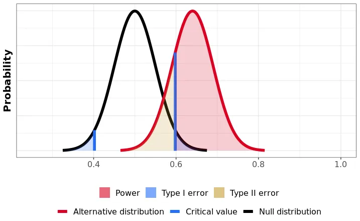
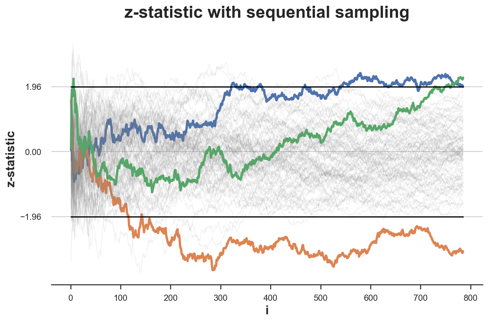
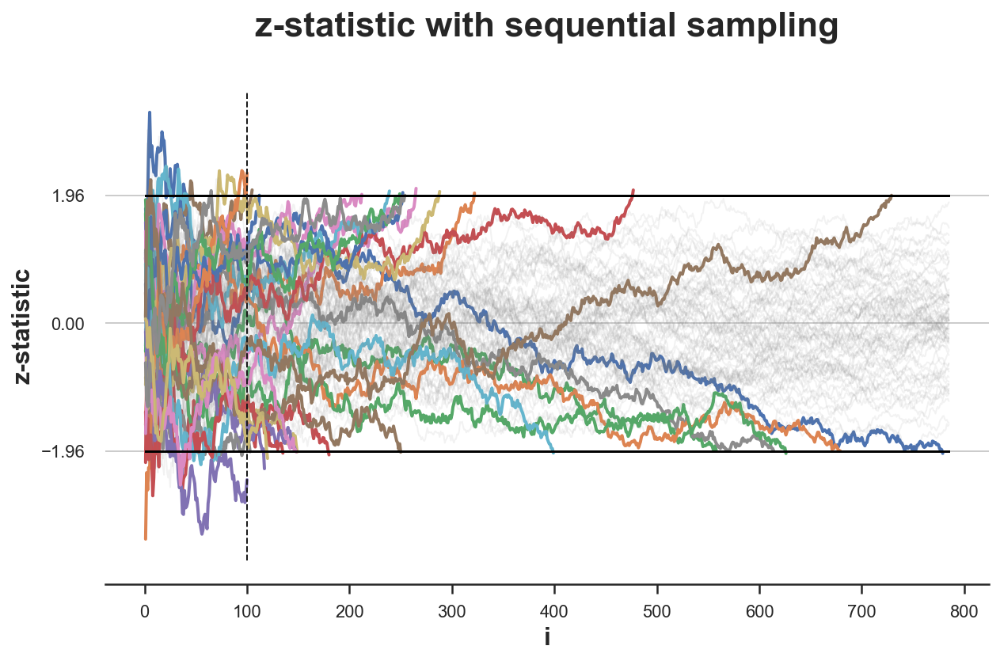
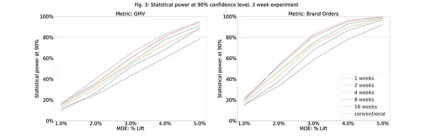

# Introduction

Although I've focused much more on the ML side of consulting projects—and I really enjoy it—I've often had to dust off my statistician hat to measure how well the algorithms I build actually perform. Most of my experience in this area has been in verifying that recommendation engines, once deployed, truly deliver value. In this article, I'll explore some key themes in AB Testing, though I'll leave out the specifics of assessing recommendation engines.

I thoroughly enjoy the "measurement science" behind these challenges; it's a great reminder that classic statistics is far from obsolete. In practice, it also lets us make informed claims based on simulations, even if formal proofs aren't immediately available. I've also included some helpful simulations.

# Basic Structure of AB Testing

AB Testing begins on day zero, often in a room full of stakeholders, where your task is to prove that your recommendation engine, feature (like a new button), or pricing algorithm really works. Here, the focus shifts from the predictive power of machine learning to the causal inference side of statistics. (Toward the end of this article, I’ll also touch briefly on causal inference within the context of ML.)

# Phase 1: Experimental Context

- **Define the feature under analysis** and evaluate whether AB testing is necessary. Sometimes, if a competitor is already implementing the feature, testing may not be essential; you may simply need to keep pace.

- **Establish a primary metric of interest.** In consulting projects, this metric often aligns closely with engagement fees, so it's critical to define it well.

- **Identify guardrail metrics**—these are typically independent of the experiment (e.g., revenue, profit, total rides, wait time) and represent key business metrics that should not be negatively impacted by the test.

- **Set a null hypothesis,** $H_0$ (usually representing a zero effect size on the main metric). Consider what would happen without the experiment, which may involve using non-ML recommendations or an existing ML recommendation in recommendation engine contexts.

- **Specify a significance level,** $\alpha$, which is the maximum probability of rejecting the null hypothesis when it is true, commonly set at 0.05. This value is conventional but somewhat arbitrary, and it’s challenging to justify because humans often struggle to assign accurate probabilities to risk.

- **Define the alternative hypothesis,** $H_1$, indicating the minimum effect size you hope to observe. For example, in a PrimeTime pricing experiment, you’d specify the smallest expected change in your chosen metric, such as whether rides will increase by hundreds or by 1%. This effect size is generally informed by prior knowledge and reflects the threshold at which the feature becomes worthwhile.

- **Choose a power level,** $1 - \beta$, usually set to 0.8. This means there is at least an 80% chance of rejecting the null hypothesis when $H_1$ is true.

- **Select a test statistic** with a known distribution under both hypotheses. The sample average of the metric of interest is often a good choice.

- **Determine the minimum sample size** required to achieve the desired power level $1 - \beta$ with all given parameters.

Before proceeding, it’s crucial to recognize that many choices, like those for $\alpha$ and $\beta$, are inherently subjective. Often, these parameters are predefined by an existing statistics or measurement science team, and a "Risk" team may also weigh in to ensure the company’s risk profile remains stable. For instance, if you’re testing a recommendation engine, implementing a new pricing algorithm, and cutting costs simultaneously, the risk team might have input on how much overall risk the company can afford. This subjectivity often makes Bayesian approaches appealing, driving interest in a Bayesian perspective for AB Testing.

# Phase 2: Experiment Design

With the treatment, hypothesis, and metrics established, the next step is to define the unit of randomization for the experiment and determine when each unit will participate. The chosen unit of randomization should allow accurate measurement of the specified metrics, minimize interference and network effects, and account for user experience considerations.The next couple of sections will dive deeper into certain considerations when designing an experiment, and how to statistically overcome them. In a recommendation engine context, this can be quite complex, since both treatment and control groups share the pool of products, it is possible that increased purchases from the online recommendation can cause the stock to run out for in person users. So control group purchases of competitor products could simply be because the product was not available and the treatment was much more effective than it seemed.

# Unit of Randomization and Interference

Now that you have approval to run your experiment, you need to define the unit of randomization. This can be tricky because often there are multiple levels at which randomization can be carried out for example, you can randomize your app experience by session, you could also randomize it by user. This leads to our first big problem in AB testing. What is the best unit of randomization and what are the pitfalls of picking the wrong unit.

## Example of Interference

Interference is a huge problem in recommendation engines for most retail problems. Let me walk you through an interesting example we saw for a large US retailer. We were testing whether a certain (high margin product) was being recommended to users. The treatment group was shown the product and the control group was not. The metric of interest was the number of purchases of a basket of high margin products. The control group purchased the product at a rate of $\tau_0\%$ and the treatment group purchased the product at a rate of $\tau_t\%$. The experiment was significant at the $0.05$ level. However, after the experiment we noticed that the difference in sales closed up to $\tau_t - \tau_0 = \delta\%$. This was because the treatment group was buying up the stock of the product and the control group was not, because the act of being recommended the product was kind of treatment in itself. This is a classic example of interference. This is a good reason to use a formal causal inference framework to measure the effect of the treatment. One way to do this is DAGs, which I will discuss later. The best way to run an experiment like this is to randomize by region. However, this is not always possible since regions share the same stock. But I think you get the idea.

## Robust Standard Errors in AB Tests

You can fix interference by clustering at the region level but very often this leads to another problem of its own. The unit of treatment allocation is now fundamentally bigger than the unit at which you are conducting the analysis. We do not really recommend products at the store level, we recommend products at the user level. So while we assign treatment and control at the store level we are analyzing effects at the user level. As a consequence we need to adjust our standard errors to account for this. This is where robust standard errors come in. In such a case, the standard errors you calculate for the average treatment effect are
*lower* than what they truly are. And this has far-reaching effects for power, effect size and the like.

Recall, the variance of the OLS estimator
$$\text{Var}(\hat \beta) = (X’X)^{-1} X’ \epsilon \epsilon’ X (X’X)^{-1}$$

You can analyze the variance matrix under various assumptions to estimate, $$\epsilon \epsilon’ = \Omega$$

Under homoscedasticity,

$$\Omega = \begin{bmatrix} \sigma^2 & 0 & \dots & 0 & 0 \\\\ 0 & \sigma^2 & \dots & 0 & 0 \\\\ \vdots & & \ddots & & \vdots \\\\ 0 & 0 & \dots & \sigma^2 & 0 \\\\ 0 & 0 & \dots & 0 & \sigma^2 \\\\ \end{bmatrix} = \sigma^2 I_n$$

Under heteroscedasticity (Heteroscedastic robust standard errors),

$$\Omega = \begin{bmatrix} \sigma^2_1 & 0 & \dots & 0 & 0 \\\\ 0 & \sigma^2_2 & & 0 & 0 \\\\ \vdots & & \ddots & & \vdots \\\\ 0 & 0 & & \sigma^2_{n-1} & 0 \\\\ 0 & 0 & \dots & 0 & \sigma^2_n \\\\ \end{bmatrix}$$

And finally under clustering, $$\Omega = \begin{bmatrix} \epsilon_1^2 & \epsilon_1 \epsilon_2 & 0 & 0 & \dots & 0 & 0 \\\\ \epsilon_1 \epsilon_2 & \epsilon_2^2 & 0 & 0 & & 0 & 0 \\\\ 0 & 0 & \epsilon_3^2 & \sigma^2_{34} & & 0 & 0 \\\\ 0 & 0 & \sigma^2_{34} & \epsilon_3^2 & & 0 & 0 \\\\ \vdots & & & & \ddots & & \vdots \\\\ 0 & 0 & 0 & 0 & & \epsilon_{n-1}^2 & \sigma^2_{n-1,n} \\\\ 0 & 0 & 0 & 0 & \dots & \sigma^2_{n-1,n} & \epsilon_n^2 \\\\ \end{bmatrix}$$

The cookbook, for estimating $\Omega$ is therefore multiplying your matrix $\epsilon\epsilon'$ with some kind of banded matrix that represents your assumption $C$,

$$\Omega = C\epsilon \epsilon'= \begin{bmatrix} 1 & 1 & 0 & 0 & \dots & 0 & 0 \\\\ 1 & 1 & 0 & 0 & \dots & 0 & 0 \\\\ 0 & 0 & 1 & 1 & \dots & 0 & 0 \\\\ 0 & 0 & 1 & 1 & \dots & 0 & 0 \\\\ \vdots & \vdots & \vdots & \vdots & \ddots & \vdots & \vdots \\\\ 0 & 0 & 0 & 0 & \dots & 1 & 1 \\\\ 0 & 0 & 0 & 0 & \dots & 1 & 1 \\\\ \end{bmatrix} \begin{bmatrix} \sigma_1^2 & \sigma_{12} & \sigma_{13} & \dots & \sigma_{1n} \\\\ \sigma_{12} & \sigma_2^2 & \sigma_{23} & \dots & \sigma_{2n} \\\\ \sigma_{13} & \sigma_{23} & \sigma_3^2 & \dots & \sigma_{3n} \\\\ \vdots & \vdots & \vdots & \ddots & \vdots \\\\ \sigma_{1n} & \sigma_{2n} & \sigma_{3n} & \dots & \sigma_n^2 \\\\ \end{bmatrix}$$

## Range of Clustered Standard Errors

$$\hat{\text{Var}}(\hat{\beta}) = \sum_{g=1}^G \sum_{i=1}^{n_g} \sum_{j=1}^{n_g} \epsilon_i, \epsilon_j$$

$$\hat{\text{Var}}(\hat{\beta}) \in [ \sum_{i} \epsilon_i^2, \sum_{g} n_g^2 \epsilon_g^2]$$

Where the left boundary is where no clustering occurs and all errors are independent and the right boundary is where the clustering is very strong but variance between clusters is zero. It is fair to ask, why we need to multiply by a matrix of assumptions $C$ at all, the answer is that the assumptions scale the error to tolerable levels, such that the error is not too large or too small. By pure coincidence, it is possible to have high covariance between any two observations, whether to include it or not is predicated by your assumption matrix $C$.

# Power Analysis

I have found that power analysis is an overlooked part of AB Testing, in Consulting you will probably have to work with the existing experimentation team to make sure the experiment is powered correctly. There is usually some amount of haggling and your tests are likely to be underpowered. There is a good argument to be made about overpowering your tests (such a term does not exist in statistics, who would complain about that), but this usually comes with some risk to guardrail metrics, thus you are likely to under power your tests when considering a guardrail metric. This is OKAY, because remember the $0.05$ level is a convention, and the $0.8$ power level is also a convention that by definition err on the side of NOT rejecting the null. So if you see an effect with an underpowered test you do have some latitude to make a claim while reduce the significance level of your test.

Power analysis focuses on reducing the probability of accepting the null hypothesis when the alternative is true. To increase the power of an A/B test and reduce false negatives, three key strategies can be applied:

- Effect Size: Larger effect sizes are easier to detect. This can be achieved by testing bold, high-impact changes or trying new product areas with greater potential for improvement. Larger deviations from the baseline make it easier for the experiment to reveal significant effects.

- Sample Size: Increasing sample size boosts the test's accuracy and ability to detect smaller effects. With more data, the observed metric tends to be closer to its true value, enhancing the likelihood of detecting genuine effects. Adding more participants or reducing the number of test groups can improve power, though there's a balance to strike between test size and the number of concurrent tests.

- Reducing Metric Variability: Less variability in the test metric across the sample makes it easier to spot genuine effects. Targeting a more homogeneous sample or employing models that account for population variability helps reduce noise, making subtle signals easier to detect.

Finally, experiments are often powered at 80% for a postulated effect size --- enough to detect meaningful changes that justify the new feature's costs or improvements. Meaningful effect sizes depend on context, domain knowledge, and historical data on expected impacts, and this understanding helps allocate testing resources efficiently.

In an A/B test, the power of a test (the probability of correctly detecting a true effect) is influenced by the effect size, sample size, significance level, and pooled variance. The formula for power,
$1 - \beta$, can be approximated as follows for a two-sample test:

$$
\text{Power} = \Phi \left( \frac{\Delta - z_{1-\alpha/2} \cdot \sigma_{\text{pooled}}}{\sigma_{\text{pooled}} / \sqrt{n}} \right)
$$

Where,

- $\Delta$ is the **Minimum Detectable Effect (MDE)**, representing the smallest effect size we aim to detect.

- $z_{1-\alpha/2}$ is the critical z-score for a significance level
  $\alpha$ (e.g., 1.96 for a 95% confidence level).

- $\sigma_{\text{pooled}}$ is the **pooled standard deviation
  ** of the metric across groups, representing the combined variability.

- $n$ is the **sample size per group**.

- $\Phi$ is the **cumulative distribution function
  ** (CDF) of the standard normal distribution, which gives the probability that a value is below a given z-score.

## Understanding the Role of Pooled Variance

- **Power decreases** as the **pooled variance**
  ($\sigma_{\text{pooled}}^2$) increases. Higher variance increases the \"noise\" in the data, making it more challenging to detect the effect (MDE) relative to the variation.

- When **pooled variance is low
  **, the test statistic (difference between groups) is less likely to be drowned out by noise, so the test is more likely to detect even smaller differences. This results in
  **higher power** for a given sample size and effect size.

## Practical Implications

In experimental design:

- Reducing $\sigma_{\text{pooled}}$ (e.g., by choosing a more homogeneous sample) improves power without increasing sample size.

- If $\sigma_{\text{pooled}}$ is high due to natural variability, increasing the sample size $n$ compensates by lowering the standard error $\left(\frac{\sigma_{\text{pooled}}}{\sqrt{n}}\right)$, thereby maintaining power.

# Difference in Difference

Randomizing by region to solve interference can create a new issue: regional trends may bias results. If, for example, a fast-growing region is assigned to the treatment, any observed gains may simply reflect that region’s natural growth rather than the treatment's effect.

In recommender system tests aiming to boost sales, retention, or engagement, this issue can be problematic. Assigning a growing region to control and a mature one to treatment will almost certainly make the treatment group appear more effective, potentially masking the true impact of the recommendations.

## Linear Regression Example of DiD

To understand the impact of a new treatment on a group, let's consider an example where everyone in group $G$ receives a treatment at time $t_e$. Our goal is to measure how this treatment affects outcomes over time.

First, we'll introduce some notation:

Define $\mathbb{1}_A(x)$, which indicates if $x$ belongs to a specific set $A$:

Let $T = \{t : t > t_e\}$, which represents the period after treatment. We can use this to set up a few key indicators:

-   $\mathbb{1}_{T(t)} = 1$ if the time $t$ is after the treatment, and $0$ otherwise.
-   $\mathbb{1}_{G(i)} = 1$ if an individual $i$ is in group $G$, meaning they received the treatment.
-   if they are both $1$ then they refer to those in the treatment group during the post-treatment period.

Using these indicators, we can build a simple linear regression model:

$$
y_{it} = \beta_0 + \beta_1 \mathbb{1}_{T(t)} + \beta_2 \mathbb{1}_{G(i)} + \beta_3 \mathbb{1}_{T(t)} \mathbb{1}_{G(i)}+ \epsilon_{it}
$$

In this model, the coefficient $\beta_3$ is the term we're most interested in. It represents the Difference-in-Differences (DiD) effect: how much the treatment group's outcome changes after treatment compared to the control group's change in the same period. In other words, $\beta_3$ provides a clearer picture of the treatment's direct impact, isolating it from other factors.

For this model to work reliably, we rely on the *parallel trends assumption*: the control and treatment groups would have followed similar paths over time if there had been no treatment. Although the initial levels of $y_{it}$ can differ between groups, they should trend together in the absence of intervention.

## Testing the Parallel Trends Assumption

You can always test whether your data satisfies the parallel trends assumption by looking at it. In a practical environment, I have never really tested this assumption, for two big reasons (it is also why I personally think DiD is not a great method):

- If you need to test an assumption in your data, you are likely to have a problem with your data. If it is not obvious from some non-statistical argument or plot etc you are unlikely to be able to convince a stakeholder that it is a good assumption.
- The data required to test this assumption, usually invalidates its need. If you have data to test this assumption, you likely have enough data to run a more sophisticated model than DiD (like CUPED).

Having said all that, here are some ways you can test the parallel trends assumption:

- **Visual Inspection:**

    - Plot the average outcome variable over time for both the treatment and control groups, focusing on the pre-treatment period. If the trends appear roughly parallel before the intervention, this provides visual evidence supporting the parallel trends assumption.

    - Make sure any divergence between the groups only occurs after the treatment.

- **Placebo Test:**

    - Pretend the treatment occurred at a time prior to the actual intervention and re-run the DiD analysis. If you find a significant "effect" before the true treatment, this suggests that the parallel trends assumption may not hold.

    - Use a range of pre-treatment cutoff points and check if similar differences are estimated. Consistent non-zero results may indicate underlying trend differences unrelated to the actual treatment.

- **Event Study Analysis (Dynamic DiD):**

    - Extend the DiD model by including lead and lag indicators for the treatment. 

    - If pre-treatment coefficients (leads) are close to zero and non-significant, it supports the parallel trends assumption. Large or statistically significant leads could indicate violations of the assumption.

- **Formal Statistical Tests:**

    - Run a regression on only the pre-treatment period, introducing an interaction term between time and group to test for significant differences in trends:

    - If the coefficient $\alpha_3$ on the interaction term is close to zero and statistically insignificant, this supports the parallel trends assumption. A significant $\alpha_3$ would indicate a pre-treatment trend difference, which would challenge the assumption.

- **Covariate Adjustment (Conditional Parallel Trends):**

    - If parallel trends don't hold unconditionally, you might adjust for observable characteristics that vary between groups and influence the outcome. This is a more relaxed "conditional parallel trends" assumption, and you could check if trends are parallel after including covariates in the model.

If you can make all this work for you, great, I never have. In the dynamic world of recommendation engines (especially always ''online'' recommendation engines) it is very difficult to find a reasonably good cut-off point for the placebo test. And the event study analysis is usually not very useful since the treatment is usually ongoing.

# Peeking and Early Stopping

Your test is running, and you’re getting results—some look good, some look bad. Let’s say you decide to stop early and reject the null hypothesis because the data looked good. What could happen? Well, you shouldn’t. In short, you’re changing the power of the test. A quick simulation can show the difference: with early stopping or peeking, your rejection rate of the null hypothesis is much higher than the 0.05 you intended. This isn’t surprising since increasing the sample size raises the chance of rejecting the null when it’s true.

The benefits of early stopping aren’t just about self-control. It can also help prevent a bad experiment from affecting critical guardrail metrics, letting you limit the impact while still gathering needed information. Another example is when testing expendable items. Think about a magazine of bullets: if you test by firing each bullet, you’re guaranteed they all work—but now you have no bullets left. So you might rephrase the experiment as, How many bullets do I need to fire to know this magazine works?

In consulting you are going to peek early, you have to live with it. For one reason or another, a bug in production, an eager client whatever the case, you are going to peek, so you better prepare accordingly.

#### Simulated Effect of Peeking on Experiment Outcomes

|         |  |
|---------------------------------------------------------------------|----------------------------------------------------------------------|
| **(a) Without Peeking:** $\frac{3}{100}$ reject null, $\alpha=0.05$ | **(b) With Peeking:** $\frac{29}{100}$ reject null, $\alpha=0.05$    |

Under a given null hypothesis, we run 100 simulations of experiments and record the z-statistic for each. We do this once without peeking and let the experiments run for $1000$ observations. In the peeking case, we stop whenever the z-statistic crosses the boundary but only after $100$th observation.

# Sequential Testing for Peeking

The Sequential Probability Ratio Test (SPRT) compares the likelihood ratio at the $n$-th observation, given by:

$$\Lambda_n = \frac{L(H_1 \mid x_1, x_2, \dots, x_n)}{L(H_0 \mid x_1, x_2, \dots, x_n)}$$

where $L(H_0 \mid x_1, x_2, \dots, x_n)$ and $L(H_1 \mid x_1, x_2, \dots, x_n)$ are the likelihood functions under the null hypothesis $H_0$ and the alternative hypothesis $H_1$, respectively.

The test compares the likelihood ratio to two thresholds, $A$ and $B$, and the decision rule is:

$$\text{If } \Lambda_n \geq A, \text{ accept } H_1,$$ $$\text{If } \Lambda_n \leq B, \text{ accept } H_0,$$ $$\text{If } B < \Lambda_n < A, \text{ continue sampling}.$$

The thresholds $A$ and $B$ are determined based on the desired error probabilities. For a significance level $\alpha$ (probability of a Type I error) and power $1 - \beta$ (probability of detecting a true effect when $H_1$ is true), the thresholds are given by:

$$A = \frac{1 - \beta}{\alpha}, \quad B = \frac{\beta}{1 - \alpha}.$$

### Normal Distribution

This test is in practice a lot easier to carry out for certain distributions like the normal distribution, assume an unknown mean $\mu$ and known variance $\sigma^2$

$$\begin{aligned} H_0: \quad & \mu = 0 , \\ H_1: \quad & \mu = 0.1 \end{aligned}$$

$$\mathcal L(\mu) = \left( \frac{1}{\sqrt{2 \pi} \sigma } \right)^n e^{- \sum_{i=1}^{n} \frac{(X_i - \mu)^2}{2 \sigma^2}}$$

$$\Lambda(X) = \frac{\mathcal L (0.1, \sigma^2)}{\mathcal L (0, \sigma^2)} = \frac{e^{- \sum_{i=1}^{n} \frac{(X_i - 0.1)^2}{2 \sigma^2}}}{e^{- \sum_{i=1}^{n} \frac{(X_i)^2}{2 \sigma^2}}}$$

The sequential rule becomes the recurrent sum, $S_i$ (with $S_0=0$) $$S_{i} = S_{i-1} + \log(\Lambda_{i})$$

With the stopping rule

- $S_i \geq b$ : Accept $H_1$

- $S_i\geq a$ : Accept $H_0$

- $a<S_i<b$ : continue

$a \approx \log {\frac {\beta }{1-\alpha }} \quad \text{and} \quad  b \approx \log {\frac {1-\beta }{\alpha }}$

There is another elegant method outlined in Evan Miller's blog post, which I will not go into here but just state it for brevity (it is also used at Etsy, so there is certainly some benefit to it). It is a very good read and I highly recommend it.

- At the beginning of the experiment, choose a sample size $N$.
- Assign subjects randomly to the treatment and control, with 50% probability each.
- Track the number of incoming successes from the treatment group. Call this number $T$.
- Track the number of incoming successes from the control group. Call this number $C$.
- If $T−C$ reaches $2\sqrt{N}$, stop the test. Declare the treatment to be the winner.
- If $T+C$ reaches $N$, stop the test. Declare no winner.
- If neither of the above conditions is met, continue the test.

Using these techniques you can "peek" at the test data as it comes in and decide to stop as per your requirement. This is very useful as the following simulation using this more complex criteria shows. Note that what you want to verify is two things,

- Does early stopping under the null hypothesis, accept the null in approximately $\alpha$ fraction of simulations once the stopping criteria is reached and does it do so
  *fast*.

- Does early stopping under the alternative reject the null hypothesis in $1-\beta$ fraction of simulations and does it do so
  *fast*.

The answer to these two questions is not always symmetrical, and it seems that we need more samples to reject the null (case 2) versus accept it case 1. Which is as it should be! But in both cases, as the simulations below show, you need a significantly fewer number of samples than before.

## CUPED and Other Similar Techniques

Recall, our diff-in-diff equation, $$Y_{i,t} = \alpha + \beta D_i + \gamma \mathbb I (t=1) + \delta D_i * \mathbb I (t=1) + \varepsilon_{i,t}$$

Diff in Diff is nothing but CUPED for $\theta=1$. I state this without proof. I was not able to find a clear one any where.

Consider the auto-regression with control variates regression equation, $$Y_{i, t=1} = \alpha + \beta D_i + \gamma Y_{i, t=0} + \varepsilon_i$$ This is also NOT equivalent to CUPED, nor is it a special case. Again, I was not able to find a good proof anywhere.

# Multiple Hypotheses

In most of the introduction, we set the scene by considering only one hypotheses. However, in real life you may want to test multiple hypotheses at the same time.

- You may be testing multiple hypotheses even if you did not realize it, such as over time. In the example of early stopping you are actually checking multiple hypotheses. One at every time point.

- You truly want to test multiple features of your product at the same time and want to run one test to see if the results got better.

## Regression Model Setup

We consider a regression model with three treatments, $D_1$, $D_2$, and $D_3$, to study their effects on a continuous outcome variable, $Y$. The model is specified as: $$Y = \beta_0 + \beta_1 D_1 + \beta_2 D_2 + \beta_3 D_3 + \epsilon$$ where:

- $Y$ is the outcome variable,

- $D_1$, $D_2$, and $D_3$ are binary treatment indicators (1 if the treatment is applied, 0 otherwise),

- $\beta_0$ is the intercept,

- $\beta_1$, $\beta_2$, and $\beta_3$ are the coefficients representing the effects of treatments $D_1$, $D_2$, and $D_3$, respectively,

- $\epsilon$ is the error term, assumed to be normally distributed with mean 0 and variance $\sigma^2$.

## Hypotheses Setup

We aim to test whether each treatment has a significant effect on the outcome variable $Y$. This involves testing the null hypothesis that each treatment coefficient is zero.

The null hypotheses are formulated as follows: $$H_0^{(1)}: \beta_1 = 0$$ $$H_0^{(2)}: \beta_2 = 0$$ $$H_0^{(3)}: \beta_3 = 0$$

Each null hypothesis represents the assumption that a particular treatment (either $D_1$, $D_2$, or $D_3$) has no effect on the outcome variable $Y$, implying that the treatment coefficient $\beta_i$ for that treatment is zero.

## Multiple Hypothesis Testing

Since we are testing three hypotheses simultaneously, we need to control for the potential increase in false positives. We can use a multiple hypothesis testing correction method, such as the
**Bonferroni correction** or the **Benjamini-Hochberg procedure**.

## Bonferroni Correction

With the Bonferroni correction, we adjust the significance level $\alpha$ for each hypothesis test by dividing it by the number of tests $m = 3$. If we want an overall significance level of $\alpha = 0.05$, then each individual hypothesis would be tested at: $$\alpha_{\text{adjusted}} = \frac{\alpha}{m} = \frac{0.05}{3} = 0.0167$$

## Benjamini-Hochberg Procedure

Alternatively, we could apply the Benjamini-Hochberg procedure to control the False Discovery Rate (FDR). The procedure involves sorting the p-values from smallest to largest and comparing each p-value $p_i$ with the threshold: $$p_i \leq \frac{i}{m} \cdot \alpha$$ where $i$ is the rank of the p-value and $m$ is the total number of tests. We declare all hypotheses with p-values meeting this criterion as significant. This framework allows us to assess the individual effects of $D_1$, $D_2$, and $D_3$ while properly accounting for multiple hypothesis testing.

# Variance Reduction: CUPED

When analyzing the effectiveness of a recommender system, sometimes your metrics are skewed by high variance in the metric i.e. $Y_i$. One easy way to fix this is by using the usual outlier removal suite of techniques. However, outlier removal is a difficult thing to statistically define, and very often you may be losing "whales". Customers who are truly large consumers of a product. One easy way to do this would be to normalize the metric by its mean, i.e. $Y_i = \frac{Y_i}{\bar Y}$. Any even better way to do this would be to normalize the metric by that users own mean, i.e. $Y_i = \frac{Y_i}{\bar Y_i}$. This is the idea behind CUPED.

Consider, the regression form of the treatment equation,
$$Y_{i, t=1} = \alpha + \beta D_i + \varepsilon_i$$

Assume you have data about the metric from before, and have values $Y_{i,t=0}$. Where the subscript denoted the $i$ individuals outcome, before the experiment was even run, $t=1$.

$$
\hat Y^{cuped}\_{t=1} = \theta\bar Y_{t=0} + \theta \mathbb E [Y_{t=0} ]
$$

This is like running a regression of $Y_{t=1}$ on $Y_{t=0}$.

$$
Y\_{i, t=1} = \theta Y_{i, t=0} + \hat Y^{cuped}_{i, t=1}
$$
Now, use those residuals in the treatment equation above,

$$
\hat Y^{cuped}_{i, t=1} = \alpha + \beta D_i + \varepsilon_i
$$

And then estimate the treatment effect.

The statistical theory behind CUPED is fairly simple and setting up the regression equation is not difficult. However, in my experience, choosing the right window for pre-treatment covariates is extremely difficult, choose the right window and you reduce your variance by a lot. The right window depends a lot on your business. Some key considerations,

- Sustained purchasing behavior is a key requirement. If the $Y_{t=0}$ is not a good predictor of $Y_{t=1}$ for the interval $t=0$ to $t=1$ then the variance of $Y^{cuped}$ will be high. Defeating the purpose.
- Longer windows come with computational costs.
- In practice, because companies are testing things all the time you could have noise left over from a previous experiment that you need to randomize/ control for.

## Simulating CUPED

One way you can guess a good pre-treatment window is by simulating the treatment effect for various levels of MDEs (the change you expect to see in $Y_i$) and plot the probability of rejecting the alternative hypothesis if it is true i.e. Power.

So you read off your hypothesized MDE and Power, and then every point to the left of that is a good window. As an example, lets say you know your MDE to be $3\%$ and you want a power of $0.8$, then your only option is the 16 week window. Analogously, if you have an MDE of $5\%$ and you want a power of $0.8$, then the conventional method (with no CUPED) is fine as you can attain an MDE of $4\%$ with a power of $0.8$. Finally, if you have an MDE of $4\%$ and you want a power of $0.8$ then a 1 week window is fine.

Finally, you can check that you have made the right choice by plotting the variance reduction factor against the pre-period (weeks) and see if the variance reduction factor is high.

CUPED is a very powerful technique, but if I could give one word of advice to anyone trying to do it, it would be this:
_get the pre-treatment window
right_. This has more to do with business intelligence than with statistics. In this specific example longer windows gave higher variance reduction, but I have seen cases where a "sweet spot" exists.

# Variance Reduction: CUPAC

As it turns out we can control variance, by other means using the same principle as CUPED. The idea is to use a control variate that is not a function of the treatment. Recall, the regression equation we ran for CUPED, $$
Y\_{i, t=1} = \theta Y_{i, t=0} + \hat Y^{cuped}_{i, t=1}
$$ Generally speaking, this is often posed as finding some $X$ that is uncorrelated with the treatment but correlated with $Y$.

$$
Y\_{i, t=1} = \theta X_{i, t=0} + \hat Y^{cuped}_{i, t=1}
$$

You could use
*any* $X$ that is uncorrelated with the treatment but correlated with $Y$. An interesting thing to try would be to fit a highly non-linear machine learning model to $Y_t$ (such as random forest, XGBoost) using a set of observable variables $Z_t$, call it $f(Z_t)$. Then use $f(Z_t)$ as your $X$.

$$
Y\_{i, t=1} = \theta f(Z_{i,t=1}) + \hat Y^{cuped}_{i, t=1}
$$

Notice here two things, - that $f(Y)$ is not a function of $D_i$ but is a function of $Y_i$. - that $f(Z)$ does not (necessarily) need any data from $t=0$ to be calculated, so it is okay, if
*no pre-treatment data
exists*! - if pre-treatment data exists then you can use it to fit $f(Z)$ and then use it to predict $Y$ at $t=1$ as well, so it can only enhance the performance of your fit and thereby reduce variance even more.

If you really think about it, any process to create pre-treatment covariates inevitably involves finding some $X$ highly correlated with outcome and uncorrelated with treatment and controlling for that. In CUPAC we just dump all of that into one ML model and let the model figure out the best way to control for variance using all the variables we threw in it.

I highly recommend CUPAC over CUPED, it is a more general technique and can be used in a wider variety of situations. If you really want to, you can throw $Y_{t=0}$ into the mix as well!

## A Key Insight: Recommendation Engines and CUPAC/ CUPED

Take a step back and think about what $f(Z)$ is
*really* saying in context of a recommender system, it is saying given some $Z$ can I predict my outcome metric. Let us say the outcome metric is some $G(Y)$, where $Y$ is sales.

$$
G(Y) = G(f(Z)) + \varepsilon
$$

What is a recommender system? It takes some $Z$ and predicts $Y$.

$$
\hat Y = r(Z) + \varepsilon'
$$

$$
G(\hat Y) = G(r(Z)) + \varepsilon''
$$

This basically means that a pretty good function to control for variance is a recommender system itself! Now you can see why CUPAC is so powerful, it is a way to control for variance using a recommender system itself. You have all the pieces ready for you. HOWEVER! You cannot use the recommender system you are currently testing as your $f(Z)$, that would be mean that $D_i$ is correlated with $f(Z)$ and that would violate the assumption of uncorrelatedness. Usually, the existing recommender system (the pre-treatment one) can be used for this purpose. The finally variable $Y^{cupac}$ then has a nice interpretation it is not the difference between what people
*truly* did and the recommended value, but rather the difference between the two recommender systems! Any model is a variance reduction model, it is just a question of how much variance it reduces. Since the existing recommender system is good enough it is likely to reduce a lot of variance. If it is terrible (which is why they hired you in the first place) then this approach is unlikely to work. But in my experience, existing recommendations are always pretty good in the industry it is a question of finding those last few drops of performance increase.

# Conclusion

The above are pretty much all you can expect to find 