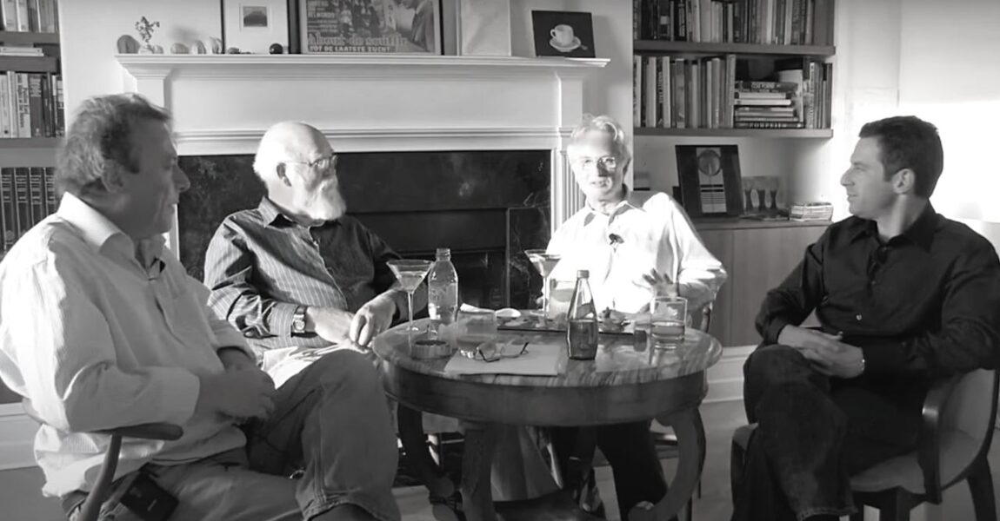
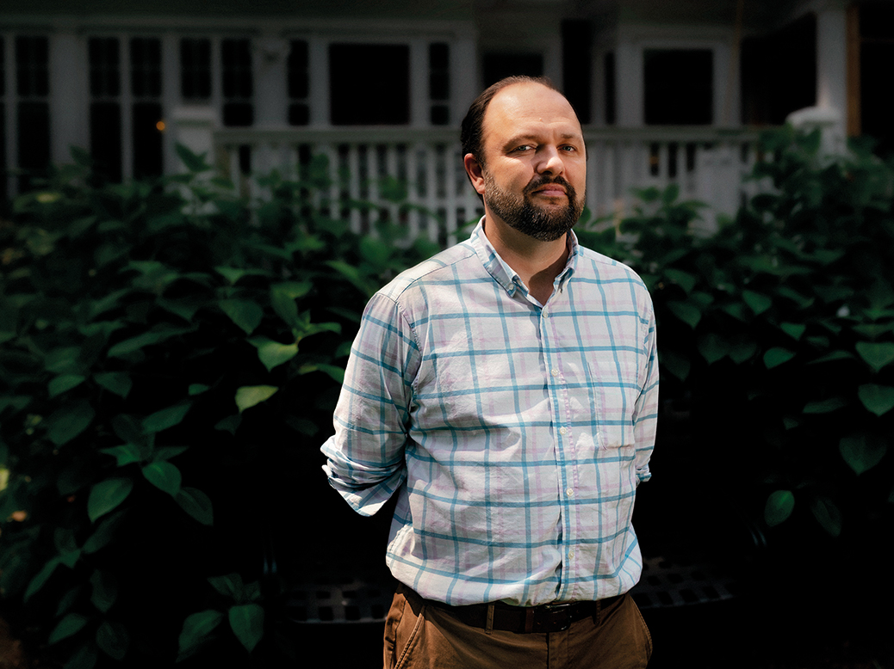

## The Return to Religion
This essay is motivated primarily by increasing reports of a return to the Catholic Church by young people in recent days. As a practicing Catholic myself, this news no doubt warms my heart. However, my thoughts on this return are layered and complex. What fully formed thought isn't?

The story of the return to religion is incomplete without first examining the departure from it. And what better place to begin than with the New Atheists? Before doing so, however, I do not wish to give them too much credit. The decline of religious belief in the West was driven by forces far larger than a handful of bestselling authors and internet debaters. Rising wealth, increasing individualism, and the gradual erosion of communal life likely played a far greater role than any argument made by Sam Harris or Richard Dawkins.

Yet if one were to choose a symbol for the online retreat from religion in the early twenty-first century, it would be difficult to find a better candidate than the New Atheists. They became the public face of a broader cultural shift, even if they were not its primary cause.

It is also worth remembering that the rise of New Atheism was, to some degree, overstated. The movement largely lived (and died) online, and its influence was concentrated almost entirely in the Western world. It is far less clear what impact, if any, it had on the developing world, where religion remained, and in many places continues to remain, an integral part of everyday life. The great debates between atheists and believers that dominated YouTube and university lecture halls often seemed immensely important to their participants, yet they barely registered across much of the globe.

## The Rise and Fall of New Atheism

The New Atheist movement is largely dead. Sam Harris has moved on to greener (read: more profitable) pastures, tucked safely behind a subscription paywall. Hitchens has, in his case, actually died. Dawkins has largely retreated as well. It must be mildly humiliating that, after spending a career criticizing Christianity, they have thus far failed to emulate its central miracle: giving things away gratis, or, one better, coming back to life.

The movement itself was very much a creature of the post-9/11 world. Prior to that, Christianity in the West had been in a slow and steady decline, but 9/11 introduced a different phenomenon altogether: a widespread hostility toward Islam. The attacks created an audience eager for critics of religion, particularly critics of Islam. Harris emerged first and most forcefully in this role, making opposition to Islam a central feature of his work. Dawkins and others soon followed.

The transition from criticizing Islam to criticizing religion as such was a short one. If religion could motivate such horrors, then perhaps the problem was not one religion but religion itself. Christianity, despite its very different history and social position in the West, was soon placed in the dock alongside Islam. What began as a reaction to a specific historical event gradually evolved into a broader indictment of religious belief as a whole. If this were a sermon (it is), I would re-tell the oft-repeated parable that ends in, “when they came for me, there was no one left to fight for me,” or something along those lines.

## The New Atheist Promise
Most of my memories of Sam Harris were him debating a hapless bishop of some unknown tradition or the equally hapless Jordan Peterson. These very heated (and very online) debates introduced an entire generation of young people (mostly men seeking community) to atheism. Christians of all denominations made for easy pickings in these online debates. Perhaps the Church had grown too accustomed to a kind of debate that the world had moved on from. Most (Old?) atheists accepted the goodness of Christianity only to debate the validity of its fundamental beliefs. Surely this chap didn't take a walk three days after kicking the bucket? As the French president said, Christianity was beautiful, but surely we aren't taking it literally, are we? In a way, Christians had been softened by the token resistance presented by people who grew up in the Christian tradition but no longer felt pressed to believe in it.

Harris' brand of atheism was different. Not only was he among the first generation of prominent atheists not to have been raised, even nominally, within the Christian tradition, but many of his followers came from entirely different religious backgrounds: former Muslims, Hindus, Buddhists, and the religiously unaffiliated.

To these followers, it scarcely mattered that the religious figures chosen to represent Christianity were often hopelessly unqualified to explain what Christians actually believe, much less defend it against criticism. Nor did many seem particularly troubled by Harris' tendency toward scientism: the belief that questions traditionally belonging to philosophy, theology, and ethics could ultimately be settled by the methods of science alone.

Harris also offered something many earlier atheists had avoided attempting: a replacement moral framework. Previous generations of atheists were often content to borrow Christian morality without the baggage of belief. Harris, by contrast, sought to construct a morality grounded in human flourishing and the minimization of suffering. This moral vision possessed something resembling a catechism, but without a church, a community, or a priesthood. It sought (or demanded, depending on who you asked) adherence yet offered little in the way of belonging, consolation, or guidance. Most importantly, Harris himself assumed no pastoral responsibility for those who adopted it, a point that will become important later.

Thus, the early wins of New Atheism inevitably involved a well-meaning religious figure, or worse, Jordan Peterson. One need only take one look at these videos to understand that Harris was railing against something he thought was Christianity (or Islam, or whatever), while Jordan Peterson defended an equally unsubstantiated version of Christianity. Ironically, Peterson sounded very much like the Old Atheists, often regurgitating some version of, “surely don't throw the baby out with the bath water.”

## Why Did the Kids Come Back to Mass?
So what happened? Why did the kids come back to Mass?  Well, three things happened.
### The Church Relearns the Battlefield

The first was that the larger Christian institutions rearmed themselves to fight a new kind of warfare. In many ways it was a reinvention, but also a reincarnation; the Church had been here before. Questioning one's faith has a deep intellectual tradition in the Catholic Church, and the tools to answer those questions were right there. The Catholic Church returned on the front foot, more visible and more "online" than ever before. These days, the most important battlefield is the online one, and Catholic influencers, armed with Thomas Aquinas and other apologists, fought back.
In some ways, it was as much a vocal rebrand as a fightback. The Papacy under both Francis and Leo distanced itself from the more conservative ideals that are often conflated with, and coded for, American Catholicism. The Catholic Church was no longer viewed as solely Republican. Funnily enough, this was also a return. This time to early American Catholicism, when the Church formed the backbone of many of the more liberal Christian movements in America. What appeared to some as a dramatic reinvention was, in reality, a rediscovery of an older tradition.
### The Failure of Replacement

The second was the retreat of the New Atheists. While they promised a lot, they ultimately failed at the first hurdle of human belief: logistics.

The New Atheist movement was far more successful at removing religion from the lives of its followers than it was at replacing it with something else. It is not for want of trying, though. Harris did offer a moral framework based on harm minimization. While the framework itself was laudable, in that few atheists had dared to offer a replacement for the morality that religion provided, it lacked the institutions and communities necessary to sustain it.

While church doors and priests remain available to answer questions from believers and non-believers alike, Harris retreated behind a paywall. I cannot blame him entirely. Much of religion's appeal is unglamorous: a hug, a shoulder to cry on, a cup of coffee after Mass. These acts of compassion are supported by institutions, traditions, logistics, and yes, bureaucracy. The very things that make religion frustrating are also the things that allow it to endure.

Perhaps this is where many of religion's ills come from as well. The same structures that provide belonging and continuity also create bureaucracy, hierarchy, and opportunities for failure. But those imperfections are often the price of having something capable of serving people beyond the level of an idea.
### The Crisis of Meaning

The third is a general malaise about morality. In this, I think both atheists, new and old, and Christians alike are equally in despair.

While Christians and New Atheists used different vocabulary and first principles to speak about morality, the underlying message was often the same: be a better person. Where the definition of "better" was the source of conflict, both agreed on the premise.

Most modern irreligious people, many of whom were once attracted to New Atheism, follow a kind of weak "be a good person, don't harm anyone" lifestyle that is little more than extreme libertarianism. The same people who once felt religion was irrelevant in teaching them how to live now find that neither Sam Harris nor New Atheism has much to offer them. And indeed, Harris is nowhere to be found, unless you subscribe to his newsletter or pay for his time. The Sam Harris Reformation will apparently be a subscription model.

People are increasingly hesitant to speak in moral absolutes anymore, such as "gambling is bad." Instead, we avert our eyes every time the FanDuel ad comes on, which was often, especially during the Super Bowl. Our lives are filled with mindless consumerism, travel, and shopping. There is no claim or ownership of meaning anymore.

This is the void into which many non-believers are thrown. To many, this is perfectly acceptable: a slow trudge toward The End, marked by empty rituals and punctuated by increasingly visceral pleasures.

But there is another route that people often take. It is often said that America is a nation of mystics, the "there's something out there" flavor of theism.

To some of these people, both New Atheism and Christianity lacked appeal. Others, when faced with this choice, made a quiet return to Christianity. Mysticism has many appeals; consistency and structure are not among them. It is a lot easier to go to a Catholic church than to head to a converted banquet hall to discuss how we are all made of light and love.

## A Return to Equilibrium

In conclusion, I think the data bears out that Gen Z converts are emerging as a larger and more visible cohort than their millennial predecessors. This is certainly a cause for celebration. However, there is little evidence to suggest that we are witnessing anything other than a return toward equilibrium.

One must come to terms with the fact that the demise of New Atheism should not be conflated with the demise of atheism itself. A combination of fatigue with organized religion, both among those who practice it and those who do not, means that a portion of the population may never return to religious life.

The most honest reading of the data probably lies somewhere between Ryan Burge’s caution about premature revival narratives and Justin Brierley’s argument that the cultural assumptions of New Atheism have begun to collapse. The story is not one of secularism disappearing overnight, nor is it one of religion simply returning to its former dominance. Rather, it appears to be a rebalancing: a generation reconsidering questions of meaning, tradition, and transcendence that many assumed had been permanently settled.

There are, of course, rumblings that these are not “true conversions”; that these are not genuine changes of heart, but rather conversions motivated by appearance, community, or cultural belonging.

What constitutes a “true conversion” merits an essay of its own (God knows *Silence* already wrestles with this question, set against the backdrop of 17th-century Japan. Must watch!). But what is true is that genuine conversion is often, though not always, preceded by conversion for appearance’s sake. Cultural renewal rarely begins with everyone fully convinced; often, practice comes before belief. Let us hope that is the case with many of these returnees.

But for now: we are so back, baby!

## Selected References

Burge, Ryan P. *The Nones: Where They Came From, Who They Are, and Where They Are Going.*  
A demographic analysis of the rise of religiously unaffiliated Americans (“nones”) and the changing landscape of American religious identity. Burge’s work provides an important counterweight to overly optimistic narratives of religious revival by emphasizing the complexity of secularization and religious change.  
https://www.amazon.com/Nones-Where-They-Came-Going/dp/1506465854

Davis, Jim, Michael Graham, Ryan P. Burge, and Collin Hansen. *The Great Dechurching: Who’s Leaving, Why Are They Going, and What Will It Take to Bring Them Back?*  
A study of the decline of church participation in America, examining the demographic and cultural forces behind religious disaffiliation while exploring the possibility of renewed engagement with religious communities.  
https://www.zondervan.com/9780310147435/the-great-dechurching/  
:contentReference[oaicite:0]{index=0}

Brierley, Justin. *The Surprising Rebirth of Belief in God: Why New Atheism Grew Old and Secular Thinkers Are Considering Christianity Again.*  
An exploration of the decline of New Atheism as a cultural movement and the renewed public conversation around Christianity, meaning, and transcendence. Brierley argues that while secularism remains influential, the intellectual confidence of the New Atheist movement has weakened.  
https://justinbrierley.com/the-surprising-rebirth-of-belief-in-god/  
:contentReference[oaicite:1]{index=1}

Pew Research Center. *Religious Landscape Study.*  
A major source of demographic data on American religious affiliation, belief, and practice, providing context for broader trends in religious decline, stabilization, and generational differences.  
https://www.pewresearch.org/religious-landscape-study/  
:contentReference[oaicite:2]{index=2}

Smith, Gregory A., et al. “Decline of Christianity in the U.S. Has Slowed, May Have Leveled Off.” *Pew Research Center.*  
A recent analysis of the 2023–24 Religious Landscape Study examining the stabilization of Christian identification and religious affiliation trends in the United States.  
https://www.pewresearch.org/religion/2025/02/26/decline-of-christianity-in-the-us-has-slowed-may-have-leveled-off/  
:contentReference[oaicite:3]{index=3}

“Young New Yorkers Have a New Hot Spot: Sunday Mass.” *The Wall Street Journal.*  
Reporting on increased attendance among young adults at Catholic Masses in New York City and the appeal of traditional religious communities among younger generations.  
https://www.wsj.com/us-news/young-new-yorkers-have-a-new-hot-spot-sunday-mass-b96e1449  
:contentReference[oaicite:4]{index=4}

Scorsese, Martin, director. *Silence* (2016).  
A film exploring the nature of faith, apostasy, cultural Christianity, and genuine conversion through the persecution of Christians in 17th-century Japan.  
https://www.imdb.com/title/tt0490215/

https://www.theguardian.com/books/2019/jan/31/four-horsemen-review-what-happened-to-new-atheism-dawkins-hitchens
