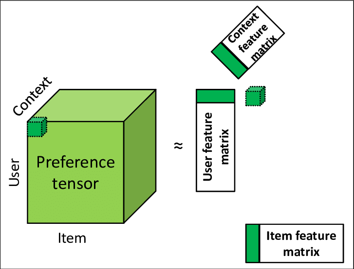

# Introduction

*When do I use "old-school" ML models like matrix factorization and when do I use graph neural networks?*\
*Can we do something better than matrix factorization?*\
*Why can't we use neural networks? What is matrix factorization anyway?*\
These are just some of the questions, I get asked whenever I start a recommendation engine project. Answering these questions requires a good understanding of both algorithms, which I will try to outline here. The usual way to understand the benefit of one algorithm over the other is by trying to prove that one is a special case of the other.

It can be shown that a Graph Neural Network can be expressed as a matrix factorization problem. However, confusingly, this matrix is not easy to interpret in the usual sense. Contrary to popular belief matrix factorization (MF) is not "simpler" than a Graph Neural Network nor is the reverse true. To make matters worse, the GCN is actually more expensive to train since it takes far for cloud compute than does MF. However, I will try to provide some intuition as to when a GCN might be worthwhile to try out.

This article is primarily aimed at data science managers with some background in linear algebra (or not, see next sentence) who may or may not have used a recommendation engine package before. Having said that, if you are not comfortable with some proofs I have a key takeaways subsection in each section that should form a good basis for decision making that perhaps other team members can dig deep into.

# Tensor Based Methods

In this section, I will formulate the recommendation engine problem as a large tensor or matrix that needs to be "factorized".\
In one of my largest projects in Consulting, I spearheaded the creation of a recommendation engine for a top 5 US retailer. This project presented a unique challenge: the scale of the data we were working with was staggering. The recommendation engine had to operate on a 3D tensor, made up of products × users × time. The sheer size of this tensor required us to think creatively about how to scale and optimize the algorithms.

Let us start with some definitions, assume we have $n_u, n_v$ and $n_t$, users, products and time points respectively.

1.  User latent features, given by matrix $U$ of dimension $n_u \times r$ and each index of this matrix is $u_i$

2.  Products latent features, given by matrix $V$, of dimensions $n_v \times r$ and each index of this matrix is $v_j$

3.  Time latent features given by Matrix $T$, of dimensions $n_t \times r$ and each index of this matrix is $t_k$

4.  Interaction given by $y_{ijk}$ in the tensor case, and $y_{ij}$ in the matrix case. Usually this represents either purchasing decision, or a rating (which is why it is common to name this $r_{ijk}$) or a search term. I will use the generic term "interaction" to denote any of the above.

In the absence of a third dimension one could look at it as a matrix factorization problem, as shown below,

{#fig:enter-label width="50%"}

Increasingly, however, it is important to take other factors into account when designing a recommendation system, such as context and time. This has led to the tensor case being the more usual case.

{#fig:enter-label width="50%"}

This means that for the $i$th user, $j$th product at the $k$th moment in time, the interaction $y_{ijk}$ is functionally represented by the dot product of these $3$ matrices, $$y_{ijk} \approx u_i\cdot v_j\cdot t_k$$ An interaction $y_{ijk}$ can take a variety of forms, the most common approach, which we follow here will be, $y_{ijk} = 1$, if the $i$th user interacted with the $j$th product at that $k$th instance. Else, $0$. But other more complex functional forms can exist, where we can use the rating of an experience at that moment, where instead of $y \in {0,1}$ we can have a more general form $y \in \mathcal{R}$. Thus this framework is able to handle a variety of interaction functions. A question we often get is that this function is inherently linear since it is the dot product of multiple matrices. We can handle non-linearity in this framework as well, via the use of non-linear function (a.k.a an activation function). $$y_{ijk} \approx {1- \exp^{u_i\cdot v_j\cdot t_k }}$$ Or something along those lines. However, one of the attractions of this approach is that it is absurdly simply to set up.

