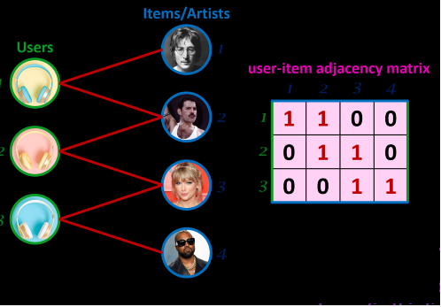
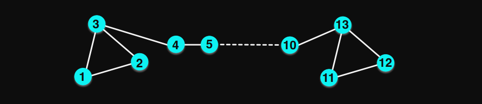

# Introduction

_When do I use "old-school" ML models like matrix factorization and when do I use graph neural networks?_ 

_Can we do something better than matrix factorization?_ 

_Why can't we use neural networks? What is matrix factorization anyway?_ 

These are just some of the questions, I get asked whenever I start a recommendation engine project. Answering these questions requires a good understanding of both algorithms, which I will try to outline here. The usual way to understand the benefit of one algorithm over the other is by trying to prove that one is a special case of the other.

While it can be shown that a Graph Neural Network can be expressed as a matrix factorization problem. This matrix is not easy to interpret in the usual sense. Contrary to popular belief, matrix factorization (MF) is not "simpler" than a Graph Neural Network (nor is the opposite true). To make matters worse, the GCN is actually more expensive to train since it takes far more cloud compute than does MF. The goal of this article is to provide some intuition as to when a GCN might be worthwhile to try out.

This article is primarily aimed at data science managers with some background in linear algebra (or not, see next sentence) who may or may not have used a recommendation engine package before. Having said that, if you are not comfortable with some proofs I have a key takeaways subsection in each section that should form a good basis for decision making that perhaps other team members can dig deep into.

# Key Tenets of Linear Algebra and Graphs in Recommendation Engine design
The key tenets of design come down to the difference between a graph and a matrix. The linking between graph theory and linear algebra comes from the fact that ALL graphs come with an adjacency matrix. More complex versions of this matrix (degree matrix, random walk graphs) capture more complex properties of the graph. Thus you can usually express any theorem in graph theory in matrix form by use of the appropriate matrix. 
1. The Matrix Factorization of the interaction matrix (defined below) is the most commonly used form of matrix factorization. Since this matrix is the easiest to interpret.
2. _Any_ Graph Convolutional Neural Network can be expressed as the factorization of _some_ matrix, this matrix is usually far removed from the interaction matrix and is complex to interpret.
3. For a given matrix to be factorized, matrix factorization requires fewer parameters and is therefore easier to train. 
4. Graphical structures are easily interpretable even if matrices expressing their behavior are not.

# Tensor Based Methods
In this section, I will formulate the recommendation engine problem as a large tensor or matrix that needs to be "factorized".\
In one of my largest projects in Consulting, I spearheaded the creation of a recommendation engine for a top 5 US retailer. This project presented a unique challenge: the scale of the data we were working with was staggering. The recommendation engine had to operate on a 3D tensor, made up of products × users × time. The sheer size of this tensor required us to think creatively about how to scale and optimize the algorithms.

Let us start with some definitions, assume we have $n_u, n_v$ and $n_t$, users, products and time points respectively.

1.  User latent features, given by matrix $U$ of dimension $n_u \times r$ and each index of this matrix is $u_i$

2.  Products latent features, given by matrix $V$, of dimensions $n_v \times r$ and each index of this matrix is $v_j$

3.  Time latent features given by Matrix $T$, of dimensions $n_t \times r$ and each index of this matrix is $t_k$

4.  Interaction given by $y_{ijk}$ in the tensor case, and $y_{ij}$ in the matrix case. Usually this represents either purchasing decision, or a rating (which is why it is common to name this $r_{ijk}$) or a search term. I will use the generic term "interaction" to denote any of the above.

In the absence of a third dimension one could look at it as a matrix factorization problem, as shown in the image below,

Increasingly, however, it is important to take other factors into account when designing a recommendation system, such as context and time. This has led to the tensor case being the more usual case.

This means that for the $i$th user, $j$th product at the $k$th moment in time, the interaction $y_{ijk}$ is functionally represented by the dot product of these $3$ matrices, $$y_{ijk} \approx u_i\cdot v_j\cdot t_k$$ An interaction $y_{ijk}$ can take a variety of forms, the most common approach, which we follow here will be, $y_{ijk} = 1$, if the $i$th user interacted with the $j$th product at that $k$th instance. Else, $0$. But other more complex functional forms can exist, where we can use the rating of an experience at that moment, where instead of $y \in {0,1}$ we can have a more general form $y \in \mathcal{R}$. Thus this framework is able to handle a variety of interaction functions. A question we often get is that this function is inherently linear since it is the dot product of multiple matrices. We can handle non-linearity in this framework as well, via the use of non-linear function (a.k.a an activation function). $$y_{ijk} \approx {1- \exp^{u_i\cdot v_j\cdot t_k }}$$ Or something along those lines. However, one of the attractions of this approach is that it is absurdly simply to set up.

## Side Information

Very often in a real word use case, our clients often have information that they are eager to use in a recommendation system. These range from user demographic data that they know from experience is important, to certain product attribute data that has been generated from a different machine learning algorithm. In such a case we can integrate that into the equation given above,

$$y_{ijk} \approx u_i\cdot v_j\cdot t_k  +  v_j \cdot v'_j + u_i \cdot u'_i$$

Where, $u'_i, v'_i$ are attributes for users and products that are known beforehand. Each of these vectors are rows in $U', V'$, that are called "side-information\" matrices.

## Optimization

We can then set up the following loss function,

$$\mathcal{L}(X, U, V, W_t, U', V') = \| X - (U \cdot V \cdot W_t) \|^2 + \lambda_1 \| U \cdot U' - X_u \|^2 + \lambda_2 \| V \cdot V' - X_p \|^2 + \lambda_3 (\| U \|^2 + \| V \|^2 + \| W_t \|^2)$$

Where:

-   $\lambda_1$ and $\lambda_2$ are regularization terms for the alignment with side information.

-   $\lambda_3$ controls the regularization of the latent matrices $U$, $V$, and $W_t$.

-   The first term is the reconstruction loss of the tensor, ensuring that the interaction between users, products, and time is well-represented.

-   The second and third terms align the latent factors with the side information for users and products, respectively.

## Tensor Factorization Loop

For each iteration:

1.  Compute the predicted tensor using the factorization: $$\hat{X} = U \cdot V \cdot W_t$$

2.  Compute the loss using the updated loss function.

3.  Perform gradient updates for $U$, $V$, and $W_t$.

4.  Regularize the alignment between $U$, $V$ with $U'$ and $V'$

5.  Repeat until convergence.

## Key Takeaway

Matrix factorization allows us to decompose a matrix into two low-rank matrices, which provide insights into the properties of users and items. These matrices, often called embeddings, either embed given side information or reveal latent information about users and items based on their interaction data. This is powerful because it creates a representation of user-item relationships from behavior alone.

In practice, these embeddings can be valuable beyond prediction. For example, clients often compare the user embedding matrix

$U$ with their side information to see how it aligns. Interestingly, clustering users based on

$U$ can reveal new patterns that fine-tune existing segments. Rather than being entirely counter-intuitive, these new clusters may separate users with subtle preferences, such as distinguishing between those who enjoy less intense thrillers from those who lean toward horror. This fine-tuning enhances personalization, as users in large segments often miss out on having their niche behaviors recognized.\
Mathematically, the key takeaway is the following equation (at the risk of overusing a cliche, this is the $e=mc^2$ of the recommendation engines world)

$$y_{ij} = u_i'v_j + \text{possibly other regularization terms}$$

Multiplying the lower dimensional representation of the $i$th user and the $j$th item together yields a real number that represents the magnitude of the interaction. Very low and its not going to happen, and very high means that it is. These two vectors are the "deliverable"! How we got there is irrelevant. Turns out there are multiple ways of getting there. One of them is the Graph Convolutional Network. In recommendation engine literature (particularly for neural networks) embeddings are given by $H$, in the case of matrix factorization, $H$ is obtained by stacking $U$ and $V$,

$$H = [U \hspace{5 pt} V]$$

## Extensions

You do not need to stick to the simple multiplication in the objective function, you can do something more complex,

$$\min \sum_{(i,j) \in E} y_{ij} \left( \log \sigma(U_i^T V_j) + (1 - y_{ij}) \log (1 - \sigma(U_i^T V_j)) \right)$$

The above objective function is the LINE embedding. Where $\sigma$ is some non-linear function.

# Interaction Tensors as Graphs

One can immediately view a the interactions between users and items as a bipartite graph, where an edge is present only if the user interacts with that item. It is immediately obvious that we can embed the interactions matrix inside the adjacency matrix, noting that there are no edges between users and there are no edges between items.

The adjacency matrix $A$ can be represented as:

$$A = 
\begin{bmatrix}
0 & R \\\\
R^T & 0
\end{bmatrix}$$

Recall, the matrix factorization $R = UV^T$,

$$A \approx
\begin{bmatrix}
0 & UV^T \\\\
VU^T & 0
\end{bmatrix}$$

where:

-   $R$ is the user-item interaction matrix (binary values: 1 if a user has interacted with an item, 0 otherwise),

-   $R^T$ is the transpose of $R$, representing item-user interactions.

For example, if $R$ is the following binary interaction matrix:

$$R = 
\begin{bmatrix}
1 & 0 & 1 \\\\
1 & 1 & 0
\end{bmatrix}$$

Note, here that $R$ could have contained real numbers (such as ratings etc.) but the adjacency matrix is strictly binary. Using the weighted adjacency matrix is perfectly "legal", but has mathematical implications that we will discuss later. Thus, the adjacency matrix $A$ becomes: 
$$A = 
\begin{bmatrix}
0 & 0 & 0 & 1 & 0 & 1 \\\\
0 & 0 & 0 & 1 & 1 & 0 \\\\
1 & 1 & 0 & 0 & 0 & 0 \\\\
0 & 1 & 0 & 0 & 0 & 0 \\\\
1 & 0 & 0 & 0 & 0 & 0
\end{bmatrix}$$

## Matrix Factorization of Adjacency Matrix

Now you could use factorize, $$A \approx LM^T$$ And then use the embeddings $L$ and $M$, but now $L$ represents embeddings both for users and items (as does $M$). However, this matrix is much bigger than $R$ since the top left and bottom right block matrix are $0$. You are much better off using the $R = UV^T$ formulation to quickly converge on the optimal embeddings. The key here is that factorizing this matrix is roughly equivalent to factorizing the $R$ matrix. This is important because the adjacency matrix plays a key role in the graphical convolutional network.

# What are the REAL Cons of Matrix Factorization

Matrix factorization offers key advantages in a consulting setting by quickly assessing the potential of more advanced methods on a dataset. If the user-item matrix performs well, it indicates useful latent user and item embeddings for predicting interactions. Additionally, regularization terms help estimate the impact of any side information provided by the client. The resulting embeddings, which include both interaction and side information, can be used by marketing teams for tasks like customer segmentation and churn reduction.\
First, let me clarify some oft quoted misconceptions about matrix factorization disadvantages versus GCNs,

1.  *User item interactions are a simple dot product ($\hat y_{ij} = u_i'v_j$*) and is therefore not linear. This is not true, even in the case of a GCN the final prediction is given by a simple dot product between the embeddings.

2.  *Matrix factorization cannot use existing features* . This is probably due to the fact that matrix factorization was popularized by the simple Netflix case, where only user-item matrix was specified. But in reality, very early in the development of matrix factorization, all kinds of additional regularization terms such as bias, side information etc. were introduced. The side information matrices are where you can specify existing features (recall, $y_{ij} = u_i'v_j + \text{possibly other regularization terms}$).

3.  *Cannot handle cold start* Neither matrix factorization nor neural networks can handle the cold start problem very well. However, this is not an unfair criticism as the neural network is better, but this is more as a consequence of its truly revolutionary feature, which I will discuss under its true advantage.

4.  *Higher order interactions* this is also false, but it is hard to see it mathematically. Let me outline a simple approach to integrate side information. Consider the matrix adjacency matrix $A$, $A^2$ gives you all edges with length $2$, such that $A + A^2$ represents all nodes that are at most $2$ edges away. You can then factorize this matrix to get what you want. This is not an unfair criticism either as multiplying such a huge matrix together is not advised and neither is it the most intuitive method.

The biggest problem with MF is that a matrix is simply not a good representation of how people interact with products and each other. Finding a good mathematical representation of the problem is sometimes the first step in solving it. Most of the benefits of a graph convolutional neural network come as a direct consequence of using a graph structure not from the neural network architecture. The graph structure of a user-item behavior is the most general form of representation of the problem.

1.  Complex Interactions - In this structure one can easily add edges between users and between products. Note in the matrix factorization case, this is not possible since $R$ is only users x items. To include more complex interactions you pay the price with a larger and larger matrix.

2.  Graph Structure - Perhaps the most visually striking feature of graph neural networks is that they can leverage graph structure itself (see Figure 4). Matrix factorization cannot do so easily

3.  Higher order interactions can be captured more intuitively than in the case of matrix factorization

Before implementing a GCN, it's important to understand its potential benefits. In my experience, matrix factorization often provides good results quickly, and moving to GCNs makes sense only if matrix factorization has already shown promise. Another key factor is the size and richness of interactions. If the graph representation is primarily bipartite, adding user edges may not significantly enhance the recommender system. In retail, edges sometimes represented families, but these structures were often too small to be useful—giving different recommendations to family members like $11$ and $1$ is acceptable since family ties alone don't imply similar consumption patterns. However, identifying influencers, such as nodes with high degrees connected to isolated nodes, could guide targeted discounts for products they might promote.

I would be remiss, if I did not add that ALL of these issues with matrix factorization can be fixed by tweaking the factorization in some way. In fact, a recent paper *Unifying Graph Convolutional Networks as Matrix Factorization* by Liu et. al. does exactly this and shows that this approach is even better than a GCN. Which is why I think that the biggest advantage of the GCN is not that it is "better" in some sense, but rather the richness of the graphical structure lends itself naturally to the problem of recommending products, *even if* that graphical structure can then be shown to be equivalent to some rather more complex and less intuitive matrix structure. I recommend the following experiment flow :

# A Simple GCN model

Let us continue on from our adjacency matrix $A$ and try to build a simple ML model of an embedding, we could hypothesize that an embedding is linearly dependent on the adjacency matrix.

$$H = f(AWX + I_nWX)$$

The second additive term bears a bit of explaining. Since the adjacency matrix has a $0$ diagonal, a value of $0$ get multiplied with the node's own features $x\in X$. To avoid this we add the node's own feature matrix $X$ using the diagonal matrix.

We need to make another important adjustment to $A$, we need to divide each term in the adjacency matrix by the degree of each node. $$\tilde{A} = A + I_n$$ $$A \equiv \tilde{D}^\frac{1}{2}\tilde{A}\tilde{D}^\frac{1}{2}$$ At the risk of abusing notation, we redefine $A$ as some normalized form of the adjacency matrix after edges connecting each node with itself have been added to the graph. I like this notation because it emphasizes the fact that you do not need to do this, if you suspect that normalizing your nodes by their degree of connectivity is not important then you do not need to do this step (though it costs you nothing to do so). In retail, the degree of a user node refers to the number of products they consume, while the degree of a product node reflects the number of customers it reaches. A product may have millions of consumers, but even the most avid user node typically consumes far fewer, perhaps only hundreds of products.

Here $X = [X_{u}, X_{i}$\]. $$H  = [U V]$$

Here we can split the equations by the subgraphs for which they apply to,

$$H_u = f(A_u W_u X_u)$$ $$H_v = f(A_v W_v X_v)$$

Note the equivalence the matrix case, in the matrix case we have to stack it ourselves because of the way we set up the matrix, but in the case of a GCN $H$ is already $m\times n$ and represents embeddings of both users and items.

The likelihood of an interaction is,

$$\hat y_{ij} = H_u^T H_v$$

The loss function is,

$$L = \sum_{(u, i) \in \mathcal{I}} \left( y_{ui} - \hat{y}_{ui} \right)^2$$

We can substitute the components of $H$ to get a tight expression for optimizing loss,

$$L = \sum_{(u, i) \in \mathcal{I}} \left( y_{ui} - f(A_u W_u X_u)^T f(A_v W_v X_v)\right)^2$$

This is the main "result" of this blog post that you can equally look at this one layer GCN as a matrix factorization problem of the user-item interaction matrix but with the more complex looking low rank matrices on the right. In this sense, you can always create a matrix factorization that equates to the loss function of a GCN.

You can update parameters using SGD or some other technique. I will not get into that too much in this post.

## Understanding the GCN equation

Equations 1 and 2 are the most important equations in the GCN framework. $W$ is some $(m+n) \times d$ set of weights that learn how to embed or encode the information contained in $X$ into $H$. For this one layer model, we are only considering values from the nodes that are one edge away, since the value of $h_i$ is only dependent on all the $x_j$'s that are directly connected to it and its own $x_i$. However, if you then apply this operation again, $H$ now has all the information contained in all the nodes connected to it in its own $h_i$ but also so does every other nodes $h_k$.

$$H^0 = f(AW^0X + I_nW^0X)$$

$$H^1 = f(AW^1H^0 + I_nW^1H^0)$$

More succinctly, $$H^1 = f(AW^1 f(AW^0X + I_nW^0X)+ I_nW^1H^0)$$

## Equivalence to Matrix Factorization for a one layer GCN

You could just as easily have started with two random matrices $U$ and $V$ and optimize them using your favorite optimization algorithm and end up with the likelihood for interaction function, 
$$\hat y_{ij} = U^T V \equiv H_u^T H_v$$

So you get the same outcome for a one layer GCN as you would from matrix factorization. Note that, it has been proved that even multi-layer GCNs are equivalent to matrix factorization but the matrix being factorized is not that easy to interpret. 

## Key Takeaways 
The differences between MF and GCN really begin to take form when we go into multi-layerd GCNs. In the case of the one layer GCN the embeddings of $H^0$ are only influenced by the nodes connected to it. Thus the features of a customer node will be only influenced by the products that they buy, similarly, the product node will be only influenced by the customers who by them. However, for deeper neural networks :

1.  2 layer: every customer's embedding is influenced by the embeddings of the products they consume and the embeddings of other customers of the products they consume. Similarly, every product is influenced by the customers who consume that product as well as by the products of the customers who consume that product.

2.  3 layer: every customers embedding is influenced by the products they consume, other customers of the products they consume and products consumed by other customers of the products they consume. Similarly, every product is influenced by the consumers of that product, as well as products of consumers of that product as well as products consumed by consumers of that product.

You can see where this is going, in most practical applications, there are only so many levels you need to go to get a good result. In my experience $2$ is the bare minimum (because $1$ is unlikely to do better than an MF, in fact they are equivalent) and $3$ is about how deep you can feasibly go without exploding the number of training parameters.

That leads to another critical point when considering GCNs, you really pay a price (in blood, mind you) for every layer deep you go. Consider the one layer case, you really have $n\times d$ and $n\times d'$ parameters to learn, because you have to learn both the weight matrix $W$ and the matrix of embeddings $H$. But the MF case you directly learn $H$. So if you were only going to go one layer deep you might as well use matrix factorization.

Going the other way, if you are considering more than $3$ layers the reality of the problem (in my usual signal processing problems this would be "physical" laws) i.e. the behavioral constraints mean that more than 3 degrees deep of influence (think about what point 3 would mean for a $5$ layer network) is unlikely to be supported by any theoretical evidence of consumer behavior.

# Final Prayer and Blessing

I would like for the reader of this to leave with a better sense of the relationship between matrix factorization and GCNs. Like most neural network based models we tend to think of them as a black box and a black box that is "better". However, in the one layer GCN case we can see that they are equal, with the GCN in fact having more learnable parameters (therefore more cost to train).\
Therefore, it makes sense to use $2$ layers or more. But when using more, we need to justify them either behaviorally or with expert advice.

### How to go from MF to GCNs
1.  Start with matrix factorization of the user-item matrix, maybe add in context or time. If it performs well and recommendations line up with non-ML recommendations (using base segmentation analysis), that means the model is at least somewhat sensible.

2.  Consider doing a GCN next if the performance of MF is decent but not great. Additionally, definitely try GCN if you know (from marketing etc) that the richness of the graph structure actually plays a role in the prediction. For example, in the sale of Milwaukee tools a graph structure is probably not that useful. However, for selling Thursday Boots which is heavily influenced by social media clusters, the graph structure might be much more useful.

3.  Interestingly, the MF matrices tend to be very long and narrow (there are usually thousands of users and most companies have far more users than they have products. This is not true for a company like Amazon (300 million users and 300 million products). But if you have a long narrow matrix that is sparse you are not too concerned with computation since at worst you have $m\times n \approx O(n), m<<n$, it does not matter much whether you do MF or GCN, but $m\times n  = O(mn)$ when $m\approx n$, for such a case the matrix approach will probably give you a faster result.

It is worthwhile in a consulting environment to always start with a simple matrix factorization, the GCN for simplicity of use and understanding but then find a matrix structure that approximates only the most interesting and rich aspects of the graph structure that actually influence the final recommendations.

# References
https://jonathan-hui.medium.com/graph-convolutional-networks-gcn-pooling-839184205692 
https://tkipf.github.io/graph-convolutional-networks/ https://openreview.net/forum?id=HJxf53EtDr 
https://distill.pub/2021/gnn-intro/ https://jonathan-hui.medium.com/graph-convolutional-networks-gcn-pooling-839184205692
