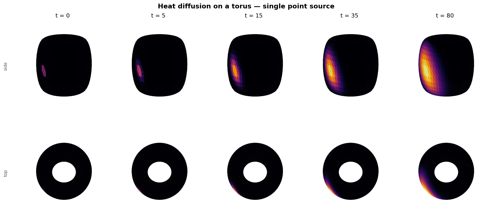
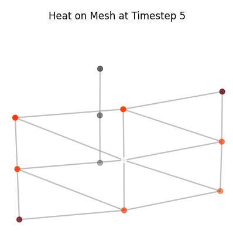
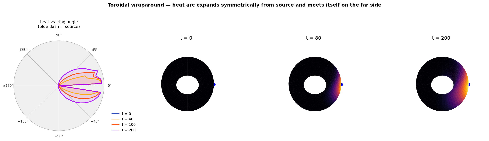
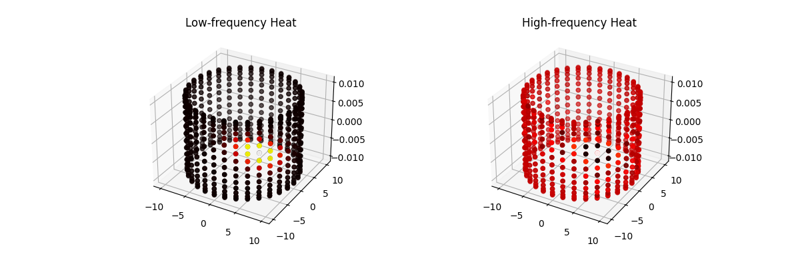
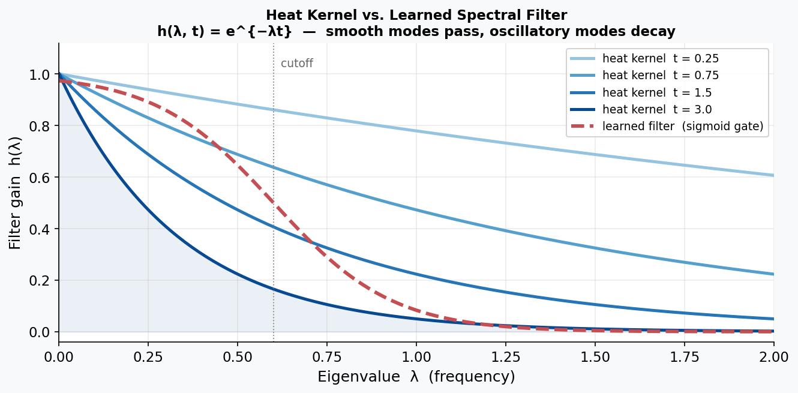
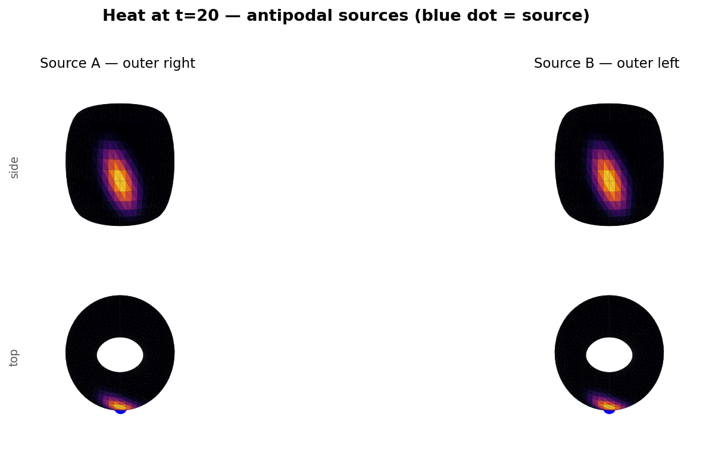
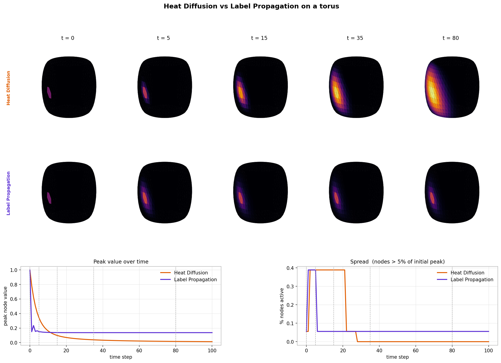

# Introduction

This is Part 2 of the series. In [Part 1](/2025/11/22/hot-cold-gcns/) we derived the Graph Fourier Transform from the Laplacian eigenbasis and built up the one-layer Spectral GCN formulation. Here we put it to work.

Repo:
https://github.com/FranciscoRMendes/graph-networks/tree/main

Notebooks:
- [GCN.ipynb](https://github.com/FranciscoRMendes/graph-networks/blob/main/GCN.ipynb) — end-to-end experiment on a 3-D torus
- [foundations.ipynb](https://github.com/FranciscoRMendes/graph-networks/blob/main/foundations.ipynb) — mathematical derivations from DFT to irregular graphs

# Application of Spectral GCN: Heat Propagation


In this section, we investigate a simple setting where a Spectral Graph Convolutional Network (GCN) performs surprisingly well: predicting heat diffusion across a toroidal mesh. Although the spectral approach is elegant and effective in the right circumstances, it also highlights several structural limitations inherent to spectral methods.


# Graph Model of Heat Propagation
When we zoom into a small patch of the torus and add the connecting edges, the mesh suddenly looks like a familiar graph. This makes the role of the graph Laplacian immediately intuitive.

<div align="center">
  
  <figcaption style="text-align:left;"> We zoom in on the hottest point on the mesh and plot it as a graph by explicitly showing edges. </figcaption>
</div>


We simulate heat diffusion on the graph using the discrete heat equation:

$$\frac{dx}{dt} = -L x$$

where $x \in \mathbb{R}^N$ is the heat at each node and $L$ is the graph Laplacian. Starting from two random vertices with initial heat, we update the heat iteratively using a simple forward Euler scheme:

$$x_{t+1} = x_t - \alpha L x_t$$

storing the state at each timestep to visualize how heat spreads across the mesh. Low-frequency modes of $L$ correspond to smooth, global patterns of heat, while high-frequency modes produce rapid, local variations.

The wraparound plot below shows this dramatically: starting from a single point source, the heat arc expands symmetrically around the ring until it meets itself on the far side.




## Graph Fourier Transform of Heat Propagation

In order to get intuition for how the Fourier transform behaves on a graph, consider the distribution of heat on the graph surface.

- The heat on the graph is represented by a real number for each node (temperature or heat energy in joules), so the signal is a vector $$x \in \mathbb{R}^{N},$$ where $N$ is the number of nodes.

- If there are $N$ nodes in the graph the (combinatorial or normalized) Laplacian is an $N\times N$ matrix $$L \in \mathbb{R}^{N\times N}$$.

We use the eigendecomposition of the Laplacian to move between the vertex domain and the spectral (frequency) domain: $$L = U \Lambda U^{\top}, \qquad
\Lambda = \operatorname{diag}(\lambda_1,\ldots,\lambda_N), \qquad
U = [U_1\; U_2\; \cdots\; U_N],$$ with the eigenvalues ordered $0=\lambda_1 \le \lambda_2 \le \cdots \le \lambda_N$. The graph Fourier transform (GFT) and inverse GFT are $$\widehat{x} = U^{\top} x, \qquad x = U \widehat{x}$$.

To visualise single-frequency modes we simply pick individual eigenvectors $U_k$: $$\text{low-frequency mode: } x_{\text{low}} = U_{k_{\text{low}}}, \qquad
\text{high-frequency mode: } x_{\text{high}} = U_{k_{\text{high}}},$$ where a natural choice is $k_{\text{low}}=2$ (the first nontrivial eigenvector) and $k_{\text{high}}=N$ (one of the largest-eigenvalue modes). Each vector $U_k$ assigns one scalar value to every vertex; plotting those values on the torus surface gives the heat-colour visualisation.

#### Practical steps used to create the figure

1.  Build a uniform torus mesh and assemble adjacency and Laplacian $L$.

2.  Compute the eigendecomposition $L=U\Lambda U^\top$ (for small / moderate meshes) or compute a selection of eigenpairs (Lanczos) for large meshes.

3.  Select a low-frequency eigenvector $U_{k_{\text{low}}}$ and a high-frequency eigenvector $U_{k_{\text{high}}}$.

4.  [Optional; not done here; to show smaller values in absolute terms]Normalize each eigenvector for display: $$\tilde{x} = \frac{x - \min(x)}{\max(x)-\min(x)} \quad\text{or}\quad
        \tilde{x} = \frac{x}{\max(|x|)},$$ so colours are comparable across panels.

5.  Render the torus surface and colour each vertex by the value $\tilde{x}$ using a diverging colormap (e.g. `heat`) and add a colourbar showing the mapping from value to colour.



#### Interpreting the GFT on the torus

- **Low-frequency mode.** The plotted heat corresponds to $U_{k_{\text{low}}}$ (small eigenvalue). The signal varies smoothly over the torus: neighbouring vertices have similar values, representing broad, global patterns of heat. 

- **High-frequency mode.** The plotted heat corresponds to $U_{k_{\text{high}}}$ (large eigenvalue). The signal alternates rapidly across nearby vertices, producing fine-scale oscillations around the torus that represent high-frequency, localised variations.

#### Spectral intuition

Recall, we expressed discrete heat propagation on a graph as,
$$
x_{t+1} = (I - \alpha L) x_t
$$
where $L$ is the graph Laplacian and $\alpha$ is a small step size.  

Using the eigendecomposition of $L$,
$$
L = U \Lambda U^\top,
$$
we can rewrite the propagation as
$$
x_{t+1} = \big(I - \alpha U \Lambda U^\top\big) x_t
         = U (I - \alpha \Lambda) U^\top x_t.
$$

Comparing with the spectral graph filtering form,
$$
x_{t+1} = U g(\Lambda) U^\top x_t,
$$
we can identify the corresponding filter as
$$
g(\Lambda) \equiv I - \alpha \Lambda.
$$


Applying a spectral filter $g(\Lambda)$ to a heat signal $x$ acts by scaling each mode: 
$$x_{\text{filtered}} = U g(\Lambda) U^\top x$$ 
so a low-pass filter suppresses the high-frequency panel patterns and produces smoother heat distributions, while a high-pass filter accentuates the oscillatory features visible in the high-frequency panel.

## The Heat Kernel: The Analytically Correct Filter

One particularly revealing special case: the heat equation $\frac{dx}{dt} = -Lx$ has a closed-form solution. Starting from initial condition $x(0)$ and evolving for time $t$:

$$x(t) = e^{-Lt}\, x(0) = U\, \mathrm{diag}(e^{-\lambda_k t})\, U^\top x(0).$$

This means the *exact* spectral filter for heat diffusion at time $t$ is the **heat kernel**:

$$h(\lambda, t) = e^{-\lambda \cdot t}.$$

Smooth modes (small $\lambda$) survive nearly unchanged; oscillatory modes (large $\lambda$) are exponentially suppressed. In code this is a single line:

```python
def heat_kernel_filter(Lambda: torch.Tensor, t: float) -> torch.Tensor:
    return torch.exp(-Lambda * t)
```

This provides a physics-informed baseline: after training on heat-diffusion data, the learned weights $\theta$ should approximately recover this exponential shape. Heat diffusion is therefore an ideal test case for spectral GCNs—the ground-truth spectral filter has a known closed form, so we can verify that the network has learned something physically meaningful rather than a coincidental fit.



# Neural Network To Learn $g_{\theta}(\Lambda)$
We can write a spectral graph convolution / filter with learnable parameters $\theta$ as

$$
x_{t+1} = U  g_\theta(\Lambda)  U^\top x_t,
$$

where $U$ is the eigenvector matrix of the Laplacian, $\Lambda$ is the diagonal eigenvalue matrix, and $g_\theta(\Lambda)$ is a diagonal matrix of learnable weights acting on each eigenmode.

Fully expanding the diagonal $g_\theta(\Lambda)$:

$$
g_\theta(\Lambda) =
\begin{bmatrix}
\theta_1 & 0 & \cdots & 0 \\\\
0 & \theta_2 & \cdots & 0 \\\\
\vdots & \vdots & \ddots & \vdots \\\\
0 & 0 & \cdots & \theta_n\\\\
\end{bmatrix},
$$

and the Laplacian eigenvectors as column vectors $U = [U_1 \; U_2 \; \cdots \; U_n]$, $U^\top = \begin{bmatrix} U_1^\top \\ U_2^\top \\ \vdots \\ U_n^\top \end{bmatrix}$, we have

$$
x_{t+1} = 
\begin{bmatrix} U_1 & U_2 & \cdots & U_n \end{bmatrix}
\begin{bmatrix}
\theta_1 & 0 & \cdots & 0 \\\\
0 & \theta_2 & \cdots & 0 \\\\
\vdots & \vdots & \ddots & \vdots \\\\
0 & 0 & \cdots & \theta_n\\\\
\end{bmatrix}
\begin{bmatrix} U_1^\top \\\\
U_2^\top \\ \vdots \\\\
U_n^\top \end{bmatrix} x_t\\\\
$$

$$
x_{t+1} = 
\begin{bmatrix} U_1 & U_2 & \cdots & U_n \end{bmatrix}
\begin{bmatrix}
\sigma(\theta_1) & 0 & \cdots & 0 \\\\
0 & \sigma(\theta_2) & \cdots & 0 \\\\
\vdots & \vdots & \ddots & \vdots \\\\
0 & 0 & \cdots & \sigma(\theta_n)\\\\
\end{bmatrix}
\begin{bmatrix} U_1^\top \\\\
U_2^\top \\ \vdots \\\\
U_n^\top \end{bmatrix} x_t
$$


This makes it explicit that each column vector $U_i$ (the $i$-th eigenvector) is scaled by the learnable weight $\theta_i$ in the spectral domain, and then transformed back to the original node space via $U$ to produce the predicted signal $x_{t+1}$.

## PyTorch Implementation

The three core operations—GFT, elementwise filtering, and inverse GFT—translate directly to PyTorch matrix operations (from `graph_fourier.py`):

```python
def gft(x: torch.Tensor, U: torch.Tensor) -> torch.Tensor:
    """Graph Fourier Transform: x̂ = Uᵀ x"""
    return U.T @ x

def igft(x_hat: torch.Tensor, U: torch.Tensor) -> torch.Tensor:
    """Inverse GFT: x = U x̂"""
    return U @ x_hat

def spectral_filter(x, U, h):
    """Graph convolution: y = U (h ⊙ Uᵀ x)"""
    return igft(h * gft(x, U), U)
```

The `SpectralGCN` module wraps these into a learnable layer. The only trainable parameter is `theta`—one weight per eigenvector:

```python
class SpectralGCN(nn.Module):
    def __init__(self, U, Lambda):
        super().__init__()
        self.U = U                # eigenvectors (fixed)
        self.Lambda = Lambda      # eigenvalues (fixed)
        self.theta = nn.Parameter(torch.ones(U.shape[0]))

    def forward(self, x):
        x_hat = self.U.T @ x                          # GFT
        filtered = torch.sigmoid(self.theta) * x_hat  # learned filter
        return self.U @ filtered                       # inverse GFT
```

The graph Laplacian is assembled from the mesh topology in `build_graph.py`. Each triangular face contributes three undirected edges, self-loops are added for stability, and the degree-normalised form is computed:

```python
def create_adjacency_matrix(mesh):
    vertices, faces = mesh.vertices, mesh.faces
    num_nodes = len(vertices)
    adj = np.zeros((num_nodes, num_nodes))
    for face in faces:
        for i in range(3):
            for j in range(i + 1, 3):
                adj[face[i], face[j]] = 1
                adj[face[j], face[i]] = 1
    adj = torch.tensor(adj, dtype=torch.float32) + torch.eye(num_nodes)
    deg = adj.sum(dim=1)
    D_inv_sqrt = torch.diag(1.0 / torch.sqrt(deg))
    L = torch.eye(num_nodes) - D_inv_sqrt @ adj @ D_inv_sqrt
    return adj, L
```

# Why Use A Neural Network?
Two motivating examples illustrate the practical usefulness of such a model:

- **Partial Observations from Sensors**
In many real-world systems, heat or pressure sensors are only available at a small subset of points. The experiment uses **750 sensors** placed on the torus using *farthest-point sampling* (FPS)—an algorithm that greedily picks each next sensor as the vertex farthest from all already-chosen sensors, ensuring uniform coverage of the surface rather than random clustering:

```python
def farthest_point_sampling(vertices, k):
    dist = torch.full((len(vertices),), float('inf'))
    sampled = [torch.randint(0, len(vertices), (1,)).item()]
    for _ in range(1, k):
        dist = torch.minimum(dist,
                             torch.norm(vertices - vertices[sampled[-1]], dim=1))
        sampled.append(torch.argmax(dist).item())
    return sampled

sensor_indices = farthest_point_sampling(mesh.vertices, num_sensors=750)
```

All non-sensor nodes are zeroed during training over 40 timesteps of diffusion (step size $\alpha = 0.4$). We train the Spectral GCN using only these sparse observations, yet the learned model reconstructs and predicts the heat field across *all* vertices on the mesh—effectively turning sparse sensor readings into a full-field prediction.



- **Generalization to a New Geometry**
One might hope that a model trained on one torus could be applied to a slightly different torus. Unfortunately, this is generally not possible in the GCN setting. The eigenvectors of the Laplacian form the coordinate system in which the model operates, and even small geometric changes produce different Laplacian spectra. As a result, the learned spectral filters are not transferable across meshes. This is a fundamental drawback of spectral GCNs. However, we shall see that the GCN framework inspires frameworks that do not suffer from this drawback. 


## Stability Issues And Normalization

While the Spectral GCN learns the qualitative behaviour of heat diffusion, raw training often leads to unstable predictions. After several steps, the overall temperature of the mesh may drift upward or downward, even though heat diffusion is energy-conserving. This is because the neural network makes predictions locally without obeying the laws of physics such as the law of conservation of energy. Which is why our predictions are on average "hotter" than the actual.

Two practical fixes alleviate this:

- **Eigenvalue Normalization.** Applying a sigmoid or similar squashing function to the learned spectral filter ensures that each frequency component is damped in a physically plausible range. This prevents the model from amplifying high-frequency modes, which would otherwise cause heat values to explode.

- **Energy Conservation.** After each predicted step, the total heat can be renormalized to match the physical energy of the system. This ensures that although the *shape* of the prediction is learned by the model, the *magnitude* remains consistent with diffusion dynamics. Empirically, this correction dramatically improves long-horizon stability.

## Training Results

Training the SpectralGCN for 300 epochs with the Adam optimizer on 40 diffusion steps yields rapid convergence:

| Epoch | MSE Loss |
|-------|----------|
| 0 | 0.000352 |
| 50 | 0.000031 |
| 100 | 0.000017 |
| 150–300 | ≈ 0.000015 |

The model achieves roughly a 10× loss reduction in the first 50 epochs, then plateaus near $1.5 \times 10^{-5}$. The steep initial descent reflects the fact that most heat-diffusion structure is captured by the lowest few eigenmodes — the tail of the training curve squeezes out residual error from higher-frequency components.

Overall, the Spectral GCN provides a compact and interpretable model for heat propagation on a fixed mesh and performs remarkably well given its simplicity. However, its reliance on the Laplacian eigenbasis also limits its ability to generalize across geometries, motivating the need for more flexible spatial or message-passing approaches in applications where the underlying mesh may change.


# Efficient Spectral Filtering: Chebyshev Approximation

The full spectral GCN has a critical bottleneck: computing $U$ costs $O(N^3)$ and must be recomputed whenever the graph changes. An elegant fix avoids the eigendecomposition entirely by approximating the spectral filter as a truncated **Chebyshev polynomial**:

$$g_\theta(L) \approx \sum_{k=0}^{K} \theta_k\, T_k(\tilde{L}),$$

where $T_k$ is the $k$-th Chebyshev polynomial, $\tilde{L} = \frac{2}{\lambda_{\max}} L - I$ is a scaled Laplacian with spectrum in $[-1, 1]$, and $K$ is the polynomial order (typically 2–5). Two key advantages over the full eigendecomposition:

- **Complexity**: $O(K \cdot |E|)$ per forward pass instead of $O(N^2)$, since applying $\tilde{L}$ is a sparse matrix–vector multiply.
- **Locality**: A degree-$K$ polynomial only aggregates $K$-hop neighbourhoods—spatial support is finite and interpretable.

The scaled Laplacian is assembled with a numerical stability term (from `build_graph.py`):

```python
def create_adjacency_matrix_tilde(mesh):
    # ... build normalized Laplacian L as above ...
    lambda_max = torch.linalg.eigvals(L).real.max()
    L_tilde = (2.0 / lambda_max) * L - torch.eye(num_nodes)
    return adj, L_tilde
```

This is the computational insight that made GCNs practical at scale. It directly leads to the Kipf & Welling (2017) formulation, which further simplifies to $K=1$ with $\lambda_{\max} \approx 2$, collapsing the polynomial to a single propagation step: $g_\theta(L) \approx \theta (I + D^{-1/2} A D^{-1/2})$. The tradeoff is expressiveness: the polynomial can only represent $K$-local filters, whereas the full spectral GCN can learn an arbitrary per-eigenvalue response.

# Label Propagation: Pinning the Source

Heat diffusion has a fundamental property that makes it unsuitable for certain tasks: it is **energy-conserving**. The source node loses heat as it spreads — after enough steps, the torus temperature equilibrates and all memory of the original source is lost. This is physically correct, but it is the wrong model when you want to say "this node is permanently important."

**Label propagation** fixes this by re-injecting the source label at every step:

$$F^{(t+1)} = \alpha\, \tilde{A}\, F^{(t)} + (1 - \alpha)\, Y$$

where $\tilde{A} = D^{-1} A$ is the row-normalised adjacency (each row sums to 1), $Y$ is the initial label vector (1 at source nodes, 0 elsewhere), and $\alpha \in (0,1)$ controls the trade-off between neighbour averaging and staying close to the known labels. Because $(1-\alpha)Y$ is added back every iteration, the source node never loses its value — the label is *clamped* at 1 throughout diffusion.

```python
def simulate_label_propagation(A_norm, source_idx, steps=100, alpha=0.9):
    n = A_norm.shape[0]
    Y = torch.zeros(n, 1)
    Y[source_idx] = 1.0
    x = Y.clone()
    for _ in range(steps):
        x = alpha * (A_norm @ x) + (1.0 - alpha) * Y
    return x
```

The figure below shows both algorithms running from the same source on the torus. The top two metric panels tell the story clearly:

- **Heat diffusion** (orange): peak node value decays to near zero as energy spreads out — the source cools.
- **Label propagation** (purple): peak node value stays pinned at 1 throughout — the source stays "hot".



Both methods spread information, but they answer different questions. Heat diffusion asks *"where does energy go?"* — the answer changes over time and the source eventually forgets it was special. Label propagation asks *"how influential is this source?"* — the source retains its identity and neighbouring nodes accumulate influence proportional to their graph proximity.

# Cold Start: Recommender Systems

What does spectral graph theory have to do with recommender systems? Once we view user--item behaviour as a graph, the connection becomes natural. In the spectral domain, *low-frequency* Laplacian eigenvectors capture broad, mainstream purchasing patterns, while *high-frequency* components represent niche tastes and micro-segments. Matrix Factorisation (MF) implicitly applies a *low-pass filter*: embeddings vary smoothly across the item--item graph, meaning MF emphasises low-frequency structure. But MF breaks down for cold-start items because an isolated item contributes no collaborative signal.

In contrast, a spectral GCN applies a learned filter $$T x = g(L)x = U\ g(\Lambda) U^\top x$$

In general, we represent user-item interactions as a bipartite graph i.e. edges do not exist between products. In this scenario, even the GCN cannot help since very clearly for a node to get assigned a value it must be connected to at least one other node. However, the graph formulation provides a very intuitive way to fix this issue! Simply add edges between products that are similar to each other. Then low frequency patterns are bound to filter into the node even if high frequency niche patterns will not. 

Matrix factorization resolves this issue by using side information (such as product attributes), which asserts similarity from external data. In my previous post I argued that you can achieve something similar through an intuitive edge-addition approach—even though it amounts to inserting 1's into a fairly unintuitive matrix and factorizing it.

# Conclusion

In this post, we've put the spectral GCN machinery to work: simulating heat diffusion on a toroidal mesh, training the model from sparse sensor readings, and verifying that the learned filter converges to the analytically correct heat kernel $h(\lambda,t) = e^{-\lambda t}$. We contrasted heat diffusion with label propagation — the pinned-source variant that is better suited to spreading known labels through a graph. We also covered the Chebyshev approximation that eliminates the $O(N^3)$ eigendecomposition bottleneck, and connected the whole framework to the cold-start problem in recommender systems.

While spectral GCNs shine on fixed graphs and structured problems, they also come with caveats: eigen-decompositions can be expensive, and filters are not always transferable across different geometries. Nevertheless, the framework provides intuition and a foundation for more flexible spatial or message-passing approaches.

So, whether you're modeling heat flowing across a mesh or figuring out what obscure sock a new customer might want next, spectral graph theory shows that Fourier Transforms can take you a long way. 

In my next post, I will deal with the remaining fundamental limitation of spectral GCNs:
- Adding a new node / transferring information to a similar graph (spatial and message-passing approaches)
