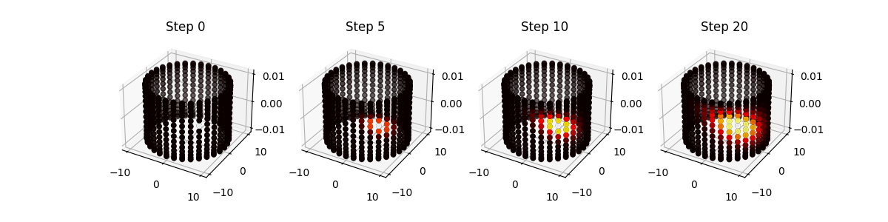

# Introduction

In this blog post we will reveal a surprising connection between the Fourier Transform and graphs. In particular, we will find that we can apply a Fourier Transform to a graph and analyze a graph in its \"spectral\" domain. As in the case of classical signal processing, this transform will hopefully make certain kinds of operations easier. In the process, we will also learn a new kind of convolution operation that can be "learned" by a neural network. 

# Classical Fourier Transform as a Spectral Decomposition

We show that the classical discrete Fourier transform (DFT) arises from the eigendecomposition of the discrete Laplacian operator. This makes the connection to the Graph Fourier Transform explicit.

## Discrete Laplacian Matrix  

Consider a 1-D signal sampled at $n$ evenly spaced points: $$x = (x_0, x_1, \dots, x_{n-1})^\top.$$

The continuous Laplacian operator $-\frac{d^2}{dx^2}$ is approximated on a uniform grid by the finite-difference stencil $$f''(i) \approx f(i+1) - 2 f(i) + f(i-1).$$

With periodic boundary conditions, the discrete Laplacian becomes the circulant matrix: $$L =
\begin{bmatrix}
 2 & -1 &  0 & \cdots & 0 & -1 \\\\
 -1 & 2 & -1 & \cdots & 0 & 0 \\\\
 0 & -1 & 2 & \cdots & 0 & 0 \\\\
 \vdots & \vdots & \vdots & \ddots & \vdots & \vdots \\\\
 0 & 0 & 0 & \cdots & 2 & -1 \\\\
 -1 & 0 & 0 & \cdots & -1 & 2
\end{bmatrix}.$$

This matrix discretises $-\frac{d^2}{dx^2}$ on a circle.

## Eigenvectors of the Discrete Laplacian  

The eigenvectors of $L$ are the complex exponentials $$u_k(j) = \frac{1}{\sqrt{n}} e^{-2\pi i k j / n}, 
\qquad k = 0, \dots, n-1.$$

These form the DFT basis. Their corresponding eigenvalues are $$\lambda_k = 4 \sin^2\!\left( \frac{\pi k}{n} \right).$$

Thus the discrete Laplacian admits the decomposition $$L = F^\ast \Lambda F,$$ where $F$ is the DFT matrix and $\Lambda = \operatorname{diag}(\lambda_k)$.

## Fourier Transform in Matrix Form  

Define the DFT matrix $$F_{k,j} 
= \frac{1}{\sqrt{n}} e^{- 2\pi i k j / n}.$$

The discrete Fourier transform of $x$ is the unitary matrix--vector product $$\hat{x} = F x,$$ and the inverse transform is $$x = F^\ast \hat{x}.$$

## Interpretation  

The classical Fourier transform is therefore the spectral decomposition of the discrete Laplacian on a 1-D grid. Its eigenvectors (complex exponentials) play the role of "frequencies," and its eigenvalues correspond to squared frequencies: $$L u_k = \lambda_k u_k.$$

# General Recipe For Transforms

Diagonalizing an operator of interest is all a transform really does. Thus, the general recipe for a transform is,

- Choose an operator $T$ that captures the structure of your data

- Compute its eigen vectors $T u_k = \lambda_k u_k$ (under some nice conditions these form a basis)

- Assemble them into a matrix $U$

- Project your data into this basic $\hat{x} = U^T x$

## Computational Issues

In many cases, an operation becomes substantially cheaper once we move to an appropriate transform domain. Suppose an operator $T$ acting on data $x$ admits the decomposition $$T = U D U^{-1},$$ where $U$ contains the eigenvectors of $T$ and $D$ is diagonal. Then applying $T$ to $x$ can be written as $$Tx = U D U^{-1} x.$$

This is advantageous because:

- Multiplication by the diagonal matrix $D$ reduces to simple elementwise scaling.

- Both $U^{-1}x$ and $U(\cdot)$ correspond to structured transforms (see my post on the computational benefits of low-rank factorizations), which can often be carried out efficiently.

However, these gains come with an important caveat: **computing the eigen-decomposition itself is expensive**. For both dense and sparse matrices, a full eigen-decomposition typically costs $O(n^3)$. If the decomposition is computed once and reused, the transform offers real computational savings. But if the eigenvectors must be recomputed repeatedly, the cost of the decomposition can outweigh the benefits of faster multiplication in the transform domain.

# Graph Fourier Transform

Using the general formulation of the Transform, we can kind of get a sense of what we need in order to create a recipe for a transform. As it turns out we can define a Laplacian operator for the graph as well! And once we have that, we can use the general recipe for a transform and get to work.

# The Laplacian

Take an undirected weighted graph $G = (V, E, W)$. The normalised Laplacian is defined as:

$$L = I - D^{-1/2} A D^{-1/2},$$

where $A$ is the adjacency matrix and $D$ the degree matrix. Write more about why this is important and a good choice.

## Sidebar on $L$

In our general framework of transforms, you could conceivably use any linear operator and transform it. What is important is that the operator means something in your use case. The Laplacian has a meaning (from the classical case above). There are two other operators you could think of using

- The adjacency matrix - perfectly okay to use. But what would the eigen values and vectors mean? (the matrix is also not PSD, which is important but we wont go into that here).

- Degree matrix - this already a diagonalized matrix, thus the decomposition would be trivial i.e. $D = I^T D I$. The transform would be $Ix = x$.

Two key facts:

1.  **Laplacian eigenvectors are the "graph sinusoids."**\
    They generalize the sine waves used in classical Fourier analysis.

2.  **Laplacian eigenvalues represent graph frequencies.**\
    Small eigenvalues correspond to smooth variation across the graph; large eigenvalues correspond to high-frequency, rapidly changing signals across edges.

## Sidebar on the Signal $x$

In the graph setting, the vector $x$ is not part of the graph's structure but rather a *signal* defined on its vertices. Formally, it is a function $$x : V \to \mathbb{R},$$ assigning a real value to each node. Examples include the temperature at each location in a sensor network, the concentration of a diffusing substance, or any node-level feature such as degree, label, or an embedding. In all cases, the graph provides the geometric structure, while $x$ provides the data living on top of it.

# The Graph Fourier Transform (GFT)

Given the eigendecomposition of the Laplacian:

$$L = U \Lambda U^{\top},$$

the **Graph Fourier Transform** (GFT) of a graph signal $x$ is:

$$\hat{x} = U^{\top} x,$$

and the inverse transform is:

$$x = U \hat{x}.$$

Interpretation:

- $x$ is an item signal (e.g., a rating vector, an embedding dimension, or item popularity).

- $U$ is the graph Fourier basis (the eigenvectors of the Laplacian).

- $\hat{x}$ decomposes the signal into frequencies over the item graph.

# One-Layer Spectral GCN

Now that we understand the Graph Fourier Transform (GFT), we can place it in the context of learning on graphs. Recall the eigen decomposition of the (combinatorial or normalized) graph Laplacian: $$L = U \Lambda U^{\top},$$ where $U$ contains the eigenvectors and $\Lambda$ contains the corresponding eigenvalues. Since the columns of $U$ form the graph Fourier basis, the GFT of a signal $x$ is simply $U^{\top}x$, and the inverse GFT is $Ux$.

The key observation behind spectral graph neural networks is that *any linear, shift-invariant operator on the graph* must commute with $L$, and hence can be written as a function of $L$. In the spectral domain this means: $$T = g(L) = Ug(\Lambda)U^{\top},$$ where $g(\Lambda)$ is a diagonal matrix whose entries are the spectral response $g(\lambda_i)$. This is the exact analogue of designing filters in classical Fourier analysis: multiplication by a diagonal spectral filter.

Applying this filter to a graph signal $x$ gives $$Tx = Ug(\Lambda) U^{\top} x,$$ which mirrors the familiar "transform--scale--inverse transform'' pipeline.

A useful intuition comes from the spectral perspective: if we apply the trivial spectral filter $$g(\Lambda) = I,$$ i.e., leave all eigenvalues unchanged, then $$T x = U g(\Lambda) U^\top x = U I U^\top x = x.$$ In other words, doing nothing in the spectral domain reproduces the original signal exactly. The graph Fourier transform framework therefore generalises the idea of filtering: by modifying $g(\Lambda)$, we can amplify, attenuate, or smooth different frequency components of $x$.

This structure leads directly to the formulation of a one-layer spectral GCN. Suppose we have input features $X \in \mathbb{R}^{n \times d_{\text{in}}}$ and we want to learn $d_{\text{out}}$ output features. For each output channel, we learn a spectral filter $g_\theta(\Lambda)$ parameterised by a set of trainable weights $\theta$. The spectral GCN layer becomes: $$H = U g_\theta(\Lambda)U^{\top} x$$ where $H \in \mathbb{R}^{n \times d_{\text{out}}}$ is the output feature matrix.

In other words:

- $U^{\top} X$ transforms node features into the spectral domain (i.e., the GFT applied column-wise),

- $g_\theta(\Lambda)$ performs learned, elementwise spectral filtering,

- $U(\cdot)$ transforms the filtered signals back to the vertex domain.

This is the original "spectral GCN'' formulation of Bruna et al., and it explicitly relies on the GFT. Later work (e.g. Kipf & Welling) replaces $g_\theta(\Lambda)$ with a polynomial approximation to avoid the $O(n^3)$ eigen-decomposition, but the conceptual core remains the same: **GCNs perform convolution by filtering in the GFT domain**.

# Application of Spectral GCN: Heat Propagation

In this section, we investigate a simple setting where a Spectral Graph Convolutional Network (GCN) performs surprisingly well: predicting heat diffusion across a toroidal mesh. Although the spectral approach is elegant and effective in the right circumstances, it also highlights several structural limitations inherent to spectral methods.

# Heat Propagation on a Torus

We consider the task of forecasting how heat evolves over time when injected into a small region of a torus. The Laplacian of the torus defines the natural "geometry" over which heat diffuses, and its eigenvectors give us the graph Fourier basis used by the Spectral GCN. A small neural network, operating entirely in the spectral domain, is capable of learning this propagation operator with impressive accuracy.

# Why Use A Neural Network
Two motivating examples illustrate the practical usefulness of such a model:

- **Partial Observations from Sensors**
In many real-world systems, heat or pressure sensors are only available at a small subset of points. We train the Spectral GCN using only these sparse observations, yet the learned model reconstructs and predicts the heat field across \emph{all} vertices on the mesh. This effectively transforms a sparse set of measurements into a full-field prediction.

- **Generalization to a New Geometry**
One might hope that a model trained on one torus could be applied to a slightly different torus. Unfortunately, this is generally not possible in the spectral setting. The eigenvectors of the Laplacian form the coordinate system in which the model operates, and even small geometric changes produce different Laplacian spectra. As a result, the learned spectral filters are not transferable across meshes. This is a fundamental drawback of spectral GCNs.

## Stability Issues and Normalization

While the Spectral GCN learns the qualitative behaviour of heat diffusion, raw training often leads to unstable predictions. After several steps, the overall temperature of the mesh may drift upward or downward, even though heat diffusion is energy-conserving. This is because the neural network makes predictions locally without obeying the laws of physics such as the law of conservation of energy. Which is why our predictions are on average "hotter" than the actual. 

Two practical fixes alleviate this:

- **Eigenvalue Normalization.** Applying a sigmoid or similar squashing function to the learned spectral filter ensures that each frequency component is damped in a physically plausible range. This prevents the model from amplifying high-frequency modes, which would otherwise cause heat values to explode.

- **Energy Conservation.** After each predicted step, the total heat can be renormalized to match the physical energy of the system. This ensures that although the *shape* of the prediction is learned by the model, the *magnitude* remains consistent with diffusion dynamics. Empirically, this correction dramatically improves long-horizon stability.

Overall, the Spectral GCN provides a compact and interpretable model for heat propagation on a fixed mesh and performs remarkably well given its simplicity. However, its reliance on the Laplacian eigenbasis also limits its ability to generalize across geometries, motivating the need for more flexible spatial or message-passing approaches in applications where the underlying mesh may change.

# Cold Start: Recommender Systems

What does spectral graph theory have to do with recommender systems? Once we view user--item behaviour as a graph, the connection becomes natural. In the spectral domain, *low-frequency* Laplacian eigenvectors capture broad, mainstream purchasing patterns, while *high-frequency* components represent niche tastes and micro-segments. Matrix Factorisation (MF) implicitly applies a *low-pass filter*: embeddings vary smoothly across the item--item graph, meaning MF emphasises low-frequency structure. But MF breaks down for cold-start items because an isolated item contributes no collaborative signal.

In contrast, a spectral GCN applies a learned filter $$T x \;=\; g(L)x \;=\; U\, g(\Lambda)\, U^\top x,$$

Thus every item will receive a signal value simply by virtue of having a shared edge with another product without having any purchase history itself.

# Appendix 

## Why a cold-start item can receive a purchase probability via graph propagation

#### Setup.

Let $G=(V,E)$ be the user--item graph. For simplicity stack users and items into the same node index set; let $x_i\in\mathbb{R}^d$ be the side feature vector for node $i$ (items have item features; users may have user features). Let $A$ be the adjacency matrix and $\tilde{A}=A+I$ include self-loops. Define the symmetric normalised operator $$\hat{A} = \tilde{D}^{-1/2}\tilde{A}\tilde{D}^{-1/2},
\qquad \tilde{D}_{ii}=\sum_j\tilde{A}_{ij}.$$

Consider a single GCN layer (linear, for analytical clarity) that produces node embeddings $$Z = \hat{A} X W,$$ where $X\in\mathbb{R}^{n\times d}$ stacks node features and $W\in\mathbb{R}^{d\times h}$ is a learned linear map to latent space $\mathbb{R}^h$. We score a user $u$ and item $i$ by their dot product and convert it to a purchase probability via a sigmoid: $$s(u,i) = z_u^\top z_i,\qquad
P(\text{purchase}\mid u,i)=\sigma\big(s(u,i)\big).$$

#### Explicit expression for a cold item connected to popular products.

Write the $i$-th row of $\hat{A}$ as $\{\alpha_{ij}\}_{j}$ (these $\alpha_{ij}$ are the normalised weights, $\alpha_{ij}=\hat{A}_{ij}$). Then $$z_i = \sum_{j\in V} \alpha_{ij}\,(x_j W).$$ If item $i$ is *cold* in the sense of having few or no interactions originally but is connected (shares an edge) to some popular product nodes $p\in\mathcal{P}\subset V$, those neighbors contribute to $z_i$ via their features $x_p$. Similarly the user embedding is $$z_u = \sum_{t\in V} \alpha_{u t}\,(x_t W).$$

The score is therefore $$s(u,i) = z_u^\top z_i
= \Bigg(\sum_{t}\alpha_{u t}\, (x_t W)\Bigg)^\top
\Bigg(\sum_{j}\alpha_{ij}\, (x_j W)\Bigg)
= \sum_{t}\sum_{j} \alpha_{u t}\,\alpha_{ij}\,
\big( x_t W\big)^\top\big(x_j W\big).$$ Focus on terms where $j\in\mathcal{P}$ (popular items connected to $i$) and where $t$ ranges over the neighbors that make $u$ prefer popular items. If the user $u$ interacts with or is close (in feature space) to the same popular products, then the inner products $(x_t W)^\top(x_j W)$ will be large and positive for those $t,j$ pairs. Hence those terms accumulate and increase $s(u,i)$.

#### A simple sufficient condition.

Assume there exists a unit vector $v\in\mathbb{R}^h$ and a constant $c>0$ such that for every popular neighbor $p\in\mathcal{P}$ $$v^\top (x_p W) \ge c,$$ and the user embedding has nontrivial projection onto $v$, $$v^\top z_u = \sum_{t}\alpha_{u t}\, v^\top (x_t W) =: \gamma > 0.$$ Then the score satisfies $$s(u,i) = z_u^\top z_i \ge (v^\top z_u)\,(v^\top z_i)
= \gamma \Bigg(\sum_{p\in\mathcal{P}} \alpha_{i p}\, v^\top(x_p W)\Bigg)
\ge \gamma \, c \sum_{p\in\mathcal{P}} \alpha_{i p}.$$ Thus if $i$ is connected to at least one popular product with substantial normalised weight $\alpha_{ip}$, the right-hand side is positive and the sigmoid $\sigma(s(u,i))$ yields a non-trivial purchase probability.

#### Spectral viewpoint (complementary intuition).

Write the Laplacian eigendecomposition $L=U\Lambda U^\top$. A spectral filter $g(L)$ acts as $$z = g(L) X W = U\, g(\Lambda)\, U^\top X W.$$ Projecting the item features $x_i$ into the eigenbasis gives coefficients $\hat{x}_i=U^\top x_i$. If a cold item $i$ shares graph-local structure with popular products, its projection $\hat{x}_i$ will contain similar *low-frequency* components to those popular products. A low-pass (or band-preserving) filter $g(\Lambda)$ will therefore map $x_i$ to a latent vector $z_i$ that aligns with the embeddings of popular items. The user embedding $z_u$, which itself aggregates (via the same filter) information from popular items the user likes, will thus have large cosine/dot alignment with $z_i$, producing a high score.

#### Summary.

Concretely, even without direct interaction history for item $i$, (i) graph propagation mixes neighbor item features into $z_i$ via $\hat{A}$, and (ii) scoring via dot product accumulates cross-terms between user-neighbor and item-neighbor features. If the neighbors are popular and the user is aligned to those popular neighbors, the resulting score $s(u,i)$ becomes large and the purchase probability $\sigma(s(u,i))$ is non-negligible. This is the precise mechanism by which GCNs (and spectral filters $g(L)$) enable useful cold-start predictions from feature+graph structure alone.
pandoc version 3.8.2.1

