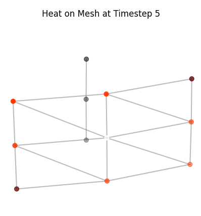

# Introduction

I have always been obsessed with the Fourier Transform, it is in my opinion the single greatest invention in the history of mathematics. Check out this [Veritasium video](https://www.youtube.com/watch?v=nmgFG7PUHfo) on it! Part of what makes the Fourier Transform so ubiquitous is that any function can be broken down into its component frequencies. What is less well known is that the definition of \"frequency\" is purely mathematical and applies to a broader class of mathematical objects than just functions! In this post I will try to provide some intuition and visualizations that expand the Fourier Transform to graphs, called the Graph Fourier Transform. Hopefully once that is clear, we will apply the Graph Fourier Transform in a Spectral Graph Convolution Network to model heat propagation in a toroidal surface.

Repo:
https://github.com/FranciscoRMendes/graph_networks/tree/main

Colab Notebook:
https://github.com/FranciscoRMendes/graph_networks/blob/main/GCN.ipynb

# Classical Fourier Transform As A Special Case Of The Graph Fourier Transform
While there are many ways to view the Fourier Transform, the most revealing perspective is to regard it as multiplication of a discrete signal by a special matrix. This viewpoint is useful for several reasons.

1.  Once a signal is discretised, it becomes a vector, and any linear operation on it can be represented as multiplication by a matrix.

2.  A transform is therefore a change of basis: multiplying a vector by a matrix produces a new representation of the same data.

3.  However, only a very small number of matrices yield transformed coordinates that are interpretable. The Fourier matrix $F$ is special because its columns correspond to pure oscillations, which are the eigenvectors of every shift-invariant operator.

4.  A useful transform must also be invertible. After performing operations in the transformed domain, one should be able to recover the original signal exactly. The Fourier matrix satisfies $F^\ast F = N I$, which gives a simple inverse and perfect reconstruction.

Every transform follows the same general recipe:

- choose a matrix whose columns represent meaningful basis vectors,

- multiply the signal by this matrix,

- interpret the transformed coefficients,

- use the inverse matrix to return to the original domain.

## DFT via the Discrete Laplacian Matrix  
We start by deriving the DFT in matrix form for a discrete signal. We will use this as a basis to then derive the Graph Fourier Transform. 
Consider a 1-D signal sampled at $n$ evenly spaced points: $$x = (x_0, x_1, \dots, x_{n-1})^\top.$$

The continuous Laplacian operator $-\frac{d^2}{dx^2}$ is approximated on a uniform grid by the finite-difference stencil $$f''(i) \approx f(i+1) - 2 f(i) + f(i-1).$$

With periodic boundary conditions, the discrete Laplacian becomes the circulant matrix (keep this in mind when we go to the graph case, we shall see later that this is exactly the Laplacian of a cycle graph): 
$$L =
\begin{bmatrix}
 2 & -1 &  0 & \cdots & 0 & -1 \\\\
 -1 & 2 & -1 & \cdots & 0 & 0 \\\\
 0 & -1 & 2 & \cdots & 0 & 0 \\\\
 \vdots & \vdots & \vdots & \ddots & \vdots & \vdots \\\\
 0 & 0 & 0 & \cdots & 2 & -1 \\\\
 -1 & 0 & 0 & \cdots & -1 & 2
\end{bmatrix}$$

This matrix discretises the second derivative, $-\frac{d^2}{dx^2}$ on a circle. 

## Eigenvectors of the Discrete Laplacian  

The eigenvectors of $L$ are the complex exponentials $$u_k(j) = \frac{1}{\sqrt{n}} e^{-2\pi i k j / n}, 
\qquad k = 0, \dots, n-1.$$

These form the DFT basis. Their corresponding eigenvalues are $$\lambda_k = 4 \sin^2\!\left( \frac{\pi k}{n} \right).$$

Thus the discrete Laplacian admits the decomposition $$L = F^\ast \Lambda F,$$ where $F$ is the DFT matrix and $\Lambda = \operatorname{diag}(\lambda_k)$.

## Fourier Transform in Matrix Form

Define the DFT matrix $$F_{k,j} 
= \frac{1}{\sqrt{n}} e^{- 2\pi i k j / n}.$$

The discrete Fourier transform of $x$ is the unitary matrix--vector product $$\hat{x} = F x$$ and the inverse transform is $$x = F^\ast \hat{x}$$.

## Interpretation  

The classical Fourier transform is therefore the spectral decomposition of the discrete Laplacian on a 1-D grid. Its eigenvectors (complex exponentials) play the role of "frequencies," and its eigenvalues correspond to squared frequencies: $$L u_k = \lambda_k u_k.$$

### So what the heck was the convolution?

Convolution is a local, weighted sum operation over neighbouring inputs. On a 1D signal you would need to use windows and slide them over the signal using the weighted sum operation over all signals in the window. 

However, by moving to the spectral domain using the graph Fourier transform, convolution reduces to a simple multiplication: $$\hat{x} = F x,$$ where $F$ is the matrix of eigenvectors of the graph Laplacian and $x$ is the signal on the nodes.

This is crucial because it allows us to *avoid explicitly defining a complicated convolution operator*. Instead, we can learn filters in the spectral domain that act directly on the eigencomponents of the signal, greatly simplifying the operation while retaining expressive power.

On a graph, performing such a convolution directly is highly nontrivial because the neighbourhoods are irregular. But what if we could mathematically transform the graph to another domain where the operation is a simple multiplcation?

<!-- ## Graph Fourier Transform
This viewpoint connects directly to the Graph Fourier Transform (GFT). _The discrete Fourier transform corresponds to the special case where the underlying structure is a cycle graph. In this case the transformation matrix is the Fourier matrix $F$, whose columns are the eigenvectors of the discrete Laplacian on the cycle._

For a general graph the same idea applies: the meaningful basis vectors are the eigenvectors of the graph Laplacian. If $$L = U \Lambda U^{\top},$$ then multiplication by $U^{\top}$ defines the Graph Fourier Transform. Thus the *DFT is the simplest instance of a Laplacian-eigenvector transform*, and the GFT extends this construction to arbitrary graphs. -->

# General Recipe For Transforms

Diagonalizing an operator of interest is all a transform really does. Thus, the general recipe for a transform is,

- Choose an operator $T$ that captures the structure of your data

- Compute its eigen vectors $T u_k = \lambda_k u_k$ (under some nice conditions these form a basis)

- Assemble them into a matrix $U$

- Project your data into this basic $\hat{x} = U^T x$

## Computational Issues

In many cases, an operation becomes substantially cheaper once we move to an appropriate transform domain. Suppose an operator $T$ acting on data $x$ admits the decomposition $$T = U D U^{-1},$$ where $U$ contains the eigenvectors of $T$ and $D$ is diagonal. Then applying $T$ to $x$ can be written as $$Tx = U D U^{-1} x.$$

This is advantageous because:

- Multiplication by the diagonal matrix $D$ reduces to simple elementwise scaling.

- Both $U^{-1}x$ and $U(\cdot)$ correspond to structured transforms (see my post on the computational benefits of low-rank factorizations), which can often be carried out efficiently.

However, these gains come with an important caveat: **computing the eigen-decomposition itself is expensive**. For both dense and sparse matrices, a full eigen-decomposition typically costs $O(n^3)$. If the decomposition is computed once and reused, the transform offers real computational savings. But if the eigenvectors must be recomputed repeatedly, the cost of the decomposition can outweigh the benefits of faster multiplication in the transform domain.

# Graph Fourier Transform

Using the general formulation of the Transform, we can kind of get a sense of what we need in order to create a recipe for a transform. As it turns out we can define a Laplacian operator for the graph as well! And once we have that, we can use the general recipe for a transform and get to work.

# The Laplacian

Take an undirected weighted graph $G = (V, E, W)$. The normalised Laplacian is defined as:

$$L = I - D^{-1/2} A D^{-1/2},$$

where $A$ is the adjacency matrix and $D$ the degree matrix. Write more about why this is important and a good choice.

## Sidebar on $L$

In our general framework of transforms, you could conceivably use any linear operator and transform it. What is important is that the operator means something in your use case. The Laplacian has a meaning (from the classical case above). There are two other operators you could think of using

- The adjacency matrix - perfectly okay to use. But what would the eigen values and vectors mean? (the matrix is also not PSD, which is important but we wont go into that here).

- Degree matrix - this already a diagonalized matrix, thus the decomposition would be trivial i.e. $D = I^T D I$. The transform would be $Ix = x$.

Two key facts:

1.  Laplacian eigenvectors are the "graph sinusoids" - They generalize the sine waves used in classical Fourier analysis.

2.  Laplacian eigenvalues represent graph frequencies - Small eigenvalues correspond to smooth variation across the graph; large eigenvalues correspond to high-frequency, rapidly changing signals across edges.

Connection to the 1D case:

The Laplacian for a cycle graph is identical to the Laplacian for the 1D case. 

## Sidebar on the Signal $x$

In the graph setting, the vector $x$ is not part of the graph's structure but rather a *signal* defined on its vertices. Formally, it is a function $$x : V \to \mathbb{R},$$ assigning a real value to each node. Examples include the temperature at each location in a sensor network, the concentration of a diffusing substance, or any node-level feature such as degree, label, or an embedding. In all cases, the graph provides the geometric structure, while $x$ provides the data living on top of it.

# The Graph Fourier Transform (GFT)

Given the eigendecomposition of the Laplacian:

$$
L = U \Lambda U^{\top}
$$

we can write the matrices in fully expanded form as

$$ U =
\begin{bmatrix}
u_{1,1} & u_{1,2} & \cdots & u_{1,n} \\\\
u_{2,1} & u_{2,2} & \cdots & u_{2,n} \\\\
\vdots  & \vdots  & \ddots & \vdots  \\\\
u_{n,1} & u_{n,2} & \cdots & u_{n,n}\\\\
\end{bmatrix}
\qquad
$$

$$
\Lambda =
\begin{bmatrix}
\lambda_1 & 0         & \cdots & 0 \\\\
0         & \lambda_2 & \cdots & 0 \\\\
\vdots    & \vdots    & \ddots & \vdots \\\\
0         & 0         & \cdots & \lambda_n\\\\
\end{bmatrix},
$$

$$
U^{\top} =
\begin{bmatrix}
u_{1,1} & u_{2,1} & \cdots & u_{n,1} \\\\
u_{1,2} & u_{2,2} & \cdots & u_{n,2} \\\\
\vdots  & \vdots  & \ddots & \vdots  \\\\
u_{1,n} & u_{2,n} & \cdots & u_{n,n}\\\\
\end{bmatrix}.
$$

Therefore,

$$
L = 
\begin{bmatrix}
u_{1,1} & u_{1,2} & \cdots & u_{1,n} \\\\
u_{2,1} & u_{2,2} & \cdots & u_{2,n} \\\\
\vdots  & \vdots  & \ddots & \vdots  \\\\
u_{n,1} & u_{n,2} & \cdots & u_{n,n}\\\\
\end{bmatrix}
\begin{bmatrix}
\lambda_1 & 0         & \cdots & 0 \\\\
0         & \lambda_2 & \cdots & 0 \\\\
\vdots    & \vdots    & \ddots & \vdots \\\\
0         & 0         & \cdots & \lambda_n\\\\
\end{bmatrix}
\begin{bmatrix}
u_{1,1} & u_{2,1} & \cdots & u_{n,1} \\\\
u_{1,2} & u_{2,2} & \cdots & u_{n,2} \\\\
\vdots  & \vdots  & \ddots & \vdots  \\\\
u_{1,n} & u_{2,n} & \cdots & u_{n,n}\\\\
\end{bmatrix}.
$$

Equivalently,

$$
U = [U_1\; U_2\; \cdots\; U_n], \qquad
$$

$$
U_i = 
\begin{bmatrix}
u_{1,i} \\\\
u_{2,i} \\\\
\vdots  \\\\
u_{n,i}\\\\
\end{bmatrix},
\quad\text{where } L U_i = \lambda_i U_i
$$

Each column $U_i$ is an eigenvector of $L$, and its entries $(u_{1,i}, \dots, u_{n,i})$ give the value of the $i$-th **graph frequency mode** at every node of the graph.

the **Graph Fourier Transform** (GFT) of a graph signal $x$ is:

$$\hat{x} = U^{\top} x,$$

and the inverse transform is:

$$x = U \hat{x}.$$

Interpretation:

- $x$ is an item signal (e.g., a rating vector, an embedding dimension, or item popularity).

- $U$ is the graph Fourier basis (the eigenvectors of the Laplacian).

- $\hat{x}$ decomposes the signal into frequencies over the item graph.

# One-Layer Spectral GCN

Now that we understand the Graph Fourier Transform (GFT), we can place it in the context of learning on graphs. Recall the eigen decomposition of the (combinatorial or normalized) graph Laplacian: $$L = U \Lambda U^{\top},$$ where $U$ contains the eigenvectors and $\Lambda$ contains the corresponding eigenvalues. Since the columns of $U$ form the graph Fourier basis, the GFT of a signal $x$ is simply $U^{\top}x$, and the inverse GFT is $Ux$.

The key observation behind spectral graph neural networks is that *any linear, shift-invariant operator on the graph* must commute with $L$, and hence can be written as a function of $L$. In the spectral domain this means: 

$$T = g(L) = Ug(\Lambda)U^{\top}$$ where $g(\Lambda)$ 

is a diagonal matrix whose entries are the spectral response $g(\lambda_i)$. This is the exact analogue of designing filters in classical Fourier analysis: multiplication by a diagonal spectral filter.

Applying this filter to a graph signal $x$ gives $$Tx = Ug(\Lambda)U^{\top}x$$ which mirrors the familiar "transform--scale--inverse transform'' pipeline.

A useful intuition comes from the spectral perspective: if we apply the trivial spectral filter $$g(\Lambda) = I,$$ i.e., leave all eigenvalues unchanged, then $$T x = U g(\Lambda) U^\top x = U I U^\top x = x$$. In other words, doing nothing in the spectral domain reproduces the original signal exactly. The graph Fourier transform framework therefore generalises the idea of filtering: by modifying $g(\Lambda)$, we can amplify, attenuate, or smooth different frequency components of $x$.

This structure leads directly to the formulation of a one-layer spectral GCN. Suppose we have input features $X \in \mathbb{R}^{n \times d_{\text{in}}}$ and we want to learn $d_{\text{out}}$ output features. For each output channel, we learn a spectral filter $g_\theta(\Lambda)$ parameterised by a set of trainable weights $\theta$. The spectral GCN layer becomes: $$H = U\ g_\theta(\Lambda)\ U^{\top} x$$ where $H \in \mathbb{R}^{n \times d_{\text{out}}}$ is the output feature matrix.

In other words:

- $U^{\top} X$ transforms node features into the spectral domain (i.e., the GFT applied column-wise),

- $g_\theta(\Lambda)$ performs learned, elementwise spectral filtering,

- $U(\cdot)$ transforms the filtered signals back to the vertex domain.

## Sidebar on $g_{\theta}(\Lambda)$

It is always good to have a good understanding of the exact matrix or vector that we need to \"learn\" so that we can represent it in PyTorch exactly! We start with the Laplacian eigendecomposition 

$$L = U \Lambda U^{\top},
\qquad 
\Lambda = 
\begin{bmatrix}
\lambda_1 & 0        & \cdots & 0 \\\\
0         & \lambda_2 & \cdots & 0 \\\\
\vdots    & \vdots    & \ddots & \vdots \\\\
0         & 0         & \cdots & \lambda_n\\\\
\end{bmatrix}.$$

To construct a spectral filter we introduce a learnable vector,

$$\theta = (\theta_1, \theta_2, \dots, \theta_n)$$ 

Thus, 

$$
g_{\theta}(\Lambda) =
\begin{bmatrix}
\theta_1 \lambda_1 & 0                  & \cdots & 0 \\\\
0                  & \theta_2 \lambda_2 & \cdots & 0 \\\\
\vdots             & \vdots             & \ddots & \vdots \\\\
0                  & 0                  & \cdots & \theta_n \lambda_n\\\\
\end{bmatrix}
$$

This makes it clear that each frequency component is scaled independently: 

$$
g_{\theta}(L)x = U g_{\theta}(\Lambda) U^{\top} x 
$$ 

and the operation modifies the contribution of each eigenvalue individually before transforming the signal back to the graph domain. Additionally, it might be worthwhile to squash the values after multiplying to make sure they are between 0 and 1. We can do this by introducing an activation function. 

$$
g_{\theta}(\Lambda) =
\begin{bmatrix}
\sigma(\theta_1 \lambda_1) & 0                       & \cdots & 0 \\\\
0                          & \sigma(\theta_2 \lambda_2) & \cdots & 0 \\\\
\vdots                     & \vdots                    & \ddots & \vdots \\\\
0                          & 0                         & \cdots & \sigma(\theta_n \lambda_n)\\\\
\end{bmatrix}
$$

This is the original "spectral GCN'' formulation of Bruna et al., and it explicitly relies on the GFT. Later work (e.g. Kipf & Welling) replaces $g_\theta(\Lambda)$ with a polynomial approximation to avoid the $O(n^3)$ eigen-decomposition, but the conceptual core remains the same: **GCNs perform convolution by filtering in the GFT domain**.

# Application of Spectral GCN: Heat Propagation

In this section, we investigate a simple setting where a Spectral Graph Convolutional Network (GCN) performs surprisingly well: predicting heat diffusion across a toroidal mesh. Although the spectral approach is elegant and effective in the right circumstances, it also highlights several structural limitations inherent to spectral methods.

# Graph Model of Heat Propagation
When we zoom into a small patch of the torus and add the connecting edges, the mesh suddenly looks like a familiar graph. This makes the role of the graph Laplacian immediately intuitive.

  
  <figcaption style="text-align:left;"> We zoom in on the hottest point on the mesh and plot it as a graph by explicitly showing edges. </figcaption>

We simulate heat diffusion on the graph using the discrete heat equation:

$$\frac{dx}{dt} = -L x$$

where $x \in \mathbb{R}^N$ is the heat at each node and $L$ is the graph Laplacian. Starting from two random vertices with initial heat, we update the heat iteratively using a simple forward Euler scheme:

$$x_{t+1} = x_t - \alpha L x_t$$

storing the state at each timestep to visualize how heat spreads across the mesh. Low-frequency modes of $L$ correspond to smooth, global patterns of heat, while high-frequency modes produce rapid, local variations.

## Graph Fourier Transform of Heat Propagation

In order to get intuition for how the Fourier transform behaves on a graph, consider the distribution of heat on the graph surface.

- The heat on the graph is represented by a real number for each node (temperature or heat energy in joules), so the signal is a vector $$x \in \mathbb{R}^{N},$$ where $N$ is the number of nodes.

- If there are $N$ nodes in the graph the (combinatorial or normalized) Laplacian is an $N\times N$ matrix $$L \in \mathbb{R}^{N\times N}$$.

We use the eigendecomposition of the Laplacian to move between the vertex domain and the spectral (frequency) domain: $$L = U \Lambda U^{\top}, \qquad
\Lambda = \operatorname{diag}(\lambda_1,\ldots,\lambda_N), \qquad
U = [U_1\; U_2\; \cdots\; U_N],$$ with the eigenvalues ordered $0=\lambda_1 \le \lambda_2 \le \cdots \le \lambda_N$. The graph Fourier transform (GFT) and inverse GFT are $$\widehat{x} = U^{\top} x, \qquad x = U \widehat{x}$$.

To visualise single-frequency modes we simply pick individual eigenvectors $U_k$: $$\text{low-frequency mode: } x_{\text{low}} = U_{k_{\text{low}}}, \qquad
\text{high-frequency mode: } x_{\text{high}} = U_{k_{\text{high}}},$$ where a natural choice is $k_{\text{low}}=2$ (the first nontrivial eigenvector) and $k_{\text{high}}=N$ (one of the largest-eigenvalue modes). Each vector $U_k$ assigns one scalar value to every vertex; plotting those values on the torus surface gives the heat-colour visualisation.

#### Practical steps used to create the figure

1.  Build a uniform torus mesh and assemble adjacency and Laplacian $L$.

2.  Compute the eigendecomposition $L=U\Lambda U^\top$ (for small / moderate meshes) or compute a selection of eigenpairs (Lanczos) for large meshes.

3.  Select a low-frequency eigenvector $U_{k_{\text{low}}}$ and a high-frequency eigenvector $U_{k_{\text{high}}}$.

4.  [Optional; not done here; to show smaller values in absolute terms]Normalize each eigenvector for display: $$\tilde{x} = \frac{x - \min(x)}{\max(x)-\min(x)} \quad\text{or}\quad
        \tilde{x} = \frac{x}{\max(|x|)},$$ so colours are comparable across panels.

5.  Render the torus surface and colour each vertex by the value $\tilde{x}$ using a diverging colormap (e.g. `heat`) and add a colourbar showing the mapping from value to colour.

#### Interpreting the GFT on the torus

- **Low-frequency mode.** The plotted heat corresponds to $U_{k_{\text{low}}}$ (small eigenvalue). The signal varies smoothly over the torus: neighbouring vertices have similar values, representing broad, global patterns of heat. 

- **High-frequency mode.** The plotted heat corresponds to $U_{k_{\text{high}}}$ (large eigenvalue). The signal alternates rapidly across nearby vertices, producing fine-scale oscillations around the torus that represent high-frequency, localised variations.

#### Spectral intuition

Recall, we expressed discrete heat propagation on a graph as,
$$
x_{t+1} = (I - \alpha L) x_t
$$
where $L$ is the graph Laplacian and $\alpha$ is a small step size.  

Using the eigendecomposition of $L$,
$$
L = U \Lambda U^\top,
$$
we can rewrite the propagation as
$$
x_{t+1} = \big(I - \alpha U \Lambda U^\top\big) x_t
         = U (I - \alpha \Lambda) U^\top x_t.
$$

Comparing with the spectral graph filtering form,
$$
x_{t+1} = U g(\Lambda) U^\top x_t,
$$
we can identify the corresponding filter as
$$
g(\Lambda) \equiv I - \alpha \Lambda.
$$

Applying a spectral filter $g(\Lambda)$ to a heat signal $x$ acts by scaling each mode: 
$$x_{\text{filtered}} = U g(\Lambda) U^\top x$$ 
so a low-pass filter suppresses the high-frequency panel patterns and produces smoother heat distributions, while a high-pass filter accentuates the oscillatory features visible in the high-frequency panel.

# Neural Network To Learn $g_{\theta}(\Lambda)$
We can write a spectral graph convolution / filter with learnable parameters $\theta$ as

$$
x_{t+1} = U  g_\theta(\Lambda)  U^\top x_t,
$$

where $U$ is the eigenvector matrix of the Laplacian, $\Lambda$ is the diagonal eigenvalue matrix, and $g_\theta(\Lambda)$ is a diagonal matrix of learnable weights acting on each eigenmode.

Fully expanding the diagonal $g_\theta(\Lambda)$:

$$
g_\theta(\Lambda) =
\begin{bmatrix}
\theta_1 & 0 & \cdots & 0 \\\\
0 & \theta_2 & \cdots & 0 \\\\
\vdots & \vdots & \ddots & \vdots \\\\
0 & 0 & \cdots & \theta_n\\\\
\end{bmatrix},
$$

and the Laplacian eigenvectors as column vectors $U = [U_1 \; U_2 \; \cdots \; U_n]$, $U^\top = \begin{bmatrix} U_1^\top \\ U_2^\top \\ \vdots \\ U_n^\top \end{bmatrix}$, we have

$$
x_{t+1} = 
\begin{bmatrix} U_1 & U_2 & \cdots & U_n \end{bmatrix}
\begin{bmatrix}
\theta_1 & 0 & \cdots & 0 \\\\
0 & \theta_2 & \cdots & 0 \\\\
\vdots & \vdots & \ddots & \vdots \\\\
0 & 0 & \cdots & \theta_n\\\\
\end{bmatrix}
\begin{bmatrix} U_1^\top \\\\
U_2^\top \\ \vdots \\\\
U_n^\top \end{bmatrix} x_t\\\\
$$

$$
x_{t+1} = 
\begin{bmatrix} U_1 & U_2 & \cdots & U_n \end{bmatrix}
\begin{bmatrix}
\sigma(\theta_1) & 0 & \cdots & 0 \\\\
0 & \sigma(\theta_2) & \cdots & 0 \\\\
\vdots & \vdots & \ddots & \vdots \\\\
0 & 0 & \cdots & \sigma(\theta_n)\\\\
\end{bmatrix}
\begin{bmatrix} U_1^\top \\\\
U_2^\top \\ \vdots \\\\
U_n^\top \end{bmatrix} x_t
$$

This makes it explicit that each column vector $U_i$ (the $i$-th eigenvector) is scaled by the learnable weight $\theta_i$ in the spectral domain, and then transformed back to the original node space via $U$ to produce the predicted signal $x_{t+1}$.

# Why Use A Neural Network?
Two motivating examples illustrate the practical usefulness of such a model:

- **Partial Observations from Sensors**
In many real-world systems, heat or pressure sensors are only available at a small subset of points. We train the Spectral GCN using only these sparse observations, yet the learned model reconstructs and predicts the heat field across *all* vertices on the mesh. This effectively transforms a sparse set of measurements into a full-field prediction.

- **Generalization to a New Geometry**
One might hope that a model trained on one torus could be applied to a slightly different torus. Unfortunately, this is generally not possible in the GCN setting. The eigenvectors of the Laplacian form the coordinate system in which the model operates, and even small geometric changes produce different Laplacian spectra. As a result, the learned spectral filters are not transferable across meshes. This is a fundamental drawback of spectral GCNs. However, we shall see that the GCN framework inspires frameworks that do not suffer from this drawback. 

## Stability Issues And Normalization

While the Spectral GCN learns the qualitative behaviour of heat diffusion, raw training often leads to unstable predictions. After several steps, the overall temperature of the mesh may drift upward or downward, even though heat diffusion is energy-conserving. This is because the neural network makes predictions locally without obeying the laws of physics such as the law of conservation of energy. Which is why our predictions are on average "hotter" than the actual.

Two practical fixes alleviate this:

- **Eigenvalue Normalization.** Applying a sigmoid or similar squashing function to the learned spectral filter ensures that each frequency component is damped in a physically plausible range. This prevents the model from amplifying high-frequency modes, which would otherwise cause heat values to explode.

- **Energy Conservation.** After each predicted step, the total heat can be renormalized to match the physical energy of the system. This ensures that although the *shape* of the prediction is learned by the model, the *magnitude* remains consistent with diffusion dynamics. Empirically, this correction dramatically improves long-horizon stability.

Overall, the Spectral GCN provides a compact and interpretable model for heat propagation on a fixed mesh and performs remarkably well given its simplicity. However, its reliance on the Laplacian eigenbasis also limits its ability to generalize across geometries, motivating the need for more flexible spatial or message-passing approaches in applications where the underlying mesh may change.

# Cold Start: Recommender Systems

What does spectral graph theory have to do with recommender systems? Once we view user--item behaviour as a graph, the connection becomes natural. In the spectral domain, *low-frequency* Laplacian eigenvectors capture broad, mainstream purchasing patterns, while *high-frequency* components represent niche tastes and micro-segments. Matrix Factorisation (MF) implicitly applies a *low-pass filter*: embeddings vary smoothly across the item--item graph, meaning MF emphasises low-frequency structure. But MF breaks down for cold-start items because an isolated item contributes no collaborative signal.

In contrast, a spectral GCN applies a learned filter $$T x = g(L)x = U\ g(\Lambda) U^\top x$$

In general, we represent user-item interactions as a bipartite graph i.e. edges do not exist between products. In this scenario, even the GCN cannot help since very clearly for a node to get assigned a value it must be connected to at least one other node. However, the graph formulation provides a very intuitive way to fix this issue! Simply add edges between products that are similar to each other. Then low frequency patterns are bound to filter into the node even if high frequency niche patterns will not. 

Matrix factorization resolves this issue by using side information (such as product attributes), which asserts similarity from external data. In my previous post I argued that you can achieve something similar through an intuitive edge-addition approach—even though it amounts to inserting 1’s into a fairly unintuitive matrix and factorizing it.

# Conclusion

In this post, we’ve journeyed from classical Fourier transforms to the spectral domain of graphs, uncovering how eigenvectors of the graph Laplacian act as the “frequencies” of a network. We saw how spectral graph convolutional networks can learn filters in this domain, elegantly predicting heat diffusion on a toroidal mesh. Along the way, we connected these ideas to recommender systems, showing how spectral methods and graph propagation provide a principled way to tackle the cold-start problem by letting information flow from similar or popular items.

While spectral GCNs shine on fixed graphs and structured problems, they also come with caveats: eigen-decompositions can be expensive, and filters are not always transferable across different geometries. Nevertheless, the framework provides intuition and a foundation for more flexible spatial or message-passing approaches.

So, whether you’re modeling heat flowing across a mesh or figuring out what obscure sock a new customer might want next, spectral graph theory shows that Fourier Transforms can take you a long way. 

In my next post, I will deal with the the two main issues of the GCN. 
- Adding a new node/ transferring information to a similar graph
- Saving the computation of the Eigen values of the graph