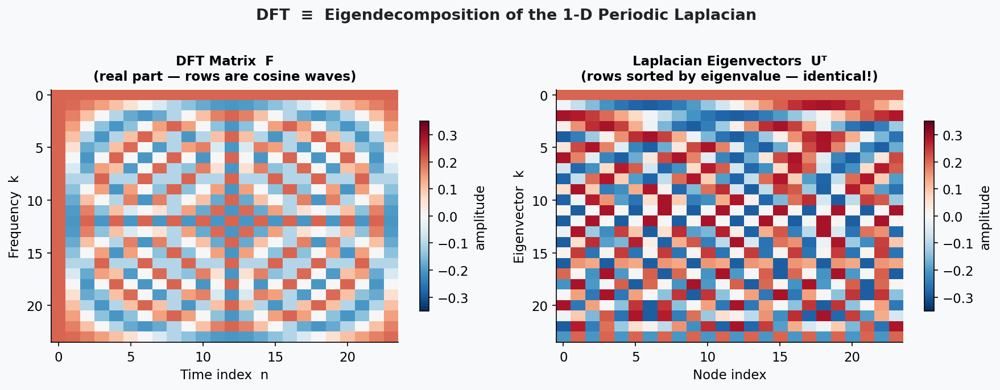
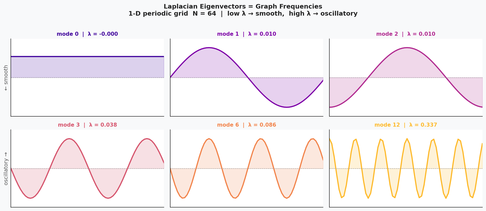
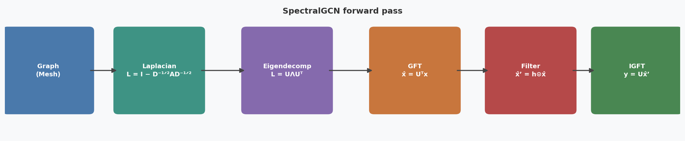

# Introduction

I have always been obsessed with the Fourier Transform, it is in my opinion the single greatest invention in the history of mathematics. Check out this [Veritasium video](https://www.youtube.com/watch?v=nmgFG7PUHfo) on it! Part of what makes the Fourier Transform so ubiquitous is that any function can be broken down into its component frequencies. What is less well known is that the definition of \"frequency\" is purely mathematical and applies to a broader class of mathematical objects than just functions! In this post I will try to provide some intuition and visualizations that expand the Fourier Transform to graphs, called the Graph Fourier Transform. Hopefully once that is clear, we will apply the Graph Fourier Transform in a Spectral Graph Convolution Network to model heat propagation in a toroidal surface.

Repo:
https://github.com/FranciscoRMendes/graph-networks/tree/main

Notebooks:
- [GCN.ipynb](https://github.com/FranciscoRMendes/graph-networks/blob/main/GCN.ipynb) — end-to-end experiment on a 3-D torus
- [foundations.ipynb](https://github.com/FranciscoRMendes/graph-networks/blob/main/foundations.ipynb) — mathematical derivations from DFT to irregular graphs

# Classical Fourier Transform As A Special Case Of The Graph Fourier Transform
While there are many ways to view the Fourier Transform, the most revealing perspective is to regard it as multiplication of a discrete signal by a special matrix. This viewpoint is useful for several reasons.

1.  Once a signal is discretised, it becomes a vector, and any linear operation on it can be represented as multiplication by a matrix.

2.  A transform is therefore a change of basis: multiplying a vector by a matrix produces a new representation of the same data.

3.  However, only a very small number of matrices yield transformed coordinates that are interpretable. The Fourier matrix $F$ is special because its columns correspond to pure oscillations, which are the eigenvectors of every shift-invariant operator.

4.  A useful transform must also be invertible. After performing operations in the transformed domain, one should be able to recover the original signal exactly. The Fourier matrix satisfies $F^\ast F = N I$, which gives a simple inverse and perfect reconstruction.

Every transform follows the same general recipe:

- choose a matrix whose columns represent meaningful basis vectors,

- multiply the signal by this matrix,

- interpret the transformed coefficients,

- use the inverse matrix to return to the original domain.

## DFT via the Discrete Laplacian Matrix  
We start by deriving the DFT in matrix form for a discrete signal. We will use this as a basis to then derive the Graph Fourier Transform. 
Consider a 1-D signal sampled at $n$ evenly spaced points: $$x = (x_0, x_1, \dots, x_{n-1})^\top.$$

The continuous Laplacian operator $-\frac{d^2}{dx^2}$ is approximated on a uniform grid by the finite-difference stencil $$f''(i) \approx f(i+1) - 2 f(i) + f(i-1).$$

With periodic boundary conditions, the discrete Laplacian becomes the circulant matrix (keep this in mind when we go to the graph case, we shall see later that this is exactly the Laplacian of a cycle graph): 
$$L =
\begin{bmatrix}
 2 & -1 &  0 & \cdots & 0 & -1 \\\\
 -1 & 2 & -1 & \cdots & 0 & 0 \\\\
 0 & -1 & 2 & \cdots & 0 & 0 \\\\
 \vdots & \vdots & \vdots & \ddots & \vdots & \vdots \\\\
 0 & 0 & 0 & \cdots & 2 & -1 \\\\
 -1 & 0 & 0 & \cdots & -1 & 2
\end{bmatrix}$$

This matrix discretises the second derivative, $-\frac{d^2}{dx^2}$ on a circle. 

## Eigenvectors of the Discrete Laplacian  

The eigenvectors of $L$ are the complex exponentials $$u_k(j) = \frac{1}{\sqrt{n}} e^{-2\pi i k j / n}, 
\qquad k = 0, \dots, n-1.$$

These form the DFT basis. Their corresponding eigenvalues are $$\lambda_k = 4 \sin^2\!\left( \frac{\pi k}{n} \right).$$

Thus the discrete Laplacian admits the decomposition $$L = F^\ast \Lambda F,$$ where $F$ is the DFT matrix and $\Lambda = \operatorname{diag}(\lambda_k)$.

## Fourier Transform in Matrix Form

Define the DFT matrix $$F_{k,j} 
= \frac{1}{\sqrt{n}} e^{- 2\pi i k j / n}.$$

The discrete Fourier transform of $x$ is the unitary matrix--vector product $$\hat{x} = F x$$ and the inverse transform is $$x = F^\ast \hat{x}$$.

## Interpretation  

The classical Fourier transform is therefore the spectral decomposition of the discrete Laplacian on a 1-D grid. Its eigenvectors (complex exponentials) play the role of "frequencies," and its eigenvalues correspond to squared frequencies: $$L u_k = \lambda_k u_k.$$

The figure below makes this explicit: the DFT matrix and the matrix of Laplacian eigenvectors are identical — the rows of both are the same cosine waves, sorted by frequency.

### So what the heck was the convolution?

Convolution is a local, weighted sum operation over neighbouring inputs. On a 1D signal you would need to use windows and slide them over the signal using the weighted sum operation over all signals in the window. 

However, by moving to the spectral domain using the graph Fourier transform, convolution reduces to a simple multiplication: $$\hat{x} = F x,$$ where $F$ is the matrix of eigenvectors of the graph Laplacian and $x$ is the signal on the nodes.

This is crucial because it allows us to *avoid explicitly defining a complicated convolution operator*. Instead, we can learn filters in the spectral domain that act directly on the eigencomponents of the signal, greatly simplifying the operation while retaining expressive power.

On a graph, performing such a convolution directly is highly nontrivial because the neighbourhoods are irregular. But what if we could mathematically transform the graph to another domain where the operation is a simple multiplcation?

# General Recipe For Transforms

Diagonalizing an operator of interest is all a transform really does. Thus, the general recipe for a transform is,

- Choose an operator $T$ that captures the structure of your data

- Compute its eigen vectors $T u_k = \lambda_k u_k$ (under some nice conditions these form a basis)

- Assemble them into a matrix $U$

- Project your data into this basic $\hat{x} = U^T x$

## Computational Issues

In many cases, an operation becomes substantially cheaper once we move to an appropriate transform domain. Suppose an operator $T$ acting on data $x$ admits the decomposition $$T = U D U^{-1},$$ where $U$ contains the eigenvectors of $T$ and $D$ is diagonal. Then applying $T$ to $x$ can be written as $$Tx = U D U^{-1} x.$$

This is advantageous because:

- Multiplication by the diagonal matrix $D$ reduces to simple elementwise scaling.

- Both $U^{-1}x$ and $U(\cdot)$ correspond to structured transforms (see my post on the computational benefits of low-rank factorizations), which can often be carried out efficiently.

However, these gains come with an important caveat: **computing the eigen-decomposition itself is expensive**. For both dense and sparse matrices, a full eigen-decomposition typically costs $O(n^3)$. If the decomposition is computed once and reused, the transform offers real computational savings. But if the eigenvectors must be recomputed repeatedly, the cost of the decomposition can outweigh the benefits of faster multiplication in the transform domain.

# Graph Fourier Transform

Using the general formulation of the Transform, we can kind of get a sense of what we need in order to create a recipe for a transform. As it turns out we can define a Laplacian operator for the graph as well! And once we have that, we can use the general recipe for a transform and get to work.

# The Laplacian

Take an undirected weighted graph $G = (V, E, W)$. The normalised Laplacian is defined as:

$$L = I - D^{-1/2} A D^{-1/2},$$

where $A$ is the adjacency matrix and $D$ the degree matrix. Why this specific form? Two reasons stand out.

**Bounded eigenvalues.** The eigenvalues of the normalized Laplacian always lie in $[0, 2]$, regardless of the graph's degree distribution. The combinatorial Laplacian $L = D - A$ has eigenvalues that scale with the maximum degree, so on a graph where one node has degree 1000 and another has degree 2, the combinatorial Laplacian is poorly conditioned. The normalization by $D^{-1/2}$ on both sides cancels this out, giving a well-conditioned operator whose spectral domain is always the same bounded interval. This matters enormously for learning: a neural network filtering in the spectral domain benefits from eigenvalues that don't vary wildly between graphs.

**Degree-fair smoothness.** The quadratic form of the normalized Laplacian gives

$$x^\top L x = \sum_{(i,j)\in E} w_{ij}\left(\frac{x_i}{\sqrt{d_i}} - \frac{x_j}{\sqrt{d_j}}\right)^2,$$

which measures the smoothness of $x$ relative to each node's degree. A hub node connected to 100 neighbours and a leaf node connected to 1 neighbour contribute to the smoothness measure on comparable terms. The combinatorial form would weight the hub's contribution 100× more heavily, making the learned eigenmodes dominated by high-degree nodes.

## Sidebar on $L$

In our general framework of transforms, you could conceivably use any linear operator and transform it. What is important is that the operator means something in your use case. The Laplacian has a meaning (from the classical case above). There are two other operators you could think of using

- The adjacency matrix - perfectly okay to use. But what would the eigen values and vectors mean? (the matrix is also not PSD, which is important but we wont go into that here).

- Degree matrix - this already a diagonalized matrix, thus the decomposition would be trivial i.e. $D = I^T D I$. The transform would be $Ix = x$.

Two key facts:

1.  Laplacian eigenvectors are the "graph sinusoids" - They generalize the sine waves used in classical Fourier analysis.

2.  Laplacian eigenvalues represent graph frequencies - Small eigenvalues correspond to smooth variation across the graph; large eigenvalues correspond to high-frequency, rapidly changing signals across edges.

The six panels below show successive eigenvectors of the 1-D periodic Laplacian. Mode 0 is flat (zero frequency); each higher mode oscillates more rapidly.

Connection to the 1D case:

The Laplacian for a cycle graph is identical to the Laplacian for the 1D case. 

## Sidebar on the Signal $x$

In the graph setting, the vector $x$ is not part of the graph's structure but rather a *signal* defined on its vertices. Formally, it is a function $$x : V \to \mathbb{R},$$ assigning a real value to each node. Examples include the temperature at each location in a sensor network, the concentration of a diffusing substance, or any node-level feature such as degree, label, or an embedding. In all cases, the graph provides the geometric structure, while $x$ provides the data living on top of it.

# The Graph Fourier Transform (GFT)

Given the eigendecomposition of the Laplacian:

$$
L = U \Lambda U^{\top}
$$

we can write the matrices in fully expanded form as

$$ U =
\begin{bmatrix}
u_{1,1} & u_{1,2} & \cdots & u_{1,n} \\\\
u_{2,1} & u_{2,2} & \cdots & u_{2,n} \\\\
\vdots  & \vdots  & \ddots & \vdots  \\\\
u_{n,1} & u_{n,2} & \cdots & u_{n,n}\\\\
\end{bmatrix}
\qquad
$$

$$
\Lambda =
\begin{bmatrix}
\lambda_1 & 0         & \cdots & 0 \\\\
0         & \lambda_2 & \cdots & 0 \\\\
\vdots    & \vdots    & \ddots & \vdots \\\\
0         & 0         & \cdots & \lambda_n\\\\
\end{bmatrix},
$$

$$
U^{\top} =
\begin{bmatrix}
u_{1,1} & u_{2,1} & \cdots & u_{n,1} \\\\
u_{1,2} & u_{2,2} & \cdots & u_{n,2} \\\\
\vdots  & \vdots  & \ddots & \vdots  \\\\
u_{1,n} & u_{2,n} & \cdots & u_{n,n}\\\\
\end{bmatrix}.
$$

Therefore,

$$
L = 
\begin{bmatrix}
u_{1,1} & u_{1,2} & \cdots & u_{1,n} \\\\
u_{2,1} & u_{2,2} & \cdots & u_{2,n} \\\\
\vdots  & \vdots  & \ddots & \vdots  \\\\
u_{n,1} & u_{n,2} & \cdots & u_{n,n}\\\\
\end{bmatrix}
\begin{bmatrix}
\lambda_1 & 0         & \cdots & 0 \\\\
0         & \lambda_2 & \cdots & 0 \\\\
\vdots    & \vdots    & \ddots & \vdots \\\\
0         & 0         & \cdots & \lambda_n\\\\
\end{bmatrix}
\begin{bmatrix}
u_{1,1} & u_{2,1} & \cdots & u_{n,1} \\\\
u_{1,2} & u_{2,2} & \cdots & u_{n,2} \\\\
\vdots  & \vdots  & \ddots & \vdots  \\\\
u_{1,n} & u_{2,n} & \cdots & u_{n,n}\\\\
\end{bmatrix}.
$$

Equivalently,

$$
U = [U_1\; U_2\; \cdots\; U_n], \qquad
$$

$$
U_i = 
\begin{bmatrix}
u_{1,i} \\\\
u_{2,i} \\\\
\vdots  \\\\
u_{n,i}\\\\
\end{bmatrix},
\quad\text{where } L U_i = \lambda_i U_i
$$

Each column $U_i$ is an eigenvector of $L$, and its entries $(u_{1,i}, \dots, u_{n,i})$ give the value of the $i$-th **graph frequency mode** at every node of the graph.

the **Graph Fourier Transform** (GFT) of a graph signal $x$ is:

$$\hat{x} = U^{\top} x,$$

and the inverse transform is:

$$x = U \hat{x}.$$

Interpretation:

- $x$ is an item signal (e.g., a rating vector, an embedding dimension, or item popularity).

- $U$ is the graph Fourier basis (the eigenvectors of the Laplacian).

- $\hat{x}$ decomposes the signal into frequencies over the item graph.

# One-Layer Spectral GCN

Now that we understand the Graph Fourier Transform (GFT), we can place it in the context of learning on graphs. Recall the eigen decomposition of the (combinatorial or normalized) graph Laplacian: $$L = U \Lambda U^{\top},$$ where $U$ contains the eigenvectors and $\Lambda$ contains the corresponding eigenvalues. Since the columns of $U$ form the graph Fourier basis, the GFT of a signal $x$ is simply $U^{\top}x$, and the inverse GFT is $Ux$.

The key observation behind spectral graph neural networks is that *any linear, shift-invariant operator on the graph* must commute with $L$, and hence can be written as a function of $L$. In the spectral domain this means: 

$$T = g(L) = Ug(\Lambda)U^{\top}$$ where $g(\Lambda)$ 

is a diagonal matrix whose entries are the spectral response $g(\lambda_i)$. This is the exact analogue of designing filters in classical Fourier analysis: multiplication by a diagonal spectral filter.

Applying this filter to a graph signal $x$ gives $$Tx = Ug(\Lambda)U^{\top}x$$ which mirrors the familiar "transform--scale--inverse transform'' pipeline.

A useful intuition comes from the spectral perspective: if we apply the trivial spectral filter $$g(\Lambda) = I,$$ i.e., leave all eigenvalues unchanged, then $$T x = U g(\Lambda) U^\top x = U I U^\top x = x$$. In other words, doing nothing in the spectral domain reproduces the original signal exactly. The graph Fourier transform framework therefore generalises the idea of filtering: by modifying $g(\Lambda)$, we can amplify, attenuate, or smooth different frequency components of $x$.

This structure leads directly to the formulation of a one-layer spectral GCN. Suppose we have input features $X \in \mathbb{R}^{n \times d_{\text{in}}}$ and we want to learn $d_{\text{out}}$ output features. For each output channel, we learn a spectral filter $g_\theta(\Lambda)$ parameterised by a set of trainable weights $\theta$. The spectral GCN layer becomes: $$H = U\ g_\theta(\Lambda)\ U^{\top} x$$ where $H \in \mathbb{R}^{n \times d_{\text{out}}}$ is the output feature matrix.

In other words:

- $U^{\top} X$ transforms node features into the spectral domain (i.e., the GFT applied column-wise),

- $g_\theta(\Lambda)$ performs learned, elementwise spectral filtering,

- $U(\cdot)$ transforms the filtered signals back to the vertex domain.

## Sidebar on $g_{\theta}(\Lambda)$

It is always good to have a good understanding of the exact matrix or vector that we need to \"learn\" so that we can represent it in PyTorch exactly! We start with the Laplacian eigendecomposition 

$$L = U \Lambda U^{\top},
\qquad 
\Lambda = 
\begin{bmatrix}
\lambda_1 & 0        & \cdots & 0 \\\\
0         & \lambda_2 & \cdots & 0 \\\\
\vdots    & \vdots    & \ddots & \vdots \\\\
0         & 0         & \cdots & \lambda_n\\\\
\end{bmatrix}.$$

To construct a spectral filter we introduce a learnable vector,

$$\theta = (\theta_1, \theta_2, \dots, \theta_n)$$ 

Thus, 

$$
g_{\theta}(\Lambda) =
\begin{bmatrix}
\theta_1 \lambda_1 & 0                  & \cdots & 0 \\\\
0                  & \theta_2 \lambda_2 & \cdots & 0 \\\\
\vdots             & \vdots             & \ddots & \vdots \\\\
0                  & 0                  & \cdots & \theta_n \lambda_n\\\\
\end{bmatrix}
$$

This makes it clear that each frequency component is scaled independently: 

$$
g_{\theta}(L)x = U g_{\theta}(\Lambda) U^{\top} x 
$$ 

and the operation modifies the contribution of each eigenvalue individually before transforming the signal back to the graph domain. Additionally, it might be worthwhile to squash the values after multiplying to make sure they are between 0 and 1. We can do this by introducing an activation function. 

$$
g_{\theta}(\Lambda) =
\begin{bmatrix}
\sigma(\theta_1 \lambda_1) & 0                       & \cdots & 0 \\\\
0                          & \sigma(\theta_2 \lambda_2) & \cdots & 0 \\\\
\vdots                     & \vdots                    & \ddots & \vdots \\\\
0                          & 0                         & \cdots & \sigma(\theta_n \lambda_n)\\\\
\end{bmatrix}
$$

This is the original "spectral GCN'' formulation of Bruna et al., and it explicitly relies on the GFT. Later work (e.g. Kipf & Welling) replaces $g_\theta(\Lambda)$ with a polynomial approximation to avoid the $O(n^3)$ eigen-decomposition, but the conceptual core remains the same: **GCNs perform convolution by filtering in the GFT domain**.

The full forward pass can be summarised as a six-step pipeline:

# Conclusion

In this post we built up the full theoretical chain: the classical Fourier Transform is the spectral decomposition of the 1-D Laplacian, and the Graph Fourier Transform generalises this to arbitrary graphs by replacing the circulant Laplacian with the graph Laplacian $L = I - D^{-1/2} A D^{-1/2}$. The eigenvectors of $L$ play the role of graph sinusoids, and convolving a signal on the graph reduces to pointwise multiplication in this eigenbasis. The one-layer Spectral GCN simply makes the per-eigenvalue scaling learnable.

In [Part 2](/2025/11/23/hot-cold-gcns-2/) we put this machinery to work: simulating heat diffusion on a 3-D torus, training a Spectral GCN to predict it from sparse sensor readings, deriving the heat kernel as the analytically correct filter, contrasting with label propagation, and connecting everything to the cold-start problem in recommender systems.
