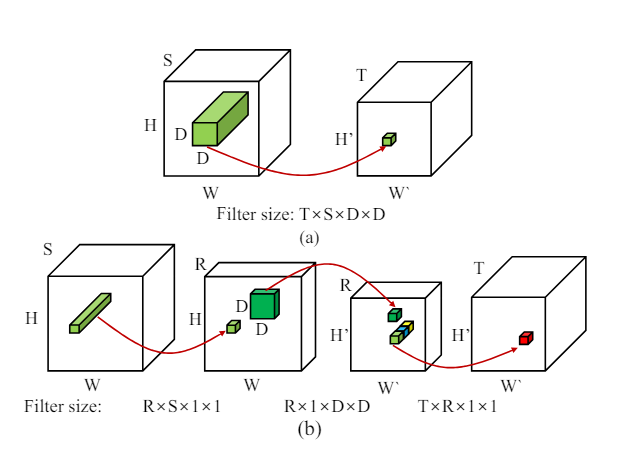

# Code Follow Along
The code can be found in the same tensor rank repository :
https://github.com/FranciscoRMendes/tensor-rank/blob/main/CNN_Decomposition.ipynb

# Convolutional Layer Case

The primary difference between the fully connected layer case and the convolutional layer case is the fact that the convolutional kernel is a tensor. We say that the number of multiplications in an operation depends on the size of the dimensions of the tensors involved in the multiplication. It becomes critical to approximate one large multi-dimensional kernel with multiple smaller kernels of lower dimension.

## Working Example

A convolution operation maps a tensor from one dimension to a tensor of another (possibly) lower dimension. If we consider an input tensor $\mathcal{X}$ of size $S\times W \times H$ then a convolution layer will map this to a tensor, $\mathcal{Y}$ of size $S\times W' \times H'$ using a kernel tensor, $\mathcal{K}$ of size $T\times S\times D\times D$.

$$
\mathcal{Y} = \mathcal{K} \times \mathcal{X}
$$

Using similar logic as defined before, the number of multiplies required for this operation in $TSD^2W'H'$. Thus a convolution layer is simply a multiplication operation over a subset of a tensor yielding a smaller tensor. We can approximate the kernel using a series of \"smaller\" multiplication operations by reducing the dimensions we need to multiply across. Consider the following decomposition,

$$
\mathcal{K} = U \mathcal{U}V
$$

This is similar to the case of the SVD with an important difference the core $\mathcal{U}$ is a 4 dimensional tensor and not a matrix. Where the first term in each bracket is the size and the second term is the number of multiplies. The size is of one kernel whereas the number of multiplies is the total number of multiplies to generate the complete output (i.e. if the operation denoted by the red arrows was calculated for the entire input tensor to generate the entire output tensor, it is given by the formula, product of kernel dimensions $\times$ product of output tensor dimensions ). $U$ : $R\times S$ ( $R S$, $RSWH$) $\mathcal{U}$ :$R\times D\times D$ ($RD^2$, $RD^2W^{t}H^{t}$) $V$ : $T \times R$ ($TR$, $TRW^{t}H^{t}$) Which makes the transformation function (with $RS + RD^2 + TR$ number of multiplies),

$$
\mathcal{Y} = U \mathcal{U}V\mathcal{X}
$$

The number of multiplies in this operation is $RS + RD^2 + TR$ which is less than $TSD^2W'H'$ if $R < T$ and $D < S$.



In the figure above each of the red arrows indicates a one convolution operation, in figure (a) you have one fairly large filter and one convolution, whereas in the figure (b) you have 3 convolution operations using 3 smaller filters. Let's break down the space and size savings for this. $$E = \frac{TTSD^2}{RS+RD^2+TR}$$ $$C = \frac{TSD^2W'H'}{RSWH + RD^2W'H + TRW'H'}$$ Recall, for our fully connected layers this formula was, $$E = C = \frac{MN}{MR + RN}$$

# Rank Selection

So we are ready to go with a decomposition, all that remains is finding out the optimal rank. Again, if the rank is too low we end up with high compression but possibly low accuracy, and if the rank is too high we end up with very low compression. In embedded systems we need to be quite aggressive in compression since this can be a hard constraint on solving a problem. In our previous example, we could \"locally\" optimize rank but in the case of CNNs this is not possible since at the very least we would have at least one FC and one convolutional layer and we must compress both somewhat simultaneously. Brute force quickly becomes hard, as for even modest tensor combinations such as $(16, x, x, x)$ and $(128, x)$ we can end up with far too many combinations to try. Binary search is also not possible since it is not clear if simultaneously lowering both ranks lowers accuracy.

## Naive Rank Selection Algorithm

The intuition is that if a layer is more sensitive to decomposition it should have higher ranks. Our algorithm is proprietary but the intuition is as follows. We start with a rank of 1 and increase the rank by 1 until the accuracy drops below a certain threshold. We then decrease the rank by 1 and continue until the accuracy drops below a certain threshold. We then take the rank that gave the highest accuracy. This is a naive algorithm and can be improved upon.
