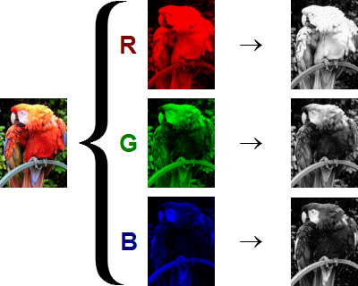
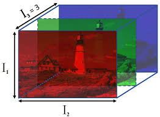
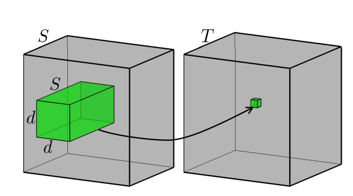
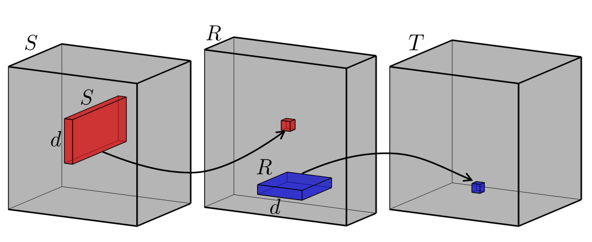
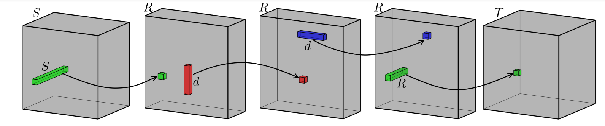

# Decomposition of a Convolutional layer

In a previous post I described (in some detail) what it means to decompose a matrix multiply into a sequence of low rank matrix multiplies. We can do something similar for a tensor as well, this is somewhat less easy to see since tensors (particularly in higher dimensions) are quite hard to visualize.
Recall, the matrix formulation,
$$Y = XW + b = XUSV' + b$$
Where $U$ and $V$ are the left and right singular vectors of $W$ respectively. The idea is to approximate $W$ as a sum of outer products of $U$ and $V$ of lower rank. 
Now instead of a weight matrix multiplication $y = WX + b$ we have a kernel operation, $y = K\circledast X + b$ where $\circledast$ is the convolution operation. The idea is to approximate $K$ as a sum of outer products of $U$ and $V$ of lower rank.
Interestingly, you can also think about this as a matrix multiplication, by creating a Toplitz matrix version of $K$ , call it $K'$ and then doing $y = K'X + b$. But this comes with issues as $K'$ is much much bigger than $K$. So we just approach it as a convolution operation for now. 
# Convolution Operation

At the heart of it, a convolution operation takes a smaller cube subset of a "cube" of numbers (also known as the map stack) multiplies each of those numbers by a fixed set of numbers (also known as the kernel) and gives a single scalar output. Let us start with what each "slice" of the cube really represents.





Now that we have a working example of the representation, let us try to visualize what a convolution is.



A convolution operation takes a subset of the RGB image across all channels and maps it to one number (a scalar), by multiplying the cube of numbers with a fixed set of numbers (a.k.a kernel, not pictured here) and adding them together.A convolution operation multiplies each pixel in the image across all $3$ channels with a fixed number and add it all up.

# Low Rank Approximation of Convolution

Now that we have a good idea of what a convolution looks like, we can now try to visualize what a low rank approximation to a convolution might look like. The particular kind of approximation we have chosen here does the following 4 operations to approximate the one convolution operation being done.



# Painful Example of Convolution by hand 

Consider the input matrix :

$$X = \begin{bmatrix}
1 & 2 & 3 & 0 & 1 \\\\
0 & 1 & 2 & 3 & 0 \\\\
3 & 0 & 1 & 2 & 3 \\\\
2 & 3 & 0 & 1 & 2 \\\\
1 & 2 & 3 & 0 & 1 \\\\
\end{bmatrix}$$ Input slice: $$\begin{bmatrix}
1 & 2 & 3 \\\\
0 & 1 & 2 \\\\
3 & 0 & 1 \\\\
\end{bmatrix}$$

Kernel: $$\begin{bmatrix}
1 & 0 & -1 \\\\
1 & 0 & -1 \\\\
1 & 0 & -1 \\\\
\end{bmatrix}$$

Element-wise multiplication and sum: $$(1 \cdot 1) + (2 \cdot 0) + (3 \cdot -1) + \\\\
(0 \cdot 1) + (1 \cdot 0) + (2 \cdot -1) + \\\\
(3 \cdot 1) + (0 \cdot 0) + (1 \cdot -1)$$

$$\implies
1 + 0 - 3 + \\\\
0 + 0 - 2 + \\\\
3 + 0 - 1 = -2$$ Now repeat that by moving the kernel one step over (you can in fact change this with the stride argument for convolution).

# Low Rank Approximation of convolution

Now we will painfully do a low rank decomposition of the convolution kernel above. There is a theorem that says that a $2D$ matrix can be approximated by a sum of 2 outer products of two vectors. Say we can express $K$ as, $$K \approx a_1 \times b_1 + a_2\times b_2$$

We can easily guess $a_i, b_i$. Consider, $$a_1 = \begin{bmatrix}
     1\\\\
     1\\\\
     1\\\\
 \end{bmatrix}$$ $$b_1 = \begin{bmatrix}
     1\\\\
     0\\\\
     -1\\\\
 \end{bmatrix}$$ $$a_2 = \begin{bmatrix}
     0\\\\
     0\\\\
     0\\\\
 \end{bmatrix}$$ $$b_2 = \begin{bmatrix}
     0\\\\
     0\\\\
     0\\\\
 \end{bmatrix}$$

This is easy because I chose values for the kernel that were easy to break down. How to perform this breakdown is the subject of the later sections.

$$K = a_1\times b_1 + a_2 \times b_2 = \begin{bmatrix}
1 & 0& -1 \\\\
1 & 0 & -1 \\\\
1 & 0 & -1 \\\\
\end{bmatrix} +
\begin{bmatrix}
0 & 0 & 0 \\\\
0 & 0 & 0 \\\\
0 & 0 & 0 \\\\
\end{bmatrix} = 
\begin{bmatrix}
1 & 0 & -1 \\\\
1 & 0 & -1 \\\\
1 & 0 & -1 \\\\
\end{bmatrix}$$

Consider the original kernel matrix $K$ and the low-rank vectors:

$$K = \begin{bmatrix}
1 & 0 & -1 \\\\
1 & 0 & -1 \\\\
1 & 0 & -1
\end{bmatrix}$$

$$a_1 = \begin{bmatrix}
1 \\\\
1 \\\\
1
\end{bmatrix}, \quad
b_1 = \begin{bmatrix}
1 \\\\
0 \\\\
-1
\end{bmatrix}$$

The input matrix $M$ is:

$$M = \begin{bmatrix}
1 & 2 & 3 & 0 & 1 \\\\
0 & 1 & 2 & 3 & 0 \\\\
3 & 0 & 1 & 2 & 3 \\\\
2 & 3 & 0 & 1 & 2 \\\\
1 & 2 & 3 & 0 & 1
\end{bmatrix}$$

## Convolution with Original Kernel  

Perform the convolution at the top-left corner of the input matrix:

$$\text{Input slice} = \begin{bmatrix}
1 & 2 & 3 \\\\
0 & 1 & 2 \\\\
3 & 0 & 1
\end{bmatrix}$$

$$\text{Element-wise multiplication and sum:}$$

$$\begin{aligned}
(1 \times 1) + (2 \times 0) + (3 \times -1) + \\\\
(0 \times 1) + (1 \times 0) + (2 \times -1) + \\\\
(3 \times 1) + (0 \times 0) + (1 \times -1) &= \\\\
1 + 0 - 3 + 0 + 0 - 2 + 3 + 0 - 1 &= -2
\end{aligned}$$

## Convolution with Low-Rank Vectors  

Using the low-rank vectors:

$$a_1 = \begin{bmatrix}
1 \\\\
1 \\\\
1
\end{bmatrix}, \quad
b_1 = \begin{bmatrix}
1 \\\\
0 \\\\
-1
\end{bmatrix}$$

Step 1: Apply $b_1$ (filter along the columns):\*\*

$$\text{Column-wise operation:}$$

$$\begin{aligned}
1 \cdot \begin{bmatrix}
1 \\\\
0 \\\\
-1
\end{bmatrix} &= \begin{bmatrix}
1 \\\\
0 \\\\
-1
\end{bmatrix} \\\\
2 \cdot \begin{bmatrix}
1 \\\\
0 \\\\
-1
\end{bmatrix} &= \begin{bmatrix}
2 \\\\
0 \\\\
-2
\end{bmatrix} \\\\
3 \cdot \begin{bmatrix}
1 \\\\
0 \\\\
-1
\end{bmatrix} &= \begin{bmatrix}
3 \\\\
0 \\\\
-3
\end{bmatrix}
\end{aligned}$$

$$\text{Summed result for each column:}$$

$$\begin{bmatrix}
1 \\\\
0 \\\\
-1
\end{bmatrix} +
\begin{bmatrix}
2 \\\\
0 \\\\
-2
\end{bmatrix} +
\begin{bmatrix}
3 \\\\
0 \\\\
-3
\end{bmatrix} =
\begin{bmatrix}
6 \\\\
0 \\\\
-6
\end{bmatrix}$$

Step 2: Apply $a_1$ (sum along the rows):\*\*

$$\text{Row-wise operation:}$$

$$1 \cdot (6) + 1 \cdot (0) + 1 \cdot (-6) = 6 + 0 - 6 = 0$$

## Comparison

-   Convolution with Original Kernel: -2

-   Convolution with Low-Rank Vectors: 0

The results are different due to the simplifications made by the low-rank approximation. But this is part of the problem that we need to optimize for when picking low rank approximations. In practice, we will ALWAYS lose some accuracy

# PyTorch Implementation

Below you can find the original definition of AlexNet. 
```python
class Net(nn.Module):
    def __init__(self):
        super().__init__()
        self.layers  = nn.ModuleDict()
        self.layers['conv1'] = nn.Conv2d(3, 6, 5)
        self.layers['pool'] = nn.MaxPool2d(2, 2)
        self.layers['conv2'] = nn.Conv2d(6, 16, 5)
        self.layers['fc1'] = nn.Linear(16 * 5 * 5, 120)
        self.layers['fc2'] = nn.Linear(120, 84)
        self.layers['fc3'] = nn.Linear(84, 10)

    def forward(self,x):
        x = self.layers['pool'](F.relu(self.layers['conv1'](x)))
        x = self.layers['pool'](F.relu(self.layers['conv2'](x)))
        x = torch.flatten(x, 1)
        x = F.relu(self.layers['fc1'](x))
        x = F.relu(self.layers['fc2'](x))
        x = self.layers['fc3'](x)
        return x

def evaluate_model(net):
    import torchvision.transforms as transforms
    batch_size = 4 # [4, 3, 32, 32]
    transform = transforms.Compose(
        [transforms.ToTensor(),
         transforms.Normalize((0.5, 0.5, 0.5), (0.5, 0.5, 0.5))])
    classes = ('plane', 'car', 'bird', 'cat',
               'deer', 'dog', 'frog', 'horse', 'ship', 'truck')
    trainset = torchvision.datasets.CIFAR10(root='../data', train=True,
                                            download=True, transform=transform)
    trainloader = torch.utils.data.DataLoader(trainset, batch_size=batch_size,
                                              shuffle=True, num_workers=2)
    testset = torchvision.datasets.CIFAR10(root='../data', train=False,
                                           download=True, transform=transform)
    testloader = torch.utils.data.DataLoader(testset, batch_size=batch_size,
                                             shuffle=False, num_workers=2)
    # prepare to count predictions for each class
    correct_pred = {classname: 0 for classname in classes}
    total_pred = {classname: 0 for classname in classes}
    # again no gradients needed
    with torch.no_grad():
        for data in testloader:
            images, labels = data
            outputs = net(images)
            _, predictions = torch.max(outputs, 1)
            # collect the correct predictions for each class
            for label, prediction in zip(labels, predictions):
                if label == prediction:
                    correct_pred[classes[label]] += 1
                total_pred[classes[label]] += 1
    # print accuracy for each class
    for classname, correct_count in correct_pred.items():
        accuracy = 100 * float(correct_count) / total_pred[classname]
        print(f'Original Accuracy for class: {classname:5s} is {accuracy:.1f} %')
```
Now let us decompose the first convolutional layer into 3 simpler layers using SVD

```python

def slice_wise_svd(tensor,rank):
    # tensor is a 4D tensor
    # rank is the target rank
    # returns a list of 4D tensors
    # each tensor is a slice of the input tensor
    # each slice is decomposed using SVD
    # and the decomposition is used to approximate the slice
    # the approximated slice is returned as a 4D tensor
    # the list of approximated slices is returned
    num_filters, input_channels, kernel_width, kernel_height = tensor.shape
    kernel_U = torch.zeros((num_filters, input_channels,kernel_height,rank))
    kernel_S = torch.zeros((input_channels,num_filters,rank,rank))
    kernel_V = torch.zeros((num_filters,input_channels,rank,kernel_width))
    approximated_slices = []
    reconstructed_tensor = torch.zeros_like(tensor)
    for i in range(num_filters):
        for j in range(input_channels):
            U, S, V = torch.svd(tensor[i, j,:,:])
            U = U[:,:rank]
            S = S[:rank]
            V = V[:,:rank]
            kernel_U[i,j,:,:] = U
            kernel_S[j,i,:,:] = torch.diag(S)
            kernel_V[i,j,:,:] = torch.transpose(V,0,1)


    # print the reconstruction error
    print("Reconstruction error: ",torch.norm(reconstructed_tensor-tensor).item())

    return kernel_U, kernel_S, kernel_V

def svd_decomposition_conv_layer(layer, rank):
    """ Gets a conv layer and a target rank,
        returns a nn.Sequential object with the decomposition
    """

    # Perform SVD decomposition on the layer weight tensorly.
    
    layer_weight = layer.weight.data
    kernel_U, kernel_S, kernel_V = slice_wise_svd(layer_weight,rank)
    U_layer = nn.Conv2d(in_channels=kernel_U.shape[1],
                                                out_channels=kernel_U.shape[0], kernel_size=(kernel_U.shape[2], 1), padding=0, stride = 1,
                                                dilation=layer.dilation, bias=True)
    S_layer = nn.Conv2d(in_channels=kernel_S.shape[1],
                                                out_channels=kernel_S.shape[0], kernel_size=1, padding=0, stride = 1,
                                                dilation=layer.dilation, bias=False)
    V_layer = nn.Conv2d(in_channels=kernel_V.shape[1],
                                                out_channels=kernel_V.shape[0], kernel_size=(1, kernel_V.shape[3]), padding=0, stride = 1,
                                                dilation=layer.dilation, bias=False)
    # store the bias in U_layer from layer
    U_layer.bias = layer.bias

    # set weights as the svd decomposition
    U_layer.weight.data = kernel_U
    S_layer.weight.data = kernel_S
    V_layer.weight.data = kernel_V

    return [U_layer, S_layer, V_layer]
    
    
class lowRankNetSVD(Net):
    def __init__(self, original_network):
        super().__init__()
        self.layers = nn.ModuleDict()
        self.initialize_layers(original_network)
    
    def initialize_layers(self, original_network):
        # Make deep copy of the original network so that it doesn't get modified
        og_network = copy.deepcopy(original_network)
        # Getting first layer from the original network
        layer_to_replace = "conv1"
        # Remove the first layer
        for i, layer in enumerate(og_network.layers):
            if layer == layer_to_replace:
                # decompose that layer
                rank = 1
                kernel = og_network.layers[layer].weight.data
                decomp_layers = svd_decomposition_conv_layer(og_network.layers[layer], rank)
                for j, decomp_layer in enumerate(decomp_layers):
                    self.layers[layer + f"_{j}"] = decomp_layer
            else:
                self.layers[layer] = og_network.layers[layer]
    
    def forward(self, x):
        x = self.layers['conv1_0'](x)
        x = self.layers['conv1_1'](x)
        x = self.layers['conv1_2'](x)
        x = self.layers['pool'](F.relu(x))
        x = self.layers['pool'](F.relu(self.layers['conv2'](x)))
        x = torch.flatten(x, 1)
        x = F.relu(self.layers['fc1'](x))
        x = F.relu(self.layers['fc2'](x))
        x = self.layers['fc3'](x)
        return x
```


# Decomposition into a list of simpler operations
The examples above are quite simple and are perfectly good for simplifying neural networks. This is still an active area of research. One of the things that researchers try to do is try to further simplify each already simplified operation, of course you pay the price of more operations. The one we will use for this example is one where the operations is broken down into four simpler operations. 



-   (Green) Takes one pixel from the image across all $3$ channels and maps it to one value

-   (Red) Takes one long set of pixels from one channel and maps it to one value

-   (Blue) Takes one wide set of pixels from one channel and maps it to one value

-   (Green) takes one pixel from all $3$ channels and maps it to one value

Intuitively, we are still taking the subset "cube" but we have broken it down so that in any given operation only $1$ dimension is not $1$. This is really the key to reducing the complexity of the initial convolution operation, because even though there are more such operations each operations is more complex.

# PyTorch Implementation
In this section, we will take AlexNet (`Net`), evaluate (`evaluate_model`) it on some data and then decompose the convolutional layers. 

## Declaring both the original and low rank network

Here we will decompose the second convolutional layer, given by the `layer_to_replace` argument. The two important lines to pay attention to are `est_rank` and `cp_decomposition_conv_layer`. The first function estimates the rank of the convolutional layer and the second function decomposes the convolutional layer into a list of simpler operations.

```python
class lowRankNet(Net):

    def __init__(self, original_network):
        super().__init__()
        self.layers = nn.ModuleDict()
        self.initialize_layers(original_network)

    def initialize_layers(self, original_network):
        # Make deep copy of the original network so that it doesn't get modified
        og_network = copy.deepcopy(original_network)
        # Getting first layer from the original network
        layer_to_replace = "conv2"
        # Remove the first layer
        for i, layer in enumerate(og_network.layers):
            if layer == layer_to_replace:
                # decompose that layer
                rank = est_rank(og_network.layers[layer])
                decomp_layers = cp_decomposition_conv_layer(og_network.layers[layer], rank)
                for j, decomp_layer in enumerate(decomp_layers):
                    self.layers[layer + f"_{j}"] = decomp_layer
            else:
                self.layers[layer] = og_network.layers[layer]
        # Add the decomposed layers at the position of the deleted layer

    def forward(self, x, layer_to_replace="conv2"):
        x = self.layers['pool'](F.relu(self.layers['conv1'](x)))
        # x = self.layers['pool'](F.relu(self.laye['conv2'](x)
        x = self.layers['conv2_0'](x)
        x = self.layers['conv2_1'](x)
        x = self.layers['conv2_2'](x)
        x = self.layers['pool'](F.relu(self.layers['conv2_3'](x)))
        x = torch.flatten(x, 1)
        x = F.relu(self.layers['fc1'](x))
        x = F.relu(self.layers['fc2'](x))
        x = self.layers['fc3'](x)
        return x

```

# Evaluate the Model
You can evaluate the model by running the following code. This will print the accuracy of the original model and the low rank model. 
    
```python
decomp_alexnet = lowRankNetSVD(net)
# replicate with original model

correct_pred = {classname: 0 for classname in classes}
total_pred = {classname: 0 for classname in classes}

# again no gradients needed
with torch.no_grad():
    for data in testloader:
        images, labels = data
        outputs = decomp_alexnet(images)
        _, predictions = torch.max(outputs, 1)
        # collect the correct predictions for each class
        for label, prediction in zip(labels, predictions):
            if label == prediction:
                correct_pred[classes[label]] += 1
            total_pred[classes[label]] += 1

# print accuracy for each class
for classname, correct_count in correct_pred.items():
    accuracy = 100 * float(correct_count) / total_pred[classname]
    print(f'Lite Accuracy for class: {classname:5s} is {accuracy:.1f} %')
```


Let us first discuss estimate rank. For a complete discussion see the the references by Nakajima and Shinchi. The basic idea is that we take the tensor, "unfold" it along one axis (basically reduce the tensor into a matrix by collapsing around other axes) and estimate the rank of that matrix.  
You can find ``est_rank`` below. 

```python
from __future__ import division
import torch
import numpy as np
# from scipy.sparse.linalg import svds
from scipy.optimize import minimize_scalar
import tensorly as tl

def est_rank(layer):
    W = layer.weight.data
    # W = W.detach().numpy() #the weight has to be a numpy array for tl but needs to be a torch tensor for EVBMF
    mode3 = tl.base.unfold(W.detach().numpy(), 0)
    mode4 = tl.base.unfold(W.detach().numpy(), 1)
    diag_0 = EVBMF(torch.tensor(mode3))
    diag_1 = EVBMF(torch.tensor(mode4))

    # round to multiples of 16
    multiples_of = 8 # this is done mostly to standardize the rank to a standard set of numbers, so that 
    # you do not end up with ranks 7, 9 etc. those would both be approximated to 8.
    # that way you get a sense of the magnitude of ranks across multiple runs and neural networks
    # return int(np.ceil(max([diag_0.shape[0], diag_1.shape[0]]) / 16) * 16)
    return int(np.ceil(max([diag_0.shape[0], diag_1.shape[0]]) / multiples_of) * multiples_of)

def EVBMF(Y, sigma2=None, H=None):
    """Implementation of the analytical solution to Empirical Variational Bayes Matrix Factorization.
    This function can be used to calculate the analytical solution to empirical VBMF.
    This is based on the paper and MatLab code by Nakajima et al.:
    "Global analytic solution of fully-observed variational Bayesian matrix factorization."

    Notes
    -----
        If sigma2 is unspecified, it is estimated by minimizing the free energy.
        If H is unspecified, it is set to the smallest of the sides of the input Y.

    Attributes
    ----------
    Y : numpy-array
        Input matrix that is to be factorized. Y has shape (L,M), where L<=M.

    sigma2 : int or None (default=None)
        Variance of the noise on Y.

    H : int or None (default = None)
        Maximum rank of the factorized matrices.

    Returns
    -------
    U : numpy-array
        Left-singular vectors.

    S : numpy-array
        Diagonal matrix of singular values.

    V : numpy-array
        Right-singular vectors.

    post : dictionary
        Dictionary containing the computed posterior values.


    References
    ----------
    .. [1] Nakajima, Shinichi, et al. "Global analytic solution of fully-observed variational Bayesian matrix factorization." Journal of Machine Learning Research 14.Jan (2013): 1-37.

    .. [2] Nakajima, Shinichi, et al. "Perfect dimensionality recovery by variational Bayesian PCA." Advances in Neural Information Processing Systems. 2012.
    """
    L, M = Y.shape  # has to be L<=M

    if H is None:
        H = L

    alpha = L / M
    tauubar = 2.5129 * np.sqrt(alpha)

    # SVD of the input matrix, max rank of H
    U, s, V = torch.svd(Y)
    U = U[:, :H]
    s = s[:H]
    V[:H].t_()

    # Calculate residual
    residual = 0.
    if H < L:
        residual = torch.sum(torch.sum(Y ** 2) - torch.sum(s ** 2))

    # Estimation of the variance when sigma2 is unspecified
    if sigma2 is None:
        xubar = (1 + tauubar) * (1 + alpha / tauubar)
        eH_ub = int(np.min([np.ceil(L / (1 + alpha)) - 1, H])) - 1
        upper_bound = (torch.sum(s ** 2) + residual) / (L * M)
        lower_bound = np.max([s[eH_ub + 1] ** 2 / (M * xubar), torch.mean(s[eH_ub + 1:] ** 2) / M])

        scale = 1.  # /lower_bound
        s = s * np.sqrt(scale)
        residual = residual * scale
        lower_bound = float(lower_bound * scale)
        upper_bound = float(upper_bound * scale)

        sigma2_opt = minimize_scalar(EVBsigma2, args=(L, M, s, residual, xubar), bounds=[lower_bound, upper_bound],
                                     method='Bounded')
        sigma2 = sigma2_opt.x

    # Threshold gamma term
    threshold = np.sqrt(M * sigma2 * (1 + tauubar) * (1 + alpha / tauubar))

    pos = torch.sum(s > threshold)
    if pos == 0: return np.array([])

    # Formula (15) from [2]
    d = torch.mul(s[:pos] / 2,
                  1 - (L + M) * sigma2 / s[:pos] ** 2 + torch.sqrt(
                      (1 - ((L + M) * sigma2) / s[:pos] ** 2) ** 2 - \
                      (4 * L * M * sigma2 ** 2) / s[:pos] ** 4))

    return torch.diag(d)
```
You can find the EVBMF code on my github page. I do not go into it in detail here. Jacob Gildenblatt's code is a great resource for an in-depth look at this algorithm.

# Conclusion
So why is all this needed? The main reason is that we can reduce the number of operations needed to perform a convolution. This is particularly important in embedded systems where the number of operations is a hard constraint. The other reason is that we can reduce the number of parameters in a neural network, which can help with overfitting. The final reason is that we can reduce the amount of memory needed to store the neural network. This is particularly important in mobile devices where memory is a hard constraint.
What does this mean mathematically? Fundamentally it means that neural networks are over parameterized i.e. they have far more parameters than the information that they represent. By reducing the rank of the matrices needed carry out a convolution, we are representing the same operation (as closely as possible) with a lot less information. 
# References
- [Low Rank approximation of CNNs] (https://arxiv.org/pdf/1511.06067)
- [CP Decomposition] (https://arxiv.org/pdf/1412.6553)
- Kolda & Bader "Tensor Decompositions and Applications"in SIAM REVIEW, 2009
- [1] Nakajima, Shinichi, et al. "Global analytic solution of fully-observed variational Bayesian matrix factorization." Journal of Machine Learning Research 14.Jan (2013): 1-37.
- [2] Nakajima, Shinichi, et al. "Perfect dimensionality recovery by variational Bayesian PCA."
- [Python implementation of EVBMF] (https://github.com/CasvandenBogaard/VBMF)
- [Accelerating Deep Neural Networks with Tensor Decompositions - Jacob Gildenblat] (https://jacobgil.github.io/deeplearning/tensor-decompositions-deep-learning) 
- [Python Implementatioon of VBMF] (https://github.com/CasvandenBogaard/VBMF)
