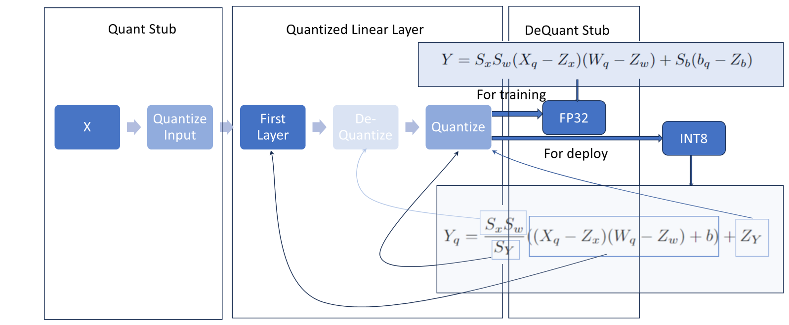

# Introduction
A common question I had when I first started working with quantization was, how exactly are values passed between layers post quantization? Looking at the quantization equations it was not immediately obvious to me how to do away with ALL floating point operations and what values were used exactly in the forward pass operation. 
In this article, I will address two main questions,
- How does PyTorch pass values between layers post quantization? And what are the quantization equations used. 
- What exactly makes floating point operations slower than integer operations?

In short, PyTorch passes integer values between layers when in INT8 only quantization. It does so using a few neat tricks of fixed point and floating point math. When in other quantization modes, values passed between layers can be float. 

# Quantized Matrix Multiplication

The overall goal of quantization is to make this multiplication operation simpler in some sense, $$Y = XW +b$$ There are two ways to make this simpler,

-   Carry out the multiplication operation in integers, as of now $X,W$ are floats

-   save $W,b$ as an integers

We can achieve both ends by,

-   replacing $XW$ by $X_qW_q$

-   adding subtracting terms to get back the original value $Y$

We can use the well known quantization scheme to carry out the quantization for each of these objects. As a recap, they are outlined again below. Personally, I just took these functions as given and "magically" converted between integers and floats, it is not quite that important to understand their inner workings at this stage. Using the quantization scheme, $$X_q = \text{clip}(\text{round}(\frac{1}{S}X + Z))$$ and de-quantization scheme,

$$X = S(X_q-Z)$$

We can write the above multiplication as, $$Y = S_q(X_q-Z_q)S_w(W_q-Z_w) + S_b(b_q-Z_b)$$ Notice that now, instead of multiplying $XW$ we have an expression where we eventually we get the integer multiply $X_qW_q$. In fact, $(X_q-Z_q)(W_q-Z_w)$ is also an integer multiply so we can leave it at that stage instead. $$Y = S_xS_w(X_q-Z_x)(W_q-Z_w) + S_b(b_q-Z_b)$$ Notice that $Y$ is still float, thus, $$Y = S_Y(Y_q - Z_Y)$$ Thus, we can write, $$Y_q = \frac{S_xS_w}{S_Y}(X_q-Z_x)(W_q-Z_w) + \frac{S_b}{S_Y}(b_q-Z_b) + Z_Y$$ Notice that, each of the matrix multiplies are integers, but the preceding coefficients are floats. This is a problem, since if our embedded system only supports integer multiplies we will not be able to do this operation. Notice also that bias' quantization prevents us from efficiently doing the operation in one step without a multiply in between. We will solve this second issue first, Notice that instead of choosing the scale and range "correctly\" we can choose them somewhat arbitrarily as long as they work. In particular we can choose to quantize $b$ such that $Z_b = 0$ and $S_XS_W = S_b$. This usually under-quantizes the bias, but its good for two reasons,

-   Bias tends to be more important for accuracy than weights do, so it is in fact better if its higher in accuracy

-   Even though they are bigger than they need to be they account for a fraction of the parameters of the neural network.

$$Y_q = \frac{S_xS_w}{S_Y}((X_q-Z_x)(W_q-Z_w)+b) + Z_Y$$ For the first issue, we use a pretty neat trick. Remember that $\frac{S_xS_W}{S_Y}$ is constant and we know it at the time of compiling, so we can consider it to be a fixed point operation, we can write it as $$M := \frac{S_xS_W}{S_Y} = 2^{-n}M_0$$ where $n$ is always a fixed number determined at the time of compilation (this is not true for floating point). Thus the entire expression, $$Y_q = M((X_q-Z_x)(W_q-Z_w)+b) + Z_Y$$ can be carried out with integer arithmetic and all values exchanged between layers are integer values.

# Data Types Passed Between Layers

Using the matrix multiplication example before, $W,b$ are the weights and biases of one fully connected layer. A question I often had was, how exactly are values passed between layers. This is because FULL INT8 quantization essentially means you can deploy a neural network on a board that does not support ANY floating point operations. It is in fact the $Y_q$ that is passed between layers when you do INT8 quantization. $$Y_q = M_0((X_q-Z_x)(W_q-Z_w)+b) + Z_Y$$ However, if you just need the weights and the multiplies to be quantized but not the activations, it means that you are getting the benefits of quantization for saving space of the weights and by using integer multiply BUT are choosing to pass values between the layers as floats. For this case, PyTorch and Keras can also spit out the floating point values, to be passed between layers, and it does this by simply omitting the de-quantization step. $$Y = S_xS_w(X_q-Z_x)(W_q-Z_w) + S_b(b_q-Z_b)$$ Here again, we can choose $S_b = S_xS_w$ but I am not sure if this additional assumption is needed, since the board has the ability to do floating point multiplications it does not matter if one or more float multiplies are needed.

To summarize,

-   For full INT8 quantization i.e. when the embedded device does not support any floating point multiplies use $Y_q$

-   For partial INT8 quantization i.e. you want the activations to be in float but weights and integer multiplies to be done in/ saved as INT8 use the equation for $Y$.

# Why Exactly Does Floating Point Slow Things Down?

Another paint point for me was the lack of reasoning as to why multiplying two floating point numbers together takes longer/ is more difficult than multiplying two INTs together. The reason has to do with physics, and we will come to it in a minute. For now let us consider two floating point numbers and their resulting multiplication. Recall, that a floating point number is always of the form $1.\text{xx}\times 2^{\text{exponent}}$. Where the leading $1$ is compulsory, if any calculation results in values such as $10.\text{xx}\times 2^{\text{exponent}}$, you need to divide the mantissa by $2$ and keep adding it to the exponent. Additionally, $\text{xx}$ means that you can only store $2$ values past the radix point (general word for what the point '$.$' is binary system).

Consider, $A = 1.11 \times 2^0$ and $B = 1.01\times 2^2$

-   Add, the exponents $2^{0+2}$

-   Multiply, the mantissas $1.11\times 1.01 = 10.0011$

-   Re-normalize, by dividing by $2$, exponent is now $2^3$, mantissa is 1.00011

-   Sign, here both numbers are positive so the sign bit is $0$

-   Truncate, $1.00\times 2^3$

As you can see, multiplying two floating point numbers takes quite a bit of steps. In particular, re-normalization could potentially take multiple steps.

For contrast, consider a fixed point multiplication, $A = 0.0111 \times 2^2$ and $B = 1.01 \times 2^2$. In this case $A$ is forced to use $2^2$, so in memory this step is simply omitted. For multiplication $2^4$ is automatically assumed.

-   Add, exponents $2^4$

-   Multiply, the mantissas 0.100011

-   Re-normalize, $10\times 2^2$

-   Sign, here both numbers are positive so the sign bit is $0$

Even though the re-normalization stage seems the same, it is actually always the same number of steps, whereas for the floating point case it can be arbitrarily long and needs to check whether there is a leading $1$.
pandoc version 3.2

# Conclusion
In this article, we discussed how values are passed between layers post quantization in PyTorch. We also discussed why floating point operations are slower than integer operations. I hope this article was helpful in understanding the inner workings of quantization and the differences between floating point and integer operations. Again, PyTorch makes things very simple by doing things for you but if you need to understand the underlying concepts then you need to open things up and verify. 

# References
https://arxiv.org/pdf/1712.05877
https://arxiv.org/pdf/1806.08342
