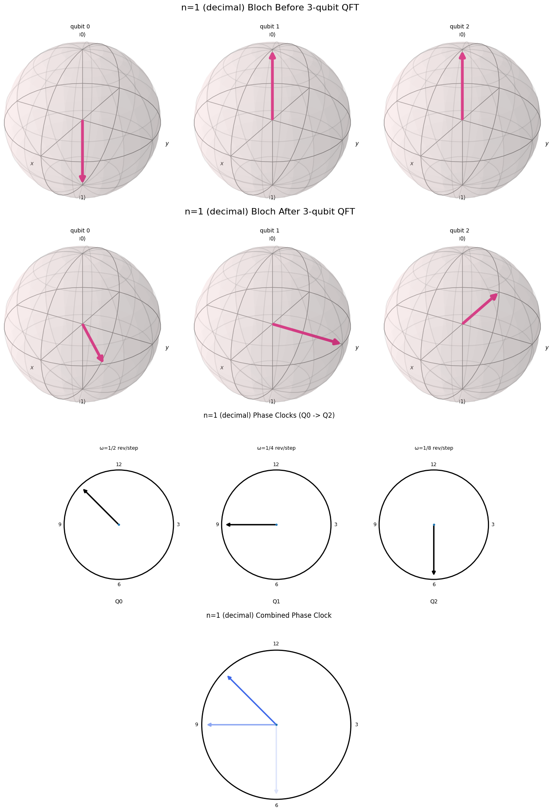
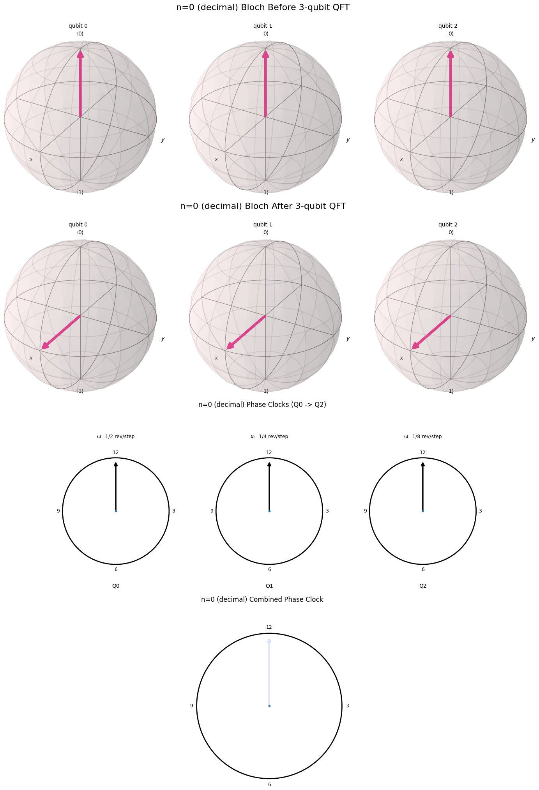

# A Useful Visualization







  <input
    type="range"
    min="0"
    max="7"
    step="1"
    value="0"
    id="blochSlider"
    style="width:60%;"
    oninput="updateBlochFrame(this.value)"
  >

  

    Binary: 0000
  

  

