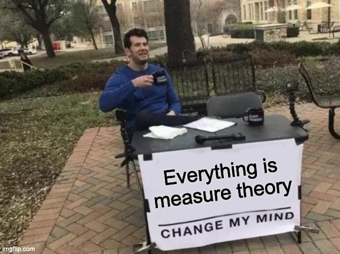
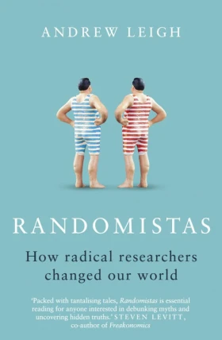

# The Bayesian Policy Maker 

*Ah they say, so here is what you do, you see its very simple. You gather data, you gather all the facts, and then you do the statistics you see, and then you make your decision. You see, a modern policymaker shouldn't bother with the inconveniences of a ideology and emotions et cetera, that stuff is for amateurs you see.*

Also, you attach a token picture of poor people being poor in a 3rd world country on a website for RCTs (the cover image above is taken from one such website, not sure why it is relevant to their study) and you are well on your way to success!
# Rarefied air of RCTs 

In the hallowed halls of economics, evidence-based policy has long been the order of the day, with statisticians and economists working hand in glove to unravel the mysteries of various policies. This delightful dance of data was often accompanied by the sage nods of experts. Enter the Randomized Controlled Trial (RCT), purportedly requiring nary an assumption nor a whisper of prior knowledge.

Ah, but herein lies the rub! Some social scientists, in their wide-eyed admiration, have crowned RCTs as the veritable holy grail of evidence, declaring that any nugget of knowledge gleaned from an RCT is the unvarnished truth, thus tossing aside the cumbersome baggage of expert opinion. Combine this with the dazzling allure of Bayesian epistemology, and we have a recipe for an unearned swagger in the land of causal inference.

This article aims to lift the veil, to show that the RCT, for all its bravado, is not above the same constraints and foibles that bedevil other studies. The RCT is not a knight in shining armor, but a gallant figure subject to the same trials and tribulations as its more scholarly counterparts.

# RCTs A History

RCTs have their roots in clinical and epidemiological studies. This is perhaps its first impediment to their use in economics and the social sciences. Social issues are often more complex and have more than one causal pathway as opposed to drugs which usually have one casual pathway and a very easily verifiable target (a bacteria or a virus). The second impediment is that while both medicine and social sciences often use overlapping terms they often use quite different language when referring to RCTs. Thus what is known in medicine is not often known and and is almost never salient when considering an RCT in economics/ social sciences. We consider two issues :

-   Average Treatment effect and why they are not the truth

-   How to use an RCT's results once we have them

# Bias and Precision

Let us clarify two important terms: bias and precision. To a non-technical audience, the term \"unbiased\" often carries an unusually high status, perhaps because it is commonly associated with impartiality in political opinions. However, in statistics, being \"unbiased\" simply means that on average, the results are correct. It does not imply accuracy in every instance. Each individual RCT might produce highly erroneous results in either direction, but these errors tend to cancel out when averaged. Consequently, the fact that an RCT is unbiased provides limited value.

The second term, precision, refers to the degree of correctness on average. In the context of RCTs, precision indicates how close the results are to the true value on average. RCTs are notoriously imprecise, as illustrated by studies that have documented large errors in both directions, such as those involving hormone replacement therapy (HRT). This lack of precision is well-known, and economists often seek to enhance precision by incorporating \"biased\" and \"subjective\" expert opinions.

# Measure Theory and the ATE

All misunderstandings about probability come from the confidence of individuals who have never had the wind knocked out of them by measure theory. And so in this section that is what we will do.

Fundamentally, the treatment effect, $Y_i$'s equation is given by, $$Y_i = \beta_iT_i + \sum_{1}^{J} \gamma_jx_{ij}$$ Where $T_i$ the boolean variable is $0$ or $1$ accordingly as whether the $i$th individual is in treatment or control. Ideally we would like to measure $Y_{i0} - Y_{i1}$. That is, we would like to observe the same individual in treatment and control and measure the difference in outcome in the two cases. In absence of this we can only observe $\bar{Y_0} - \bar{Y_1}$ i.e. the difference in population mean between the treated and un-treated population. It is a remarkable theorem from statistical theory that says that, the difference in these means is an *unbiased* estimator of the treatment effect. This is remarkable because it requires very few if any assumptions. Recall, that unbiased-ness buys us relatively little for a study done once as it could be a *completely* random effect we observe in any *one* study. Below, is a measure theoretic proof of why this is the case, $$E(aX+bY) = \int_{\Omega} aX + bY dP$$ $$= a\int_{\Omega}XdP + b\int_{\Omega} YdP$$ $$= aE(X) + bE(Y)$$ Where this last equation follows from the linear nature of the expectation operator. This is another vital weakness of the RCT, you can *only* ever get at the mean effect. You cannot get a meaningful measure of any other statistic. As an economist we are very often concerned with the median and below is a similar proof of why this is not the case, $$M(X) = m_1 ,s.t. \int_{0}^{m_1} f(x) dx = \frac{1}{2}$$ one can immediately see that this is a lot hairier to linearly separate than before, i.e. $$M(aX+bY) \neq a M(X) + b M(Y)$$ This is another critical weakness of an RCT, you can only tell what the treatment effect is in expectation. Though not useless, this is far from usual when a statistician would rather know the entire distribution of outcomes. This is generally the case with other forms of studies.

# Randomization

Randomization is often looked at as this perfect tool that answers all questions related to variance between the treatment and control group but as we will see this is often not the case in practice. Recall, $$\bar{Y_1} - \bar{Y_0} = \bar{\beta_1} + \sum_{j=1}^J \gamma_j (\bar{x}\_{1ij} - \bar{x}\_{0ij}) = \bar{\beta_1} + (\bar{S_1} - \bar{S_0})$$

Usually, the second term on the right is equated to $0$. But there is considerable slight of hand involved here. While un-biasedness guarantees that the second term is $0$ *in expectation*. In any one trial we have no idea about the size of this term. This is referred to in the clinical trials literature as random confounding or realized (as in one realization of a trial) confounding.

# Randomization and Balance

Exactly what randomization does is lost in popular parlance. There is often a misconception that randomization (in the sense of a laboratory clinical experiment) does as much as a perfect control. This is not the case, randomization is often always far worse than a good control. This fact is often lost in popular literature and can be captured by this quote in a World Bank manual attributed to Gerter et al 2016. *We can be confident that our estimated impact contributes the true impact of the program, since we have eliminated all observed and the unobserved factors that might plausibly explain the difference in outcomes.* This statement confuses the fact that the second term is zero in *expectation* over many hypothetical trials (which this study did not do) and with it being zero in any one trial. Popular economics literature is littered with such statements. It is this lack of nuance (and grace) that is the cause for RCTs being as widely misunderstood as they are.

# Post Mortem

While, I have many misgivings about Bayesian epistemology in general, I think it is a very narrow way of viewing the world. It is also pseudo mathematical for a variety of reasons (see Pollock for a mathematical discussion of why it is not a tractable mathematical theory, but rather a subjective philosophy that appropriates real mathematics). For the reasons mentioned here, I think that RCTs do not often contribute enough signal to update probabilities about hypotheses in a meaningful way. In addition, it has become fashionable to quote a counter intuitive or counter-theoretical result from an RCT to suggest that theory needs to change, rather than requiring more studies or more information about causal pathways to improve the body of scientific evidence in either direction. Finally, the idea that RCTs require little no theory is patently false. Since a good RCT requires a good control which often requires a good theory which in turn is subject to all the shortcomings of the human experience such as political bias and subjectivity. *No causality in, no causality out*. Words to live by indeed.

# References

Critique of Bayesian Epistemology (https://johnpollock.us/ftp/PAPERS/Problems%20for%20Bayesian%20Epistemology.pdf)
Understanding and misunderstanding randomized controlled trials (https://pubmed.ncbi.nlm.nih.gov/29331519/)