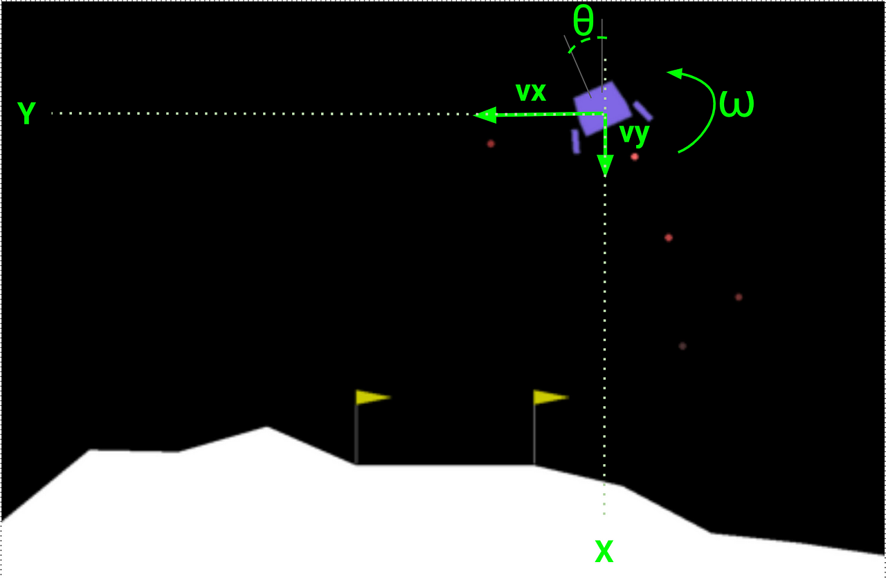

# Introduction
Just like in the previous example using the CartPole environment, we will be using the Lunar Lander environment from OpenAI Gym. The goal of this example is to implement the Soft Actor Critic (SAC) algorithm from scratch using PyTorch. The SAC algorithm is a model-free, off-policy actor-critic algorithm that uses a stochastic policy and a value function to learn optimal policies in continuous action spaces. 
Like before, I will be using notation that matches the original paper (Haarnoja et al., 2018) and the code will be structured in a similar way to the previous example. The main difference is that we will be using a different environment and a different algorithm.
Since the paper's notation is critical to the understanding of the code, I highly recommend reading that alongside (or before) diving into the code.
Part 1 of this series provides extensive details linking the theory to the code. In this part, we will focus on the implementation of the SAC algorithm in PyTorch for Lunar Lander. 

# Example Data

<html>
<head>
    
</head>
<body>
    <table>
        <tr>
            <th class="action" colspan="2">Action</th>
            <th class="reward">Reward</th>
            <th class="state" colspan="8">State</th>
            <th class="done">Done</th>
            <th class="next-state" colspan="8">Next State</th>
        </tr>
        <tr>
            <th class="action">Main</th>
            <th class="action">Lateral</th>
            <th class="reward"></th>
            <th class="state">x</th>
            <th class="state">y</th>
            <th class="state">v_x</th>
            <th class="state">v_y</th>
            <th class="state">angle</th>
            <th class="state">angular velocity</th>
            <th class="state">left contact</th>
            <th class="state">right contact</th>
            <th class="done"></th>
            <th class="next-state">x</th>
            <th class="next-state">y</th>
            <th class="next-state">v_x</th>
            <th class="next-state">v_y</th>
            <th class="next-state">angle</th>
            <th class="next-state">angular velocity</th>
            <th class="next-state">left contact</th>
            <th class="next-state">right contact</th>
        </tr>
        <tr>
            <td class="action">0.66336113</td>
            <td class="action">-0.485024</td>
            <td class="reward">-1.56</td>
            <td class="state">0.00716772</td>
            <td class="state">1.4093536</td>
            <td class="state">0.7259957</td>
            <td class="state">-0.06963848</td>
            <td class="state">-0.0082988</td>
            <td class="state">-0.16444895</td>
            <td class="state">0</td>
            <td class="state">0</td>
            <td class="done">False</td>
            <td class="next-state">0.01442766</td>
            <td class="next-state">1.4081073</td>
            <td class="next-state">0.73378086</td>
            <td class="next-state">-0.05545701</td>
            <td class="next-state">-0.01600615</td>
            <td class="next-state">-0.15416077</td>
            <td class="next-state">0</td>
            <td class="next-state">0</td>
        </tr>
        <tr>
            <td class="action">0.87302077</td>
            <td class="action">0.8565877</td>
            <td class="reward">-2.85810149</td>
            <td class="state">0.01442766</td>
            <td class="state">1.4081073</td>
            <td class="state">0.73378086</td>
            <td class="state">-0.05545701</td>
            <td class="state">-0.01600615</td>
            <td class="state">-0.15416077</td>
            <td class="state">0</td>
            <td class="state">0</td>
            <td class="done">False</td>
            <td class="next-state">0.02185297</td>
            <td class="next-state">1.4071543</td>
            <td class="next-state">0.7518369</td>
            <td class="next-state">-0.04247425</td>
            <td class="next-state">-0.02521554</td>
            <td class="next-state">-0.18420467</td>
            <td class="next-state">0</td>
            <td class="next-state">0</td>
        </tr>
        <tr>
            <td class="action">0.4880578</td>
            <td class="action">0.18216014</td>
            <td class="reward">-2.248854395</td>
            <td class="state">0.02185297</td>
            <td class="state">1.4071543</td>
            <td class="state">0.7518369</td>
            <td class="state">-0.04247425</td>
            <td class="state">-0.02521554</td>
            <td class="state">-0.18420467</td>
            <td class="state">0</td>
            <td class="state">0</td>
            <td class="done">False</td>
            <td class="next-state">0.02941189</td>
            <td class="next-state">1.4065428</td>
            <td class="next-state">0.7646336</td>
            <td class="next-state">-0.02735517</td>
            <td class="next-state">-0.03385869</td>
            <td class="next-state">-0.17287907</td>
            <td class="next-state">0</td>
            <td class="next-state">0</td>
        </tr>
        <tr>
            <td class="action">0.0541396</td>
            <td class="action">-0.70224154</td>
            <td class="reward">-0.765160122</td>
            <td class="state">0.02941189</td>
            <td class="state">1.4065428</td>
            <td class="state">0.7646336</td>
            <td class="state">-0.02735517</td>
            <td class="state">-0.03385869</td>
            <td class="state">-0.17287907</td>
            <td class="state">0</td>
            <td class="state">0</td>
            <td class="done">False</td>
            <td class="next-state">0.03697386</td>
            <td class="next-state">1.4056652</td>
            <td class="next-state">0.7634756</td>
            <td class="next-state">-0.03918146</td>
            <td class="next-state">-0.04105976</td>
            <td class="next-state">-0.14403483</td>
            <td class="next-state">0</td>
            <td class="next-state">0</td>
        </tr>
    </table>
</body>
</html>

# Lunar Lander Dataset Explanation

This dataset captures the experience of an agent in the **Lunar Lander** environment from OpenAI Gym. Each row represents a single **transition** (state, action, reward, next state) in the environment.

# Environment Details

1. **Action**
   - `Main Engine`: The thrust applied to the main engine.
   - `Lateral Thruster`: The thrust applied to the left/right thrusters.

2. **Reward**
   - The reward received in this step. It is based on:
     - Proximity to the landing pad.
     - Smoothness of the landing.
     - Fuel consumption.
     - Avoiding crashes.

3. **State**
   - `x, y`: Position coordinates.
   - `v_x, v_y`: Velocity components.
   - `theta`: The lander’s rotation angle.
   - `omega`: The rate of change of the angle.
   - `left contact, right contact`: Binary indicators (0 or 1) showing whether the lander has made contact with the ground.

4. **Done**
   - `True`: The episode has ended (either successful landing or crash).
   - `False`: The episode is still ongoing.

5. **Next State**
   - The same attributes as **State**, but after the action has been applied.

# Sample Game Play 

# Game play 500 games 
YouTube video embedded 
<iframe width="560" height="315" src="https://www.youtube.com/embed/pSSxC84vXCw?si=VFDUhuxb4C8jn8Be" title="YouTube video player" frameborder="0" allow="accelerometer; autoplay; clipboard-write; encrypted-media; gyroscope; picture-in-picture; web-share" referrerpolicy="strict-origin-when-cross-origin" allowfullscreen></iframe>

# Game play 500k games 
<iframe width="560" height="315" src="https://www.youtube.com/embed/HHmulIyuHGc?si=OnObtwo8VqmsdaKp" title="YouTube video player" frameborder="0" allow="accelerometer; autoplay; clipboard-write; encrypted-media; gyroscope; picture-in-picture; web-share" referrerpolicy="strict-origin-when-cross-origin" allowfullscreen></iframe>