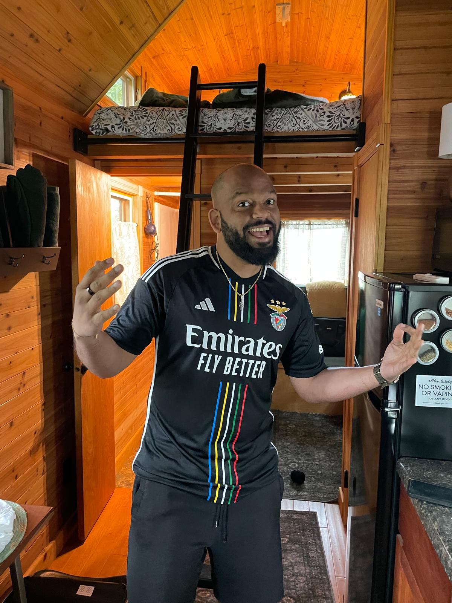

Hello! Welcome to my blog. I am a senior AI Engineer at Renesas Electronics America. In my current role I focus primarily on implementing deep neural networks on embedded systems. Most of my work is in the field of computer vision and signal processing, and requires a deep fundamental understanding of the math behind these fields to implement a neural network that is both light and fast. In previous lives, I have been an AI Consultant at the Boston Consulting Group and a researcher at the University of Chicago's Thirty Million Words Center (under John List and Dana Suskind).

I love mathematics and algorithms and was hoping to use this blog to share some of my thoughts and ideas on these topics. In particular, due to my background in mathematics I prefer to teach myself using small toy examples and proofs, that make the main idea clear and easy to understand without any code. To me, learning AI is all about implementing the algorithm by hand with a pen and paper!

In my free time I play a lot of basketball and football (soccer) and you can find me in rec leagues across Chicago.

